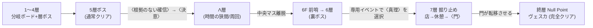

# DICE BOUND — 統合仕様書

本ドキュメントは **設計・ロジック・仕様の統合正本**。
2026-07-27 に `docs/specs/` (18 本)・`docs/plans/`・`docs/open-questions/` を吸収して一本化した。

---

## 0. この文書について

### 0-1. 正本の階層

**最終正本は常に実コード。** 本書はその上位構造（設計意図・ルール・決定履歴）を保持する。
巨大カタログ（個別数値の羅列）は転記せず、下表の外部正本を指す。

| 対象 | 正本 | 本書の扱い |
|---|---|---|
| ダメージ計算の式・適用順・ctx 用語集 | [DAMAGE_CALC_REFERENCE.md](../Assets/Scripts/CombatSystem/DAMAGE_CALC_REFERENCE.md) | 骨子のみ記述・式は複製しない |
| アイテム全カタログ | [items.json](../Assets/Data/InventorySystem/items.json) | 分類とルールのみ |
| パッシブ全 166 種の効果 | `AllPassiveSkillEffects.cs` / `EnemyPassiveSkillEffects.cs` | 体系と機構のみ |
| 敵ステータス | [enemies.json](../Assets/Resources/enemies.json) | 構造のみ |
| 七つの大罪の ID・効果・フレーバー | [PermanentDebuffIds.cs](../Assets/Scripts/MetaProgression/PermanentDebuffIds.cs) | 位置づけのみ |
| ID 定数 | [Ids.cs](../Assets/Scripts/GameLoop/Ids.cs) (`ItemIds` / `BossIds`) | 規約のみ |
| イベント定義 | [event_list.txt](../Assets/Resources/Events/event_list.txt) | フォーマットのみ |
| 筐体レイアウト実寸 | [docs/design/cabinet-layout.html](design/cabinet-layout.html) 他 | 設計思想のみ |
| バランス学習結果 | `BALANCE_CHANGELOG_*.md` / `BALANCE_TIER_LIST_*.md` | **BOT 自動生成・改変禁止** |

### 0-2. プレイヤー向け文面

ゲーム内チュートリアル文面は [handbook.md](handbook.md) が正本。本書とは目的が違う
（あちらは「どう遊ぶか」まで、攻略情報は書かない）。

### 0-3. 記述規約

- 実装され動いているものだけを「仕様」として書く。未実装・保留は §23 に隔離し、silent gap を作らない。
- 数値を書く前に実コードか DAMAGE_CALC_REFERENCE を確認する。**憶測で書かない**。
- 実装を変えたら本書と DAMAGE_CALC_REFERENCE を同時に直す。

---

## 1. プロジェクト概要

**DICE BOUND** — Unity 3D ローグライク（ボードゲーム調・ダイス戦闘）。
分岐するボード状のフロアを進み、マスを解決し、各層のボスを倒して深部へ潜る。

| 項目 | 値 |
|---|---|
| エンジン | Unity 2022.3.22f1 |
| レンダリング | Built-in Render Pipeline（URP/HDRP 不使用・ポスト処理は自前 `OnRenderImage`） |
| 言語 | C# |
| 開始 HP | 30 |
| 層 | 1 → 7（`normalClearFloor` = 5） |

### ディレクトリ地図

| 領域 | 主ディレクトリ |
|---|---|
| 戦闘 | `Assets/Scripts/CombatSystem/` |
| マップ・ラン | `Assets/Scripts/MapSystem/`, `GameLoop/` |
| インベントリ・パッシブ | `Assets/Scripts/InventorySystem/` |
| メタ進行 | `Assets/Scripts/MetaProgression/` |
| 契約 | `Assets/Scripts/GameLoop/Contracts/` |
| Λ層 | `Assets/Scripts/GameLoop/Lambda/` |
| イベント | `Assets/Scripts/EventSystem/` |
| BOT・自動調整 | `Assets/Scripts/AutoTest/` |

---

## 2. 設計原則（変更禁止の規約）

### 2-1. 正本ポリシー

- 唯一の正本は実コード。
- ダメージ計算の正本は `DAMAGE_CALC_REFERENCE.md`。式を変えたら同ファイルも更新する。
- 七つの大罪フレーバーの正本は `PermanentDebuffIds.cs`。
- アイテムカタログの正本は `items.json`。
- `BALANCE_CHANGELOG_*` / `BALANCE_TIER_LIST_*` は BOT 自動生成＝改変しない。

### 2-2. 画中画の原則（2026-07-13 確定）

**ゲーム世界はゲーム盤内チップの演算結果にすぎない。**

- **LCD の外**（筐体・机・充電などの盤上機構）に lore は一切関与しない。
- **lore 側も筐体に言及しない**。
- 盤上機構のフレーバーはメカ用語で書き、世界観固有名詞（ヴェイランド等）を使わない。
- 情報表示（予告・収支プレビュー）は LCD 側、物理的な操作対象（ダイス・端子）はワールド側。

### 2-3. ピクセル規約

- ピクセル要素（PPU=32）の状態表現に `transform.localScale` 倍率を**使わない**。
  色／明度／別スプライトで表現する。
- ピクセルパーフェクト（1dot = 物理 4×4px）は **LCD 上のみ**の制約。ワールド側は透視カメラで
  距離により密度が変わるため、そもそも 1:1 対応が成立しない。

### 2-4. ID 直書き禁止

複数ファイルから参照する ID・日本語 ID・ロジック分岐に使う ID/prefix は
`Ids.cs`（`ItemIds` / `BossIds`）か `ClassStarter` の定数を経由する。
ボス判定は `BossIds.IsBoss(id)`。新しい ID を跨ファイル参照する時は先に定数を足す。

### 2-5. CombatContext の 3 区分

新フィールドを足す時は `perTurn` / `decay` / `persistent` の区分を XML コメントに明記し、
perTurn/decay は `BeginNewTurn` の該当 Phase に必ずリセットを追加する。
1〜2 箇所しか触らない一時値はフィールドではなく `accumulatedValues` / `nextTurnBuffs` 辞書へ。

### 2-6. シングルトン規約

`_shuttingDown` + `[RuntimeInitializeOnLoadMethod]` パターンを守る（シーン破棄時の再生成警告防止）。

### 2-7. 用語規約

| 概念 | 正本表記 | 使わない |
|---|---|---|
| 振るダイスの本数 | **ダイス個数**（`playerDiceCount`） | 曖昧な「1ダイス」 |
| 各ダイスの目 | **出目** | — |
| 端子に挿した出目の和 | **端子配線合計+N** | ダイス合計+N |
| 攻撃力への加算 | **攻撃+N** | ダイス合計+N |
| 会心率への加算 | **会心率+N%** | 会心ダイス合計値+N / 会心率+N/9 |
| 与える側 | **与ダメージ** | 与ダメ（略さない） |
| 受ける側 | **被ダメージ** | 被ダメ（略さない） |
| 軽減を無視 | **軽減不可** | 軽減不能 |
| 会心の確定 | **会心確定** | 必ず会心ヒット |

**「ダイス合計+N」は禁止語彙。** ADR-0009 の相互攻撃モデルでは合計比較が存在しない。

> **未解消**: `items.json` の効果説明文には旧表記「ダイス合計+N」が残存。一括置換は未実施（§23）。

### 2-8. スキル表示名の統一

同一 `internalName` は武器・パッシブアイテムで同じ `skillName` を使う。

| internalName | 正本 skillName | 旧・別名（廃止） |
|---|---|---|
| Might I–IV | **筋力** | 剛力 |
| Fortitude I–IV | **頑強** | 堅忍 |
| Insight I–IV | **心眼** | 慧眼 |
| Steadfast | **堅忍** | — |

`堅忍` は Steadfast 専用（敗北時の条件付き軽減）。Fortitude の常時軽減は `頑強` で別効果。

---

## 3. 決定履歴（ADR 要約）

ADR 原本は `docs/adr/` に残置（決定の経緯と棄却理由の記録として価値があるため）。
以下は決定内容の要約。

| # | 決定 | 状態 |
|---|---|---|
| 0001 | ランダム Trap マス撤去（死にノードのため）。`karma_trap` は ADR-0002 により撤去 | accepted |
| 0002 | **希望システム採用** — カルマ＋飢餓を単一ゲージへ統合 | accepted |
| 0003 | 装備→戦闘反映は既存パッシブ機構と同経路（案B）。専用ステータス合算層は作らない | accepted |
| 0004 | **武器ダメージ分離** — ダイス＝勝負／武器＝威力／会心＝独立 | accepted |
| 0005 | 敵のロール力↔ダメージ二択スタンス | **superseded by 0009** |
| 0006 | プレイヤー攻撃/防御スタンス | **superseded by 0009** |
| 0007 | **ボス署名ダイス** — 固有面構成で性格づけ、面の各値を学習 | accepted |
| 0008 | **疑似3D スプライト描画** — LCD=平行投影/dot 厳密、ワールド=透視/スプライト可 | accepted |
| 0009 | **相互攻撃モデル + ダイス配線 + 段階エスカレーション** | accepted（実装途上） |
| 0010 | **役システム（ヨット型）** — ダイス5個・端子ごとの役・充電リロール・タイミング判定OL廃止 | **実装完了・Accepted 保留**（Verification ③ のみ未達） |

> ADR-0010 は ADR-0009 を **superseded しない**。相互攻撃・完全情報テレグラフ・段階エスカレーションは
> 土台として残り、柱1（配線）の上に役を載せ、柱5（充電）にリロールという用途を足す形。
> 検討の全記録は [design-yacht.md](design-yacht.md)、棄却案は [design-rejects.md](design-rejects.md)。

### 主要な棄却記録（再提案禁止）

- **勝負判定ベースの配線**（ADR-0009 検討過程）── 敵合計が見えた後の配置が「必要攻撃量の逆算＋余り流し」
  の算数に退化する。また敗北ダメが `max(|差|, threat)` である限り攻撃ダイスが三役を兼ね、
  同レートの防御端子が完全に支配される。
- **職業固有端子**（剣士=追撃/騎士=聖盾 等）── やりすぎ。職業差は「スターター消耗品 1 個」原則へ回帰。
- **Hades 鏡式の A/B 二択メタ**（§15）── 「不均衡なら答え探し / 均衡ならコイントス」のジレンマ。
- **差→会心ルート**（ADR-0004 検討過程）── 大差勝利が確定会心化し、会心率という武器差別化軸を潰す。
- **ダイス側パッシブ**（ADR-0009）── 廃止。ダイスの個性は物理差（個数・面数）のみで表現する。
- **アイテム刻印 / Sigil / 挑戦刻印**（§9・旧§15-2γ）── 廃止。取得時のランダム付加特性を
  通常プールにも挑戦スコア報酬にも再導入しない。

---

## 4. ラン構造

### 4-1. 進行

- `currentFloor` 1 → `maxFloor` **8**。開始 HP 30。
- **通常クリア** (`IsNormalClear`)：5 層ボス撃破。
- **完全クリア** (`IsFullClear`)：**8 層 Null Point** でヴェスカ撃破。
- 各フロアは前哨基地 (Outpost) で開始し、分岐ボードを進んで層ボスへ至る。
- **ボスが居るのは 1/3/5/6/8 層**（`MapGenerator.HasBoss`）。2/4/7 層にボスマスは無く、
  「前へ進めなくなった時点」が層クリア（`GameManager.IsBosslessFloorCleared`）。



**2026-09-14: 7 層からボスを外し、ヴェスカを 8 層へ移した。** 7 層の終端は〈門〉で、
そこが補給と代償の最終地点になる。`boss_layer7`〜`_p4` という **ID は据え置き** ──
学習ファイル・Tier 表・`boss_tuning.json` のキーが ID 基準なので、層番号に合わせて
改名すると過去データと切れる（3 層プールの `boss_layer2`/`boss_layer4` と同じ扱い）。

### 4-2. 〈確信〉ゲート

`convictionStage` — イベント「災厄の予兆」で〈根拠のない確信〉取得時 1、以降**エリート戦勝利毎に +1**。
段階値は確信の強さを表すが、深層ゲートとは分離する。

| 条件 | 名称 | ゲート |
|---|---|---|
| 〈根拠のない確信〉を持って5層ボス撃破 | 〈決意〉 | 6F 進入可 (`layer6Unlocked`) |
| 6層専用イベント「裂け目の記録」で最後の頁を開く | 〈真理〉 | 7F 進入可 (`layer7Unlocked`) |

6層は固定一本道 `前哨→裂け目の記録→ショップ→休憩→ボス`。専用イベントは一度限り・
抽選なしであり、「手記を閉じる」を選べば〈決意〉のまま6層クリアエンディングへ進む。
7層は `前哨→ショップ→休憩→門`（ボスなし）。8層は `前哨→ボス` のみで、
**8層の前哨基地は回復しない**（転移した先の一点であって野営地ではない）。

lore 的には「ギルド管轄も 5 層まで」「5 層を抜けた時点で凱旋級の栄誉」であり、
6 層以降に降りるのは確信に憑かれた者だけ（§19）。

### 4-3. 7 層の〈門〉と不完全起動（GateFlaw）

7 層の終端マス `Gate`。地獄の果ての壁に、大きな円盤が立てかけられている。
横に書かれた文が不思議と読める ── これは**門**で、いくつかの代償を払えば起動する。

門は 3 工程で動く。**手を抜いた工程が、そのまま向こう側での欠陥になる。**

| 工程 | 問われること | 代償 | 怠ると |
|---|---|---|---|
| ① 外縁の再構成 | 生物の血が要るらしい | **最大HP −25%** | 〈不完全な修復〉充電が毎ターン終了時に半減する |
| ② 起動 | いくつかの遺物が要るらしい | **ランダムに遺物 2 個** | 〈不完全な起動〉同じ端子へ 3 本以上配線できない |
| ③ 転移 | 意識が薄れてゆく | **希望 −40** | 〈不完全な転移〉ボスの攻撃がブロック出目を貫通する |

複数同時所持可（フラグ）。効果は**門をくぐった後の戦闘**＝ 8 層ヴェスカ戦にだけ乗る。
数値の正本は [GateFlaws.cs](../Assets/Scripts/GameLoop/GateFlaws.cs)。
罰の実装は 3 つとも**プレイヤー側の規則**で、敵は一切強化しない。

- 〈不完全な修復〉`CombatContext.ConsumeHalfCharge` をターン終了時に呼ぶ。
  **支出には計上しない**（`ConsumeCharge` を使うと〈短絡〉と充電経済の計装が汚れる）。
- 〈不完全な起動〉`IgnitionMaxDicePerTerminal = 2`。武器は全て 5 ダイスなので
  **必ず 3 端子とも使わされる**（2+2+1）。攻撃全振りが消えるので一点集中が最も痛い。
  強制は `CombatManager.SanitizeWiring`、**配線 AI 3 系統も同じ制約で列挙する**
  （AutoRunner / SuperCombatAI / ExactCombatAI）── 規則だけ入れて方策が知らないと、
  測るのは「罰の強さ」ではなく「AI が制約を知らない損」になる。
- 〈不完全な転移〉`TransferPierceRate = 0.50`（**未計測の仮置き**）。
  〈貫きの錐〉がブロックを丸ごと 0 にして致死率を基準の 2.80 倍にした前例があるので、
  割合にして「厚く配線した分は必ず残る」形にしてある。実値は 8 層ボス戦の
  ブロック／被ダメ分布を採ってから決めること。

> **2026-09-14 リワーク。** 旧〈罪の儀式〉（血の儀 / 貪欲の儀 / 遺品の儀 →
> ゴルゴダの心 / 断絶した時間 / 灰燼の烙印）から全面差し替え。廃止の理由は §24。

> GateFlaw と七つの大罪（メタ恒久デバフ）は**全く別系統**。同時に両方を背負い得る。

### 4-4. 特殊フラグ

- `defeatedSaintGeorges` — 5 層裏ボス（シュヴァリエ）撃破。
- `gedatsuVictory` — 覚者最終形態（妙覚）のサドンデス勝利＝解脱。

---

## 5. マップ

### 5-1. ボード構造

正本: `MapSystem/MapGenerator.cs`

- `LaneCount = 3`、`RowCount = 10`（Row 0 = 前哨基地、Row 9 = 休憩）。
- 接続：前方 / 斜め (`DiagonalChance = 0.6`) / 同行横移動 (`LateralChance = 0.3`)。
- 収束ノード (`lane = -1`)：前哨基地・ボス。
- **6 / 7 / 8 層は専用マップ**（`laneCount = 1`）。
  6層 `前哨→裂け目の記録→ショップ→休憩→ボス` / 7層 `前哨→ショップ→休憩→門`（ボスなし） /
  8層 Null Point `前哨→ボス`。`MapGenerator.LastFloorWithShop = 7`（**最終層ではない** ──
  「ランで最後のショップか」を `maxFloor` で判定すると 8 層に店が無いので永遠に成立しない）。

### 5-2. マス種別と抽選重み

| TileType | 内容 | 重み |
|---|---|---|
| Battle | 戦闘 | 29 |
| Event | イベント | 25 |
| EliteBattle | エリート（**精鋭の敵 1 体**・報酬ゴールド ×2.0） | 14 |
| Exchange | 交換（パッシブ 1 つ→上位 Tier ランダム） | 7 |
| Shop | ショップ | 7 |
| Treasure | 秘宝 | 3 |
| Rest | 休憩（HP 回復 or 強化） | 2 |

非抽選（固定配置）: Outpost / Boss / Gate / LambdaRing / LambdaExit。

**廃止済み**: `Trap`（ADR-0001）/ `Mystery` / `karma_trap`（ADR-0002）。
いずれも生成されない。`TileType` の enum 値と表示ラベルのみ**セーブ互換のため残置**
（2026-07-27 に生成経路・ハンドラ・翼の恩寵の罠無効化分岐まで削除済み）。

### 5-3. ノード状態

`visited` / `activated`（再訪時の再発火防止）/ `revealed`（高難易度でマスを隠す）/
`isFalseMerchant`（挑戦デバフ「偽の商人」用）。

### 5-4. エリート（2026-09-20 改訂）

**エリートは [enemies.json](../Assets/Resources/enemies.json) の独立した敵**（`"elite": true`、id は `<元の敵>_elite`、
表示名は「精鋭〜」）。EliteBattle マスはエリート敵からだけ、通常の戦闘マスは雑魚からだけ抽選する
（[FloorManager.cs](../Assets/Scripts/GameLoop/FloorManager.cs)）。**強さは JSON の数値そのもの**で、
戦闘直前に倍率を掛ける処理は無い。調整するときは enemies.json の値を直接動かす
（CLAUDE.md「隠し倍率禁止・実数値を直接調整」）。

- **エリートは常に単体。** 2 体戦は通常マスの引き（報酬 ×2 の賭け）として残す。
- 報酬ゴールドは ×2.0（[CombatRewards.cs](../Assets/Scripts/GameLoop/CombatRewards.cs) `EliteRewardMul`）。
  **BOT の航行スコアも同じ値を読む**ので、ここを動かすと BOT の進路選択も動く。
- 4 層以降の敵のエリートは、固有のエリートパッシブ（早業 / 不死の軍勢 / 霊体 …）を持つ。
- 旧実装（雑魚に後から倍率を掛ける 2 系統の「精鋭化」）は §24 を参照。

### 5-5. フロアモディファイア

`perTurnSelfDamage` / `enemyPerTurnHeal` / `defeatDamageReduction` / `coinRewardMultiplier` /
`shopPriceMultiplier`。ショップ価格は **4 層 +20% / 5 層 +40%**。

### 5-6. 層タイトル（正本: `LayerTitles.cs`）

| 層 | ボス | タイトル | サブタイトル |
|---|---|---|---|
| 1 | トレジャーゴブリン | 第一層　陽の差す浅層 | 振り返れば、まだ入口の光が見える |
| 2 | ゴブリン王 | 第二層　群れの領分 | 石の通路に、無数の足音が反響する |
| 3 | 毒沼の主 | 第三層　毒の沼 | 空気が変わる。息をするたび、喉の奥が湿る |
| 4 | 鏡の双子 | 第四層　鏡像の界 | 影が、ひとつだけ多い |
| 5 | 業火の審判官 | 第五層　審きの淵 | 多くの者が、ここで引き返す。引き返せた者は |
| Λ | （時間の狭間） | 時間の狭間 | 同じ角を、もう何度曲がっただろう |
| 6 | 灰燼の王 | 第六層　灰の玉座 | 滅びを見届ける番人が、ここに座している |
| 7 | （なし・終端は〈門〉） | 第七層　掘り止め | ここから下は、誰も掘っていない |
| 8 | ヴェスカ | 終層　Null Point | Signal lost |

発火は `GameManager.EnterFloor` / `EnterLambda`。**バナー UI は未実装**（`LayerTitles.OnShow` を購読して後付け）。

### 5-7. 大穴の異常現象（層モディファイア）

各層突入時、ゲーム化対象 15 件から **1〜2 件**を引き（2 件の確率 30%）、層全体に持続。層クリアで解除。

**種別の重みは〈希望〉連動**（希望 `h ∈ [0,100]`）:

```
P(BUFF)   = 20 + 0.30 × h
P(MIXED)  = 30                 (希望によらず一定)
P(DEBUFF) = 50 − 0.30 × h
```

希望が満ちている時は世界が穏やかに映り、涸れている時は害ばかりが目に入る、という主観バイアスの表現。
種別決定後は当該種別内で均等抽選。2 件目も種別から再抽選（ただし MIXED+MIXED は引かない）。

| 種別 | 件数 | 現象 |
|---|---|---|
| BUFF | 4 | 逆行する滝 / 影が落ちない正午 / 燃える河 / 逆さ雷 |
| DEBUFF | 7 | 鉄を溶かす太陽 / 落石のような雹 / 朱の雪 / 鳴りやまない鐘 / 崩れる地平 / 沈み続ける湖面 / 薄れる人 |
| MIXED | 4 | 蝕夜 / 沈む静寂 / 削る砂 / 間歇の崩落 |
| lore のみ（却下） | 5 | 大穴からの呼び声 / 重力の継ぎ目 / 戻らない歩み / 歌う風穴 / 二重の月の出 |

**実装済 13/15。未実装 2 件**はいずれもマップ API 拡張が必要（§23）:
逆行する滝（前ノードへ戻る機構）/ 沈み続ける湖面（ノード削除＋接続再配線）。
層突入時のモーダル通知も未実装（現状 Log のみ）。

---

## 6. 戦闘

### 6-1. 現況

**ADR-0009 相互攻撃モデルが正式仕様であり、既定で有効**（2026-07-27〜）。

```csharp
CombatManager.UseMutualAttackPipeline = true;   // 既定
```

`false` にすると旧ロール勝負の `ExecuteTurn()` に戻る ── **新旧比較スイープ用の退避経路**として残してある。
計算経路は DAMAGE_CALC_REFERENCE.md §1（旧）/ §9（新）に併記。

### 6-2. 設計思想（ADR-0009）

相互攻撃モデルは「早期決着に賭けるか、安全な長期戦を組むか」のジレンマを**構造が素で生成する**。
完全情報でも成立し、被弾を"効率よく受ける"レース判断が熟練の中身になる。

残課題「ブロック合戦の膠着」は**段階エスカレーション**が時計として解決する。

### 6-3. ターン構造（8 段）

```
0. ターン開始処理  : 充電消費判定（通電/停電の確定・ゲージ更新）、DoT/ステータス tick
1. 敵ロール        : 敵ダイス発火 + 敵パッシブ集計 → 敵攻撃合計 確定
2. 予告            : LCD に敵攻撃値・スケール段階・次段階までの残ターンを表示
3. 自ロール        : 自ダイス発火 + 自パッシブ集計
4. リロール (任意) : 希望を払って振り直し ── 配線前のみ可
5. 配線            : 前ターン配線が自動適用済み・変更はここ → LCD に収支プレビュー
6. 解決            : プレイヤー攻撃 → 敵攻撃（敵 HP 0 で即終了・敵攻撃は発生しない）
7. ターン終了処理  : OnTurnEnd 系 → 1 へループ
```

- 充電消費 (0) が敵予告 (2) より**前**なのは意図的 ── 停電の有無が確定しないと配線判断 (5) の
  収支計算が立たない。
- **6 の解決順（プレイヤー先制・撃破時は敵攻撃なし）は全戦闘の体感難度を決める急所。**
  変更する場合は AutoRunner 再計測が必須。
- 旧ルール「振り直し後も配線先は変更不可」は廃止。配線時点で敵実値も自分の出目も見えているのが
  正規状態であり、防ぐべき事後情報が存在しない。

### 6-4. 端子と配線

自分のロール後、出目を端子へ割り当てる。**配線は残る**（前ターンの配線を自動適用）。
未配置は攻撃へ自動合流。介入は例外時のみ（テンポ規約）。

| 端子 | 参照 | 効果 |
|---|---|---|
| 攻撃 | **出目** | 置いた出目分、自攻撃ダメージへ加算（高い目の定席） |
| ブロック | **出目** | 置いた出目分、敵攻撃を軽減 |
| 充電 | **出目** | 置いた出目分、充電を獲得 |
| 特殊 | — | ショップで購入した特殊端子を 1 つ装着。未購入時は蓋絵 |
| （蓋） | — | 予備枠。物理最大 5 枠固定 |

### 6-5. 特殊端子（設計・未実装）

**[接続制限 N]** = その端子に同時接続できるダイス数の上限。パワー上限と枠圧を一語で制御する
中核パラメータで、レアリティと連動（Ⅰ=B〜S / Ⅱ=G / Ⅲ=L 目安）。

| 端子 | 制限 | 効果 |
|---|---|---|
| 重攻撃 | Ⅰ | 接続ダイスの出目を 1.5 倍して加算 |
| 完全防御 | Ⅰ | 接続ダイスの防御値を 2 倍 |
| 出血 | Ⅱ | 接続合計値分の出血を付与し、接続**ダイス数**分だけ出血を発動 |
| 治癒 | Ⅰ | 接続合計値分 HP 回復（制限Ⅰで最大 6/T ── 回復一択化を上限で殺す） |
| 決死 | Ⅲ | 接続合計値分の自傷 + 同数を加算 + **不足 HP の 5%** を加算 |
| 急所 | Ⅰ | 接続ダイスが**そのロールの最小値**の時のみ発動: 軽減不可ダメ + 出目×2 |
| 照準 | Ⅰ | 接続出目 ÷2（切上げ）を会心へ加算（そのターンのみ） |
| 蓄電池 | Ⅱ | 充電獲得が **1 ダイスあたり +2**（出目への上乗せ。出目1→3 / 出目6→8） |
| 冷却材 | Ⅲ | 接続合計値を蓄積、閾値到達でエスカレーション段階を 1 ターン遅延 |
| 鋳造口 | Ⅰ | 接続合計値を蓄積、N 到達ごとにこの戦闘中の出目 +1（恒常変換） |
| 反攻 | Ⅱ | このターン受けた最終ダメージのうち、接続合計値までを敵へ反射 |

数値は全て暫定・AutoRunner スイープ対象。

### 6-6. ダメージ計算（骨子・式の正本は DAMAGE_CALC_REFERENCE §9）

```
自攻撃 atkBase = playerAttackPower + Σ(攻撃端子の出目) + ctx.mutualAttackBonus
                → 臨界爆発（予約消費）→ ProcessDamage → ApplyWinDamageModifiers
                → 希望疲労（15% で 0 ダメ）→ 敵HP 減算

敵攻撃 enemyAtk = Escalation.EnemyAttackValue(敵, ターン, 敵出目合計)
                = round(段階倍率 × (baseAttack + 敵出目合計))
       lossBase = max(0, enemyAtk − Σ(ブロック端子の出目))
                → ProcessDamage → ApplyLossDamageModifiers → プレイヤーHP 減算
```

**敵の攻撃値は 通常/エリート/ボス を問わず、必ずこの 3 段だけで決まる**（2026-07-28 確定）:

1. **規定の基礎攻撃力**（`baseAttack`、未指定なら `threat`）
2. **このターンのダイス合計値** ── パッシブ補正込みの実値を**そのまま**加算
3. **パッシブ等の追加分・倍率・バフ/デバフ**（エスカレーション段階倍率を含む）

**この結果がそのまま予告値になる。** 予告と盤上の数字が一致しない中間係数を置いてはならない。

**enemies.json 未指定時の既定**: `baseAttack = max(1, threat)` / `escalationProfile = "std"`。

#### 構造知見（実装時の必須制約・シミュレート由来）

1. ~~**敵ダイスの攻撃寄与は圧縮必須（β≈0.3）**~~ ── **2026-07-28 撤回**。
   「旧ロール勝負用ダイスを直加算するとレースが閉じない」という観測自体は正しかったが、
   対処として**隠し係数で出目を目減りさせた**のが誤り。予告に出る数字と盤上のダイスが
   一致しなくなる。**正しい対処は署名ダイスそのものをナーフすること**（§13-2 の L3 学習レバー）。
   β 撤去に伴い、**全敵のダイス期待値は旧ロール勝負基準のまま据え置かれている** ──
   実効攻撃が約 3.3 倍になるので、AutoRunner による全面再調整が必須（§23-7）。
2. **エスカレーション倍率は敵攻撃値全体（基礎+ダイス寄与）に適用** ── 基礎のみだとシールド蓄積系の
   成長を追い越せずグラインド無敵化する。
3. **敵 HP はグローバル ×0.5 目安で再スケール** ── 旧 HP はロール勝負前提の値。

### 6-7. 収支トリガー

`balance = (与ダメ + 固定ダメ) − 被ダメ` を解決後に算出し、
`playerWonRoll = balance > 0` / `playerLostRoll = balance < 0` を上書きしてから
`OnRollWin` / `OnRollLose` / `OnRollDraw` を再発火する。

旧「ロール勝敗」トリガーは**収支トリガー**に再定義された。既存 79 箇所のトリガー効果は無改修で動く。
収支はレースの進捗そのもの＝痕跡ではなく本物の指標。

> **副作用**: 出目参照系は `ProcessPostRoll` 時点で発火するため、収支確定前の `playerWonRoll` を
> 参照する効果は値が古い（§23）。

### 6-8. 段階エスカレーション（時計）

敵攻撃値が **T5/10/15/20** の可視閾値で段階スケールする。
**スケール対象は攻撃値のみ**（HP/防御をスケールさせると長期戦だけが一方的に壊れる）。

| プロファイル | 段階倍率 (stage 0..4) | 用途 |
|---|---|---|
| `std`（既定） | 1.00 / 1.20 / 1.40 / 1.60 / 1.80 | 中庸曲線（2026-08-16 緩和・旧 1.30/1.60/1.95/2.30） |
| `rush` | 1.00 / 1.40 / 1.80 / 2.20 / 2.60 | 早期決着教師 |
| `gentle` | 1.00 / 1.15 / 1.30 / 1.45 / 1.60 | グラインド許容 |
| `spike` | std + T12 のみ `max(std, 2.5)` | 断罪周期の後継 |

> **2026-08-16 の緩和根拠**（0pt・1000ラン実測の段階別ターン比）
>
> | | S0 | S1 | S2 | S3 | S4 |
> |---|---|---|---|---|---|
> | 雑魚/精鋭 | **80.8%** | 17.2% | 1.7% | 0.2% | 0.1% |
> | ボス | 51.1% | 28.1% | 12.9% | 4.8% | 3.0% |
>
> 後半 3 段は**実質ボス専用**。雑魚戦の 8 割のターンは倍率 1.00 のまま終わるので、
> 曲線を緩めても道中の難度は動かず、長期戦のボスだけが緩む。
> **閾値 T5/10/15/20 は据え置き** ── 全戦闘の平均は 5.3T で設計時の想定どおりであり、
> 「戦闘が長くなったので閾値が古い」という仮説は実測で否定された。動かすべきは倍率側だった。

狂暴化（T50）は最終段階として体系に統合。
チューニング目安: シールド蓄積系のグラインドビルドが**第 2〜3 閾値までに損益分岐**する傾斜。

### 6-9. 完全情報テレグラフ

敵の攻撃値・スケール段階・次段階までの残ターンを盤上/LCD で公開する。
隠すことで守っていた均衡（情報切断）は不要になったため、読める情報は全部見せる。

### 6-10. 会心（2026-07-26 リバランス）

> **敵側の会心は 2026-08-08 に全廃した**（雑魚 15 体・ボス 5 体・偽の商人＝全敵）。
> 被弾が「基礎 + ロール × エスカレーション」だけになり、プレイヤーが読める量になる。
> `criticalNumerator` はプレイヤー側と旧データ互換のために残っているが、`enemies.json` は全て 0。
> 廃止によるクリア率の変化は誤差の範囲だった（遺物なし 7 層クリア 22.6% → 22.2%）ので、
> ボスの実数値による相殺は行っていない。

**旧**: 会心率 = 有効分子/9（11% 刻み・分子 9 で 100% 常時会心）／倍率 ×2.0
**新**: 会心率(%) を float で加算 → **0〜1 へクランプするだけ**（2026-09-15 に逓減を撤去）

**式の正本は [DAMAGE_CALC_REFERENCE.md §2-B](../Assets/Scripts/CombatSystem/DAMAGE_CALC_REFERENCE.md)。
ここでは再記述しない**（二重管理で片方が腐るため・CLAUDE.md 正本ポリシー）。設計上の要点だけ:

- **加算した分がそのまま実効会心率になる。** 積むほど効かなくなる区間は無い
- **加算が 100% に届けば常時会心。** 旧カーブは 100% へ漸近するだけで、通常経路では
  常時会心が成立しなかった。`forceCritical` の「確定会心の特権」は、
  **到達コストの差**（特権側は 1 ターンで確定する）へ置き換わった
- 天井は Λ注意散漫 `lambdaCritRateCap` のみ。変換の**後**に `min` で効く

> **2026-09-15 より前の、会心に関わる測定値は無効。** 同じ加算 50% が 41.8% ではなく
> 50.0% になり、高会心帯ほど差が開く（旧 100% → 60.0% / 旧 200% → 75.4%）。
> 遺物軸〈会心率〉の引退根拠のうち「逓減が会心ビルドで最も価値を下げる」は**もう成り立たない**
> （オーバーキル由来の理由は残るので引退自体は維持・§24）。

**確定/封印フラグ**（`±99` センチネル方式は廃止）:

| フラグ | 意味 | 該当 |
|---|---|---|
| `forceCritical` | 必ず会心（最優先） | 天極(ゾロ目) / 短絡(過充電3T) / 末那識(HP≤35%・与ダメ+30% も) / 画竜点睛(出目最大) |
| `critSuppressed` | 会心を封印 | 無心の刃 |

優先順位は `forceCritical` > `critSuppressed` > 通常判定。

> **会心率は % に統一し 5% 刻みに揃えた（2026-09-19）**: 旧「分子（1 = 5.5%）」を全経路から撤去した。
> `items.json` の武器は `critRatePct`（例 11 = 11%）、層効果は `critRatePctBonus`、
> パッシブ・消耗品・戦闘中バフは `ctx.critRatePctAdd`（小数）へ足す。
> 武器＋層補正だけを 0〜50% にクランプしてから他の会心ソースを加える（層のマイナスは武器分しか削れない）。
> 式の正本は `DAMAGE_CALC_REFERENCE.md` §2-B。 **UI** は `ItemDataV2.CriticalRateLabel()` が判定と同じ変換を通す。

### 6-11. 武器ダメージ分離（ADR-0004）

**ダイス＝勝負（命中）／武器＝威力／会心＝独立** に役割分離。

- `attackPower` は武器の素火力（items.json）。武器性能差の主軸。
- **ダイス個数は同 Tier 一律**（剣/斧/ダガー/盾の同 Tier は個数同じ＝勝率パリティ）。
  個数は Tier 進行レバーに留め、武器選択では変えない。
- 武器の性能差は **attackPower ＋ critRatePct ＋ パッシブ** のみ。

| 武器 | B | S | G | L |
|---|---|---|---|---|
| 盾 | 1 | 2 | 3 | 4 |
| 剣 | 2 | 3 | 4 | 5 |
| 斧 | 3 | 4 | 6 | 8 |
| ダガー | 1 | 2 | 3 | 4 |

（呪い系 2/3/4/5・竜閃 3・炎の杖 3・デフォルト 2d6 = 2。数値は BOT 較正対象）

### 6-12. 敵パッシブの視点スワップ（最重要の前提）

敵スキルは `FireEnemyTrigger` で**視点を入れ替えて**実行される。

| コード上の表記 | 実際の意味 |
|---|---|
| `ctx.playerDiceTotal` / `playerCurrentHP` | **敵自身** |
| `ctx.enemyCurrentHP` / `enemyDiceTotal` | **実プレイヤー** |
| `ctx.fixedDamageToEnemy` | **実プレイヤーへの**軽減不可ダメージ |

**スワップされない共有フィールド**（敵が書くと実値に直接効く）:
`enemyDiceTotalBonus` / `bossDiceBonus` / `enemyDamageReductionPct` / `enemyThreat` /
`enemyDamageTakenMultiplier` / `healBlocked` / `healShieldReduction` / `accumulatedValues` /
`ashenSuddenDeath` / `myokakuSuddenDeath` / `pendingEnemySwapId`

---

## 7. キーワード 4 軸

キーワードは「溜める役 / 増やす役 / 消費する役」で構成され、揃って初めて回る。
各キーワードは §15 のメタ「種火」トラックと接続している。

### 7-1. 毒 — 拘束・妨害

正本: `StatusRegistry.Defs["poison"]`

| 項目 | 値 |
|---|---|
| 対象 | 敵 |
| tick | ターン開始時 |
| DoT | スタック数 × 1（軽減不可） |
| 減衰 | **なし**（永続蓄積） |
| 上限 | **10** |

**主効果はダメージではなく拘束** ── 麻痺毒が毒スタック分だけ敵攻撃を下げる（`mutualEnemyAttackReduction`）。

| 分類 | 効果 |
|---|---|
| ジェネレータ | 毒塗り(開幕+1) / 腐蝕の一撃(攻撃時10%で+1) / 蛇の血(会心時+2) / 毒の霧(3T毎+1) |
| 消費・爆発 | **毒殺者**(毒5到達で敵最大HP×20%・1戦1回) / 毒液噴射(毒2消費で+10 軽減不可) |
| 状態バフ | **麻痺毒**(毒スタック分 敵攻撃-N) / 毒の刃(毒>0 で outgoing+15%) |
| Safety | 遅効の呪(T5以降 毎T+1) |

### 7-2. 出血 — 継戦積み・火力

| 項目 | 値 |
|---|---|
| 対象 | 敵 |
| 減衰 | **毎ターン -1**（止血阻害で無効化） |
| 上限 | なし |

| 分類 | 効果 |
|---|---|
| ジェネレータ | Sting(与ダメ時+1) / 裂傷の刃心(会心時+2) / 紅蓮の刃(敵HP割合で+1〜+3) / 血の宿命(開幕+2) |
| 消費・爆発 | **血の一撃**(出血1消費で 与ダメ+スタック値×3) / 絞り出し(T終了時 出血×2 追加固定ダメ) |
| 状態バフ | 血路の旗(出血×3% outgoing) / **止血阻害**(自然減衰を無効化＝無制限蓄積) |
| 補助 | 血の匂い(出血3以上で会心率+) |

### 7-3. 充電 — 端子直結

| 項目 | 値 |
|---|---|
| 獲得 | 充電端子に挿した**ダイス個数**（出目不問） |
| 上限 | **10** |
| 過充電閾値 | **7 以上**（2026-07-17 に 10→7 へ下方修正） |

| 分類 | 効果 |
|---|---|
| ジェネレータ | 蓄電池(開幕+3) / 発電機(被ダメ時+1) / 触媒(与ダメ時+1) / 雷雲(ロール後25%で+1) |
| 消費型 | 火花(充電1消費で与ダメ+5) / 雷撃(充電3消費で与ダメ+30%) |
| 過充電型 | 過負荷(過充電中 outgoing+30%) / **短絡**(過充電3T継続で会心確定+全消費) |
| Safety | 予備電源(充電0時に1度だけ全回復) |

**消費型と過充電型は構造的に噛み合わない**（消費すると閾値を割る）。どちらかに寄せる設計。

### 7-4. 臨界 — メーター蓄積 → 爆発

Burn（炎上）は 2026-07-16 に**全廃**（Bleed と機構重複のため）。その後継軸。

| 項目 | 値 |
|---|---|
| 蓄積 | 毎T `meter += 攻撃配線ダイスの出目合計 (attackSum)` |
| 閾値 | 基準 **50**（降下閾値で 35） |
| 爆発 | 次T の攻撃に flat **+50**（臨界圧で 80） |
| 爆発後 | meter = 0（余熱で 20 / 不冷却で閾値の半分） |
| 有効化条件 | **臨界パッシブを 1 つ以上所持**（`rinkaiThreshold > 0`） |

| 分類 | 効果 |
|---|---|
| 加速 | 発火(開幕+15) / 熱伝導(被ダメ量も加算) / 輻射(攻撃配線Tに+5) |
| 威力 | 臨界圧(50→80) / **連鎖爆発**(爆発Tの攻撃は会心確定) |
| 回転率 | 余熱(20残置) / 不冷却(閾値半分残置) / 降下閾値(50→35) |
| Safety | 不朽の熱(メーター40以上で致命ダメを HP1 で耐える・全消費・1戦1回) |

---

## 8. パッシブ体系

### 8-1. レイヤリング原則（ADR-0009）

「何がどこでロジックを持つか」を 3 層に固定する。
旧モデルの「パッシブがロール合計を書き換える」習慣は**持ち込まない**。

| 層 | 役割 | ロジック |
|---|---|---|
| ダイス（装備） | 素材の物理特性のみ: 振る個数・面数 | **持たない** |
| 端子 | 出目の変換先（能動・配線が要る） | 変換ルール |
| パッシブ | 常時装置 | 解決時の修飾チェーンで発動 |

**見えない補正の禁止**: パッシブはロール値（LED の表示）を直接書き換えない。
例外は「出目操作」カテゴリのみで、これは **LED の表示が実際に変わる**形でのみ許可
── 「LED に見えている出目 = 配線に使える値」を常に真にし、収支プレビューの信頼性を保証する。

### 8-2. 規模と分類

**全 166 種**（プレイヤー 102 / 敵 64）。個別効果の正本は実コード。

| 群 | 例 |
|---|---|
| 汎用 Tier 制（I〜IV） | 追撃 / 反撃 / 筋力 / 頑強 / 心眼 / 活力 / 吸血 / 不屈 / シールドバッシュ / 貸与された時間 / 利刃 / 賞金首狩り / 重畳 |
| キーワード系 | 毒 9 / 出血 9 / 充電 9 / 臨界 9（§7） |
| 鈍器系 | 会心を犠牲に非会心ダメを強化（全 9 種・`nonCritOutgoingMultiplier`） |
| 会心バリエーション | 裂傷の刃心 / 防殻の一閃 / 急所穿ち / 吸命の牙 / 一点集中 / 連環の極み |
| 剣の舞セット | 4 枚集約で〈ブレイドダンス〉へ変化 |
| ユニーク | パリィ / 聖なる守り / 切り返し / 虚空 / 復讐 / 血令 / 天命 / 無我無心 / 画竜点睛 他 |
| 敵・エリート固有 | 精鋭 13 種 + 汎用 |
| ボス固有 | 各層ボス + 覚者 7 形態 + シュヴァリエ |

### 8-3. ADR-0009 対応状況

| 分類 | プレイヤー | 敵 | 計 |
|---|---:|---:|---:|
| ✅ そのまま動く | 68 | 43 | **111** |
| 🔀 ヘルパー/切替で対応済み | 30 | 4 | **34** |
| ⚠️ 意味変質（後段対応） | 3 | 15 | **18** |
| ❌ 無効化/no-op | 1 | 2 | **3** |

**ブリッジ方式**: `ctx.AddPlayerAttackOrDiceBonus(n)` が `UseMutualAttackPipeline` で書き先を切替。
- `mutualAttackBonus` — atkBase に加算（「ダイス合計+N」の転生先）
- `mutualEnemyAttackReduction` — 敵攻撃値から減算（「敵ダイス-N」の転生先）

主なリワーク:

| パッシブ | 変更 |
|---|---|
| 追撃 I-IV | 固定値 +2/4/6/8 → **与ダメ +15/30/50/100%**（筋力=加算と役割分離） |
| 反撃 I-IV | ロール敗北時 → **被ダメ発生時**発火 |
| 虚空 | ダイス差≤3 → **攻撃端子0本で双方0+敵に最大HP5%** |
| 天命 | 敵合計≥自×2 → **被ダメ≥現HP50%** |
| 画竜点睛 | 即勝利上書き → **攻撃+(出目+10) + forceCritical** |
| 停戦協定 | 収支0が頻発するため **no-op 化**（再設計待ち） |

### 8-4. 発火順の罠（実装時の必須知識）

- **ダイス合計/攻撃への加算は `IPassiveSkillEffect` の `OnPostRoll` に書く。**
  `ITimedEffect` の `OnRoll` に書くと `RecomputeDiceTotals` に上書きされる。
- run 参照は `GameManager.Instance.Run`。
- 敵 `OnPostRoll` は勝敗判定**後**に発火する。敵がダイス合計を判定に乗せたい場合は
  `OnTurnStart` で `enemyDiceTotalBonus` に積む。
- `criticalMultiplier` / `critRatePctAdd` は毎ターン再取得・0 リセット。
  倍率/率への加算は **OnCriticalCheck で毎ターン再適用**する。
- `accumulatedValues` は戦闘開始でのみリセット＝戦闘中は持続。

### 8-5. ステータス統一フレーム

`StatusRegistry.Defs[id] = StatusDef{ target, tickTiming, dotPerStack, dotScalesWithStacks, decayPerTurn, maxStacks }`

- 保持: `CombatContext.playerStatusStacks` / `enemyStatusStacks`（**絶対視点**＝視点スワップしない）。
- tick: `TickStatuses(StatusTick.TurnStart)` を `BeginTurn` の `BeginNewTurn` 直後に 1 回呼ぶ。
- **加算的導入**: 既存の出血/威圧/負傷はバランス済みのため現状フィールドのまま据え置き。
  本フレームに載っているのは現状 **毒のみ**（burn は 2026-07-18 に定義ごと dead 化）。
- 制限: DOT 値は def 単位（発生源別の可変ダメ未対応）／DOT は軽減不可（fixedDamage 経由）。

---

## 9. アイテム・インベントリ

### 9-1. カテゴリとレアリティ

- カテゴリ: パッシブ / 消費 / 武器 / ダイス / 武器強化素材 / フラグアイテム。
- レアリティ: BRONZE / SILVER / GOLD / LEGENDARY / MYTHIC。
- **Lv1 以上は全て遺物**（lore 上）。強化素材そのものも遺物。

### 9-2. グリッドインベントリ（**廃止決定済・未実装**）

現行: `GRID_WIDTH = 5`、`inventoryUnlockedRows` 初期 4 → ショップ拡張で +1、最大 8。

> **2026-07-24 ユーザー決定: グリッド式インベントリとシジル（刻印）を完全廃止する。**
> 理由: 煩雑なだけで戦略性を生んでいない。パッシブ所持は**無制限**（制約はゴールドとドロップ運のみ）。
> 新しい物理表現は筐体の USB 状スティック挿し（§18）。
> **実行は筐体ビジュアル確定後・別セッション。現時点で未着手**（詳細な作業手順は §23-4）。

### 9-2b. 副次ステータス → **全廃（2026-09-15）**

〈副次ステータス〉は **2026-09-15 に撤去した**（経緯は §24）。
`subCritRatePct` / `subOpeningShield` / `subMaxHp` / `subOutgoingPct` の 4 フィールドと
`ItemSubStats` は**存在しない**。アイテムの効果はパッシブだけが持つ。

#### items.json の書式（2026-09-19）

**パッシブ品は品そのものが 1 つのパッシブ。** 書くのは `id`・`name`（品名）・`skill`（パッシブ名）だけで、
パッシブ id = 品の `id`、パッシブの説明 = 品の `description`。効果がステータスで表せるなら `stats` も品に直接書く。

```json
{ "id": "Lifesteal_2", "name": "魂喰らいの血石", "skill": "吸血", "description": "…",
  "stats": [ { "stat": "lifesteal", "value": 4 } ] }
```

**武器は共有パッシブを参照する。** 同じラダー（〈間合III〉を T4 武器 4 本が持つ 等）は最上位の `skills` 表に 1 回だけ
定義し（`id`/`name`/`description`/`stats`）、武器は `"skills": ["SwordReachIII", "Destiny"]` と id を並べる。
読み込み時に `ItemDatabase` が従来の `passiveSkills` へ展開するので、下流のコードは変わらない。

旧書式の `passiveSkills[].internalName` / `skillName` と、パッシブ品の説明文の二重持ちは廃止した
（87 品すべてで品の説明と同文だった）。旧パッシブ id（`LifestealII` 等）はパッシブ品では品の id（`Lifesteal_2`）に置き換わった。
`sizeX` / `sizeY` も同日に削除（コード側は全品 1×1 として扱う）。

#### 説明文の統一規約（2026-07-27 / 2026-09-15 簡素化 / 2026-09-19 一本化）

**Passive アイテムの説明文は 1 つしかない**（`description` がそのままパッシブの説明）。

- アイテム側とスキル側で言い換える余地はもう無い。
- 括弧は**全角**（`（）`）で統一。
- 装飾的な煽り文句（「初速の爆発起点」「拘束の中核」等）は**書かない**。
  効果の理解に必要な補足（`（ボスは5%）` `（1戦闘1回）` `（消費前の値で計算）` 等）はスキル側に書く。
- **複数スキルを持つ武器**は例外 ── `description` は「攻守バランス型。…」のような要約を維持する。

> 2026-07-27 に 53 件を統一。この時 **Indomitable I〜IV のアイテム説明が
> 「敵の脅威を軽減＋開幕シールド」という旧効果のまま**だったことが判明した
> （実装は 2026-07-15 に「HP◯%以下で被ダメージ-30%」へリワーク済み）。
> アイテム側とスキル側を別々に手書きしていたのが原因で、機械導出はその再発防止でもある。

#### 汎用ラダー（家系ラダー）は 1 ラダー 1 品まで

`Might` / `Pursuit` / `Counter` / `Fortitude` / `Insight` / `Vitality` ほかの
**I〜IV の 4 段ラダーはアイテムとしては解体済み**。各ラダーから**代表 1 品だけ**を残し、
残りの段は items.json から削除してある（`Counter` と `BladeEdge` は 0 品＝全廃）。

| ラダー | 残した段 | アイテム |
|---|---|---|
| Might | I | 半歩深めの力帯 |
| Pursuit | IV | 数え終わりの戦刃 |
| Counter | — | **全廃** |
| Fortitude | I | 戻り数なき革胸当て |
| Insight | I / II | 十五年目の計測器 / 測量師の片眼鏡 ※GOLD・LEGENDARY 帯は空き（§24） |
| Vitality | I | 黙働きの治癒環 |
| Indomitable | III | 折れ旗の肩章 |
| ShieldBash | IV | 内から落ちた城盾 |
| LentTime | IV | 刻限付きの質札 |
| Lifesteal | II | 朝嫌いの紅指輪 |
| BladeEdge | — | **全廃** |
| BountyHunter | III | 百一人目の鉈 |
| Conqueror | III | 勝敗不明の戦旗 |

> **`PassiveSkillRegistry` の登録は 54 段ぶん残っており、うち 40 段はどのアイテムも積んでいない。**
> これは**削除の残骸であって、埋めるべき空きではない**。
> [DAMAGE_CALC_REFERENCE.md §3-A](../Assets/Scripts/CombatSystem/DAMAGE_CALC_REFERENCE.md) の表も
> 4 段が生きているかのように書かれたままなので、**あの表からアイテムの存在を推定しないこと**。
> 2026-09-15 に、この残骸を「孤児になったスキル」と読み違えて
> `InsightIII` / `InsightIV` をアイテムへ復帰させかけた（即日撤回）。

### 9-3. パッシブアイテム

- **パッシブアイテム**: `ownedPassiveItems`。追加は `PassiveAddHelper.AddPassiveItem` 経由。
  **同名の重複所持は不可** ── 現所持 (`ownedPassiveItems`) だけでなく
  **`seenPassiveItemIds`（そのランで一度でも取得した ID・売却/廃棄後も残る）**とも照合し、
  ヒットしたら付与自体をスキップする。ショップ陳列・錬金・種火 r3 の抽選も同じ集合で除外する。
  ＝ **同名パッシブはラン中 1 個きり**で、手放しても再取得できない。

### 9-4. 装備・強化

- `equippedWeaponId`（空 = デフォルト 2d6）/ `equippedDiceId`（空 = 武器ダイス）。
  取得時 `Loadout.TryAutoEquip` で更新。
- **武器の "+" 段階** `weaponPlus`（0/1）: 休憩強化で 0→1、1 の状態で次 Tier 武器へ置換し 0 に戻る。
- **限界突破（業物）** `limitBreakStage`（0-10）: T4+ 到達後に休憩で上昇。1lv ごと攻撃+2・与ダメ+2。
- **防具は独立スロットでなく**防御系パッシブ（頑強等）として内包される。

### 9-4b. 武器 4 家系の性格（2026-09-05 リワーク）

正本は [WeaponFamilyEffects.cs](../Assets/Scripts/InventorySystem/PassiveSkills/Effects/WeaponFamilyEffects.cs)、
割り当ては [WeaponProgression.cs](../Assets/Scripts/InventorySystem/PassiveSkills/WeaponProgression.cs)。
効果表は [DAMAGE_CALC_REFERENCE.md §3-B2](../Assets/Scripts/CombatSystem/DAMAGE_CALC_REFERENCE.md)。

**旧構成は共通ラダー（筋力/追撃/心眼/頑強/活力）を 2 本ずつ借りていた。**
これは**アイテム側の家系システムの名残**で、剣=筋力+追撃 / 斧=筋力+心眼 と半分が同じ
── 家系の違いが数値の大小でしか出せなかった。家系ごとに専用ラダー 2 本へ置換した。

| 家系 | 性格 | ラダーA (T1〜) | ラダーB (T2〜) | 固有1 (T3) | 固有2 (T4) |
|---|---|---|---|---|---|
| 短剣 | 短期決戦・一撃必殺＋DOT 削り | 疾手（最初の3T のみ攻撃+N） | 毒手（開幕に毒／会心で追加） | 処刑 | 蝕夜 |
| 剣 | タイマン力＋バランス | 間合（攻+N かつ 被ダメ−M） | 一対一（**単体戦のみ**） | 切り返し | 果たし合い（**単体戦のみ**） |
| 盾 | 生存＋カウンター | 城壁（被ダメ−N／毎T回復） | 反攻（**守った出目合計が反撃になる**） | パリィ | 衛士の慣い |
| 斧 | 削り合いレース＋自己バフ | 猛り（ターン経過で攻撃+） | 大鉈（敵の削れ具合で与ダメ+） | 復讐 | 血令（**HP割合で負けている間だけ強い**） |

**それぞれの弱点を明示的に持たせている**（「常に得」を作らない・§11 の設計原則と同じ）:
短剣＝4T 目以降ただの武器 / 剣＝2 体戦で持ち味の半分が死ぬ / 盾＝攻撃端子に挿さないと火力が出ない /
斧＝押しているうちは血令が乗らず、開幕が弱い。

**剣が 2 体戦で弱いのは意図的**。戦闘名は 1 マス手前で開示される（§ EncounterPresets）ので、
「剣を担いでいる間はペアを避ける」がプレイヤーの選択として成立する。
**開示を外すならこの条件付きの強さも見直すこと**（選べない弱点はただの罰則になる）。

**廃止した設計**: 「全ダイス同値／全ダイス最大」を発火条件にする効果。
素の 6 面 × 5 個で `6/6^5 = 1/1296`、1 ラン 260 ターン前後を回して期待 0.2 回 ＝ **5 ランに 1 回**。
旧・血令（ゾロ目で ×2.5 を軽減不能へ置換）と旧・運命（全ダイス最大で ×2）が両方これで死んでいた。
**同型の条件を再提案しないこと。**

**武器の `diceMax` は死にデータ**。2026-08-17 のダイスアイテム廃止以降、面と最大値は
`DiceFaceParts` が供給し、武器はダイス**個数**と**会心率**しか定義しない
（[GameManager.GatherPlayerCombatStats](../Assets/Scripts/GameLoop/GameManager.cs)）。
items.json 側は誤読防止のため全武器 `6` に揃えてある。

**items.json の武器 `skills` は進行武器では実行時に読まれない**（`RunPassiveSync` が
`WeaponProgression.Compute` を使う）。表示専用なので、**変更時は必ず両方を同期させること**。
ただし共有 `skills` 表の `stats` は、そのパッシブ id の実装そのもの（`PassiveSkillRegistry` が読む）。

### 9-5. 装備→戦闘の反映経路（ADR-0003）

| 反映対象 | 経路 |
|---|---|
| 武器 → ダイス個数・会心率 | `GameManager.GatherPlayerCombatStats` |
| ダイス → 面（最大値は武器から取らない） | 同上（`DiceFaceParts.Build`） |
| 進行武器（`sword/axe/dagger/shield_tN`）のパッシブ | `WeaponProgression.Compute` → `RunPassiveSync` で動的付与 |
| 防具・装備/所持パッシブ | `RunPassiveSync.RefreshFromRun` → `PassiveSkillManager` |
| weaponPlus / 業物Lv | `CombatManager.ApplyWinDamageModifiers` / `MasterworkNotes` |

---

## 10. 希望システム（ADR-0002）

カルマ＋飢餓を統合した単一の精神ゲージ。正本: `HopeSystem.cs`

### 10-1. 段階と効果

| 希望 | 段階 | 上限ロック | 被弾損/戦闘 | デバフ（累積） |
|---|---|---|---|---|
| 76–100 | 平静 (Calm) | なし | **−4** | なし |
| 46–75 | 焦燥 (Fretful) | なし | **−5** | **疲労**: 攻撃が 15% で最終ダメージ半減 |
| 21–45 | 悲観 (Pessimism) | **上限 45 に固定** | **−7** | ＋**苦悩**: 会心倍率 −0.3 |
| 1–20 | 絶望 (Despair) | 上限 20 | **−10** | ＋**迷妄**: 戦闘開始時パッシブ 1–3 個無効 |
| 0 | 発狂 (Madness) | — | — | **5 移動でラン終了**／10 まで回復でリセット |

**ラチェット＝上限低下式（一方向）。** 希望が 45 以下になったら上限 45、20 以下になったら上限 20 に
固定され、**回復してもその値を超えられない**。段は独立した 2 段で、45 から 20 へ飛ぶわけではない。

> 2026-08-09 の緩和: **疲労** は 0 ダメージ → **最終ダメージ半減**、**苦悩** は −0.5 → **−0.3**。
> 0 ダメージは「そのターンの攻撃が丸ごと消える」ため、与ダメを積むビルドほど損失が大きく、
> 低希望帯を機械的に忌避させていた（〈渇き〉のような低希望を報酬にする設計が成立しない原因）。

### 10-2. 減少源

| 行動 | 希望 |
|---|---|
| 戦闘の HP 収支マイナス | 段階依存 −4〜−10 |
| 横移動 1 回 (`LateralCost`) | −5 |
| ダイス振り直し 1 回 (`RerollCost`) | −3 |
| 悪選択 (`EvilChoiceCost`) | −10 |
| 絶望的な戦闘 T1+（挑戦デバフ） | HP 収支マイナス時の戦闘後減少にさらに −1 |

- HP 収支は開始時 HP のスナップショットと終了時 HP（終了時回復込み）の比較。
  **被弾しても回復しきればノーカウント**。
- **回復源はほぼない** — `ComposureRecover = 0`（2026-06-04 に被弾0勝利の回復を撤廃）。
  休憩・前哨基地でも回復しない。食料アイテムのみ少量。

### 10-3. 設計意図

回復／吸血／シールド／再生が「希望防御」になり、持久・タンク型に存在理由が出る。
絶望帯デバフが「HP 収支非マイナス勝利」を困難化し、回復が必要な時に枯れる（創発の絶望）。

> **Λ「注意散漫」との非競合**: Λ は会心**率**の上限、希望「苦悩」は会心**倍率**。効く軸が別。

---

## 11. 職業（出自）

ラン開始時に選ぶ。**常時バフは build を硬直化させるため持たせない。**
効果は「専用スターター消耗品 1 個の配布」＋開始武器のみ。

| 職業 | ID | 開始武器 | 消耗品 | 効果 |
|---|---|---|---|---|
| 剣士（既定） | `uniq_class_polish` | 訓練用の剣 | 瞬間研磨剤 | **次の 1 撃だけ 与ダメージ+150%**（`rollPurity` 中は無効） |
| 騎士 | `uniq_class_oath` | 端材の盾 | 不抜の聖紋 | HP80% 以上を保つ間 被ダメ −40%。**一度割ると戦闘中永久無効**（回復で復活しない） |
| 狂戦士 | `uniq_class_painkiller` | 薪割りの斧 | 痛覚遮断剤 | 致命ダメを HP=1 で踏みとどまる。次T 開始時 HP=1 なら大幅強化、**そのターン終了時に死亡**。戦闘外使用不可 |
| 暗殺者 | `uniq_class_dagger` | 懐刀 | 仕込み刃 | 次のロール敗北時、被ダメを無効化し同値を敵へ軽減不可反射（1 ロール限り） |

### 設計原則（変更時も維持）

- **ハズレ条件を必ず持つ**: 騎士=低HPで死蔵 / 狂戦士=雑魚に切ると無価値 / 暗殺者=長期戦で価値消失 /
  剣士=汎用ゆえ山場を選ぶ判断が問われる。「常に得」な配布品を作らない。
- **暗記耐性**: 全効果がリアルタイム状態に依存し、周回知識で価値が固定化しない。
- **排出隔離**: `uniq_class_*` は `EventOnlyItemFilter` でショップ/宝箱/ランダム配布から除外
  （basePrice=0 のため漏れると 0G 陳列）。
- 新職業追加は `ClassType` / `ClassStarter.GetConsumableId` / items.json / フィルタの **4 点セット**。

### 物語的位置づけ

**職業は出自ではなく「空白の数年」の分岐**。主人公の来歴（§19-5）は全職業で共通・固定。
祖父母の急逝による自暴自棄から数年の逸脱があり、その過ごし方が職業。

| 職業 | 空白の数年 | lore 接続 |
|---|---|---|
| 剣士 | 誰でも拾う傭兵団に身を投げた。無名のまま帰還 | 傭兵団（ヴェイランド拠点） |
| 騎士 | 辺境警備に志願、脱退騎士団くずれに型を仕込まれた。騎士にはなれなかった | 騎士旅団＝旧守備騎士団の脱退者 |
| 狂戦士 | 北へ消えようとした。隊商護衛、北方の民に混じる暮らし、儀式薬の常用 | 北方氷原諸部族 |
| 暗殺者 | 使い捨ての刃物として使われることを望んだ。教団の末端 | クルガ由来の暗殺教団 |

**どの分岐でも大成していない。**「何者にもなれずに帰ってきた」が確信テーマの維持条件
── 職業が主人公を特別にしてはならない。職業別バックストーリーを本節の範囲を超えて生やさない。

---

## 12. 旅団契約 —— **廃止 (2026-08-11)**

> **このシステムは削除された。** コード (`Assets/Scripts/GameLoop/Contracts/` 全 10 ファイル、
> `AutoTest/ContractAiPicker.cs`)、`RunState.activeContracts`、戦闘/層/希望の各フック、
> AutoRunner の集計ブロック、起点イベント〈別れのキャラバン〉を撤去済み。
> 経緯と実測は [§24](#24-廃止削除の記録) を参照。
>
> **仕様の記述は残さない** ── 残すと「実装されているもの」として再参照されるため。
> 復活させる場合は git 履歴 (2026-08-11 以前) から取ること。

## 13. ボスと自動難易度調整

### 13-1. 各層ボス

正本は [enemies.json](../Assets/Resources/enemies.json)。下表は **2026-09-19 時点**の実データ（生成）。

| 層 | ボス | id | HP | `baseAttack` | 出目 | 大技 | 特徴 |
|---|---|---|---:|---:|---|---|---|
| 1 | トレジャーゴブリン | `boss_layer1` | 674 | 12 | 0-2 | — | 戦闘不得手・戦利品 |
| 3 | ゴブリン王 | `boss_layer2` | 1964 | 25 | 1-7 | — | 号令（毎T 自ダイス+3） |
| 3 | 毒沼の主 | `boss_layer3` | 1824 | 25 | 1-7 | — | 毒の侵蝕（毎T末 毒+1・スタック分の軽減不可） |
| 3 | 鏡の双子 | `boss_layer4` | 2400 | 22 | 4-10 | — | 鏡映の応答（**12 未満の与ダメは次T反射**。高火力で叩き割る） |
| 5 | 業火の審判官 | `boss_layer5` | 3900 | 39 | 2-9 | 周期 3・×2.5 / 溜め ×0.6 | 審判の炎（毎T末 軽減不可）+ 威圧+。`baseDefenseRate` 0.15 |
| 5 裏 | シュヴァリエ | `boss_layer5_hidden` | 4418 | 43 | 2-9 | 周期 3・×2.5 / 溜め ×0.6 | 二形態循環（コントラタック / オポジション）+ プリオリテ累積。`baseDefenseRate` 0.15 |
| 6 | 灰燼の王 | `boss_layer6` | 3200 | 46 | 2-9 | — | 二相型（下記）+ 烈炎。`baseDefenseRate` 0.15 |
| 8 | ヴェスカ p1 | `boss_layer7` | 2250 | 39 | 2-10 | 周期 3・×2.5 / 溜め ×0.6 | 小手調べ。`baseDefenseRate` 0.35 |
| 8 | ヴェスカ p2 | `boss_layer7_p2` | 2250 | 39 | 2-9 | 周期 3・×2.5 / 溜め ×0.6 | 遺物学者（§13-4） |
| 8 | ヴェスカ p3 | `boss_layer7_p3` | 2000 | 39 | 2-11 | 周期 3・×2.5 / 溜め ×0.6 | 神話 |
| 8 | ヴェスカ p4 | `boss_layer7_p4` | 1000 | 26 | 2-11 | 周期 3・×2.5 / 溜め ×0.6 | 天与。**ここが本番**（下記） |

> **2026-09-19: ボスが「素通り」になっていたので攻撃を引き上げ、5 層以降に大技サイクルを入れた。** 本番 BOT (Optimal) の 7 層クリアが 41.0% に達し、ボス戦の死亡率は 1 戦あたり 0.4%（雑魚 0.8%・エリート 5.2% より低い）だった。原因は上の MUST がまた破られていたこと ── ボスの素の攻撃期待値が同じ層の雑魚以下（5 層ボス 20.5 に対し 5 層雑魚 27〜34）で、09-14 の精鋭化（エリート攻撃 ×1.5）で**エリートとボスの強さが逆転**していた。ボス前の休憩所確定配置（08-16）で挑戦時 HP も 96〜100%。全ボスの `baseAttack` を**同じ層のエリートの攻撃期待値と揃う値**へ直接引き上げ（隠し倍率なし）、梯子（現状→エリート並み を 0/25/50/75/100%）を各 1 万ラン測って 100% を採用。json へ書き込んだ後の実測: クリア 41.0% → **19.4%**、ボス戦死亡率 0.4% → 11.0%/戦（梯子の 100% アームは 22.1% だったが、スイープの文字列受け渡しの不具合で 1 層ボスとヴェスカ p4 の上書きが効いていなかった）。大技サイクル（`heavyPeriod`/`heavyMul`/`heavyWindupMul`、式は DAMAGE_CALC_REFERENCE §9）は 5 層以降のみ。6 層は〈業火の予兆〉が同じ役なので付けていない。狙いは先読みで得られる資源配分（HP を使う・充電を貯める・受け切れない攻撃を受けない・先に倒す）をボスで問うこと。

> **2026-09-14: この表は全行がずれていた。** 実データと突き合わせた結果、HP も `baseAttack` も
> 一致する行が 1 つも無く（例: 6 層 表 4300/17 → 実 3200/29、1 層 表 3 → 実 6）、
> 2 層/4 層の行は**存在しない配置**を層として載せていた（`boss_layer2`/`boss_layer4` は
> 3 層プール用の流用 ID で、層番号ではない）。上表は `enemies.json` から生成し直したもの。
> `threat` は全ボス 7（1 層のみ 1）。**数値を引用する前に実データを見ること。**

> **MUST**: ボスの `baseAttack` は**同じ層の通常敵より必ず大きく**する。
> `EffectiveRollCount => UsesAttackRoll ? 1 : diceCount` かつ `UsesAttackRoll => attackRollMax > 0` で、
> `enemies.json` の敵は雑魚もボスも全員 `attackRollMin`/`Max` を持つ。つまり
> **誰もが毎ターン 1 回しか振らない**（`diceCount` は旧方式の残骸で参照されない）。
> 攻撃値 = `(baseAttack + 1 ロール) × エスカレーション倍率` なので、
> **`baseAttack` の差がほぼそのまま攻撃値の差になる**。
> 2026-08-04 まで 1F/3F/5F ボスが 2〜3 のまま放置され（同層の雑魚は 10〜15）、
> 5 層ボスが同じ層の雑魚の**半分以下**の攻撃値しか出していなかった。
> §13-5 の梯子表を必ず確認すること。

> **`boss_layer7` は 8 層のボス**（2026-09-14 にヴェスカを 7 層から Null Point へ移した）。
> ID を層番号に合わせて改名していないのは、学習ファイル・Tier 表・`boss_tuning.json` の
> キーが ID 基準で、改名すると過去データと切れるため。3 層プールの `boss_layer2`/
> `boss_layer4` と同じ扱い（`FloorManager.BossIdForFloor` が対応表の正本）。

**灰燼の王 v2 二相型**（2026-07-16 ADR-0009 対応リワーク）:

- Phase1 (HP>50%): 灰の再生 毎T +2%（予兆Tはなし）/ 業火の予兆 周期 4T で敵ダイス +15
- Phase2 (HP≤50%): 再生停止 / 予兆を周期 3T に加速 / 憤怒の残滓 敵ダイス +3 常時
- 共通: 灰塵の外殻（被ダメ 15 超え分を半減）/ 焦土契約（収支負けで敵攻撃+5・最大+25）
- 旧 JudgmentBlaze/AshArmor/ImmortalEmber/EmberAura/StarfireProliferation/ScorchedEarth は
  **相互攻撃パイプで発火経路が壊れる**ため全廃（OnPreDealDamage 依存だった）。

**全ボス共通**: ボスノードの敵に「狂暴化」を自動付与（T50 で回復封印・敵被ダメ×3・ダイス+10）。

### 13-2. ボス署名ダイス（ADR-0007）

均一ダイスは `E25 (5d9)` が上限で、強ビルドの基礎ロール（4D 完全 E26〜、フラット加算で E33+）に
追従できず、チューナーが HP 水増しに陥っていた。これを解消する。

5 個振り・面 6 つ・各値 ∈ **[1,9]**（11 等はグラフィック表現不可）。

| ボス | 署名ダイス | 面 | ×5 期待値 | 形＝性格 |
|---|---|---|---|---|
| 5層 業火の審判官 | 裁火のダイス | `[2,3,3,6,7,8]` | E24.2 | 二極（赦免/断罪）・荒い |
| 5層裏 シュヴァリエ | 決闘のダイス | `[4,5,5,6,6,7]` | E27.5 | 低分散・規律 |
| 6層 灰燼の王 | 薄火のダイス | `[4,6,7,7,8,8]` | E33.3 | 上寄り |
| 7層 覚者 | 往生呪のダイス | `[7,8,8,9,9,9]` | E42.5 | 高い床・逃れられない |

**学習**: L3 が面の各値そのものを増減。難しすぎ→高い面を 1 下げる / 易しすぎ→低い面を 1 上げる。
昇順維持・[1,9] クランプ。全面飽和時のみ HP に回す。

### 13-3. ボス自動チューナー L3

正本: `AutoTest/BossTuning.cs`, `BossBalanceTuner.cs`

#### 規約（厳守）

- **隠し倍率（×1.xx）を禁止。** 各パッシブの**実数値そのもの**を増減して落ち着かせる。
- **大原則**: 調整は**クリア率が目標帯 (DeadZone) から外れたときだけ**行う。
  ロール勝率の調整はクリア率調整の*手段*であって目的ではない
  ＝**勝率が問題ないのにロール勝率をレンジへ寄せにいくことはしない**。
- **レバー優先順**: ① スキル（死因の被ダメ支配率で本命選択）→ ② ダイス/固有面 →
  ③ 弱ロール比 → ④ 攻撃力（高火力スタンス倍率）→ ⑤ HP。
- **ロール勝率レンジは②③のゲート（制約）**: レンジを割る方向の調整は不可（巻き戻して次レバーへ）。
- **死因は「キル時の一撃」ではなく「戦闘総被ダメに占める各ソースの支配率」で診断**する。
  総被ダメの ≥40% を占めるソースを本命レバーにする。
- **死因に短絡しない。多角診断**（例: 断罪支配でもロール勝率が低い→断罪ダイス／
  勝てて稀な致命→断罪係数）。
- 候補レバーは優先順位つきで、本命が範囲飽和なら次点へ自動フォールスルー。
- **変更が無いバッチも changelog に「変更なし」を必ず追記**。
- **7 層ボスは通常の難易度調整を行わない** ── 唯一「真我」（素ロール固定加算）でロール勝率を寄せる。

### 13-4. 7 層ヴェスカ ── 遺物抽選（2026-07-27 設計中・未実装）

物語側は §19-4。**現行 7 層（覚者）は ADR-0009 未移行**（妙覚のサドンデス／逆観の「ダイス合計」／
真我のロール勝率参照が全て旧モデル語彙）なので、ロア差し替えと無関係に作り直しになる。

#### 仕組み

**ターン開始時に、その段のプールから遺物を抽選して発動する。**効果は攻撃力・シールド・
バフ/デバフ・挙動を複合的に足す。段が上がるほど上位等級が解禁される（**下位等級も引き続き出る**）。

| 段 | プール | HP（仮） | 台詞 |
|---|---|---|---|
| 1 | 〜SILVER | 750 | 「小手調べといこう」 |
| 2 | 〜LEGENDARY | 1000 | 「少しは心得が有るようだが、まだまだ若いな」 |
| 3 | 〜MYTHIC | 1500 | 「遺物の使い方を見せてやろう」 |
| 4 | 〜DIVINE | **9999** | 「知りたいぞ、その強さの源が。」 |

#### 固有パッシブ

| 名前 | 効果 | 備考 |
|---|---|---|
| **遺物学者** | 上記プールから毎ターン抽選して遺物を使用 | 予告に `天与の剣[遺物学者]` 形式で表示 |
| **連続実験** | **HP が 0 になったとき死亡せず、次のフェーズに移行する** | 4 段連戦の存在をパッシブ欄で説明する枠。**最終段 (p4) はこれを持たない** ── 欄に無いこと自体が「これで最後」の告知になる |
| **停滞する時間** | プレイヤーが攻撃端子にダイスを 1 本も置かなかったターン、次ターンの敵攻撃 **+N**（累積・上限あり） | **消極策への課税。**シールド半減で「待つ」が無料の正解になる穴を塞ぐ。**N が L3 チューナーの第一レバー**（廃止する 真我 の後任・実数値なので §13-3 の隠し倍率禁止に適合） |
| **解析演算** | プレイヤーが収支プラスで終えるたび、**回避率 +3%**（最大 **60%**） | **回避は全ダメージを回避する**（通常・固定・軽減不可すべて）。既存のメタ俊敏回避（[CombatManager.cs:2083](../Assets/Scripts/CombatSystem/CombatManager.cs#L2083)）と同じ挙動・同じフック位置 |
| **裂け目** | **毎ターン、最大 HP の 5% を自ら失う** | 裂け目を強引に開き続けている代償（§19-4）。下記の通り**戦闘構造そのものを決める** |
| **天与の才** | **段 4 以降限定。**遺物を 2 つ同時に使用（1 枚 DIVINE 確定＋1 枚ランダム） | 段 4 の 2 枚抽選はハードコードではなくこのパッシブが実装する |

#### 裂け目 ── 各段は 20 ターンで自壊する

`最大値の 5%` は定数なので、**HP がいくつでも 20 ターンで 0 になる。**
9999 は「削って倒す数値」ではなく、**段 4 が耐久戦であることの表明**。

| 段 | HP | 裂け目/T | プレイヤー寄与（150/T 時） | 実ターン数 |
|---|---|---|---|---|
| 1 | 750 | 37.5 | 80% | 4T |
| 2 | 1000 | 50 | 75% | 5T |
| 3 | 1500 | 75 | 67% | 6.7T |
| 4 | 9999 | 500 | **23%** | 15.4T |

**HP 配分は「勝てるか」ではなく「どれだけ短縮できるか」を決めるパラメータ。**
そして戦闘の質が段を追って反転する ── **段 1 は自分が殺している / 段 4 は彼が勝手に死ぬのを耐えて見ている。**

#### 抽選プール（18 品・名前は items.json から流用、効果は別物）

| 等級 | 攻撃 | 防御 | 妨害 |
|---|---|---|---|
| **BRONZE** | **鉛芯の握斧**<br>使用時、攻撃力+5 | **革の手甲**<br>使用時、シールド+5 | **裂傷の刃心**<br>攻撃でダメージを与えたとき、大出血+1 |
| **SILVER** | **溜め打ちの拳套**<br>使用時、次ターン開始時に攻撃力+1（**永続・最大5**） | **返しの盾**<br>被ダメージ時、シールドで軽減したダメージの **100%** を反射 | **腐敗の塗り薬**<br>3 ターンの間、プレイヤー回復量 -50% |
| **GOLD** | **落雷の避雷針**<br>プレイヤーのロール時、ダイスの数値を 1 つだけ（ランダム）1 に固定 | **不死の心臓**<br>減少 HP の **20%** を回復 | **麻痺毒の小瓶**<br>このターン、プレイヤーの攻撃力 -10（0 で床） |
| **LEGENDARY** | **抱え式の破城槌**<br>攻撃力+20 | **不落の城盾**<br>シールド+10、シールドで軽減したダメージの **200%** を反射 | **処刑人の烙印**<br>攻撃終了時、プレイヤー HP が最大の 20% 以下なら 9999 の軽減不可ダメージ |
| **MYTHIC** | **殺戮**<br>攻撃時、大出血+3、攻撃力+20 | **真守**<br>シールド+99 | **刻**<br>毒・出血を 0 にし、プレイヤーの臨界／充電ゲージを 0 にする |
| **DIVINE** | **天与の剣**<br>攻撃時、プレイヤーの最大 HP を 10 削る、攻撃力+20 | **天与の盾**<br>受けるダメージ -99% | **天与の指輪**<br>プレイヤーはこのターン行動不可 |

#### 大出血（新規ステータス）

**解除不可・ターン経過で数値が減らない・数値分を次のターン開始時に HP へダメージ。**
既存の出血（自然減衰あり ── `止血阻害` が「自然減衰を無効化」と書いているのが根拠）とは別物。
**4 連戦を跨いで持ち越す。**

**これが 7 層の実際の死因**（設計意図・上限や減衰は入れない）。期待累積:

| 段 | ターン（回避 60% 想定） | 大出血の増加/T | 累積 |
|---|---|---|---|
| 1 | 7.7 | 0.17（裂傷の刃心 1/6） | 1.3 |
| 2 | 9.1 | 0.08（1/12） | 2.1 |
| 3 | 11.1 | 0.27（裂傷+殺戮 各 1/15） | 5.1 |
| 4 | 17.9 | 0.27 | **9.9** |

段 4 終盤で **10/T**、段 4 だけで累計約 **120 ダメージ**。軽減不可・回避不能・解除不可。

> **設計意図: 7 層は回復手段の持ち込みを要求する。** これは明示的な build 要件であり、
> 攻撃一辺倒のビルドを 7 層で止めるゲート。
> 同時に**回復は 3 方向から攻撃される** ── 腐敗の塗り薬（-50%）／天衣無縫（採用時）／
> **狂暴化 T50（回復封印）**。
> **狂暴化の T50 が事実上の制限時間**になる ── 回復を封じられた状態で 10/T の大出血は詰み。
> 回避 60% まで乗った場合の想定総ターンが約 46T なので、**T50 との余裕は薄い。AutoRunner の要監視項目。**

#### ヴェスカのシールド規約（確定）

- **ターン跨ぎで持ち越し、毎ターン半分になる。**
- **切り捨て**（99 → 49）。1 → 0 で確実に消える。
- **§6-3 段 0「ターン開始処理」で、半減 → 抽選付与の順**。逆にすると真守が半減して届く。

```
99 → 49 → 24 → 12 → 6 → 3 → 1 → 0      (7T で消滅)
```

**上限は自動で決まる**: `S = S/2 + 収入` の定常解 ＝ **収入の 2 倍**
（真守を引き続けても 198 が上限。別途キャップ不要）。

#### 設計上の含意

- **割れない相手には待った方が得**（半減で勝手に減るため）。だがエスカレーション（T5/10/15/20）・
  大出血の累積・溜め打ちの永続加算が待機を罰する ＝ §6-2 のジレンマが素で立つ。
- **真守 × 不落の城盾 で最大 198 反射。** プレイヤーの開始 HP は 30（`RunState.Initialize`）なので
  実質即死。半減により脅威が **3 ターン尾を引く**（198 → 98 → 48）＝読めるカウントダウンになる。

#### 抽選規約（確定）

- **1 ターン 1 枚。段 4 のみ 2 枚。**
- **形態変化直後の 1 ターン目は、その段で追加された等級から確定で選出。**
  台詞と同時に新等級が出るので、段の identity がその場で立つ。
- **プールは累積**（段 4 は 18 品すべて）。下位等級も最後まで出る ── 基礎攻撃力があるので、
  守勢の札しか無い等級（GOLD）が混ざっても問題にならない。
- **予告（§6-3 段 2）で開示する。** パッシブ欄に `天与の剣[遺物学者]` の形式で表示。
  §6-2「完全情報でも成立する」に従う。**真守 × 不落の城盾（198 反射）が
  「殴らないことが正解のターン」として成立するのは、開示があるからこそ。**
- **大出血は 4 連戦を跨いで持ち越す。**
- **落雷の避雷針が 1 に固定するダイスはランダム**（最大出目固定だと重すぎ、最小だと
  屑目を充電端子へ流せるため無害 ── §6-4 で充電は個数参照）。
- **麻痺毒の攻撃力 -10 は 0 で床を引く。** LEG 武器の `attackPower` は 4〜8 なので、
  実効は「武器攻撃力を消す」。攻撃端子の出目分は残る。
- **天与の指輪の「行動不可」はロールしないこと。** §6-4「配線は残る」が適用されても
  置くダイスが無いためブロック端子は 0 ＝ **エスカレーション済みの敵攻撃を素で全部受ける**。
  段 4 で単発致命があり得るのは仕様として許容。

#### 出現確率（上記から決まる）

| 段 | プール | 枚数 | 各品/T | 新等級が出る確率 |
|---|---|---|---|---|
| 1 | 6 | 1 | 16.7% | T1 確定 → 以降 50.0% |
| 2 | 12 | 1 | 8.3% | T1 確定 → 以降 25.0% |
| 3 | 15 | 1 | 6.7% | T1 確定 → 以降 20.0% |
| 4 | 18 | 2 | 11.1% | T1 確定 → 以降 31.4% |

8 ターンの段なら、最も薄い段 3 でも MYTHIC を平均 2.4 回見る。等級重み付けは不要。

#### 抽選制が「二値の壁」を消している（重要）

回復・防御札の均衡は、**発動が確率であること**によって薄まる。

```
均衡 減少HP = D ÷ (P × f)        撃破条件: D ≥ 段HP × P × f
```

不死の心臓（f = 20%）は、段 HP 600・段 2（P=8.3%）で **撃破閾値 D ≥ 10/T**。
7 層到達ビルドなら確実に超えるため、**回復量を上げても詰みは発生しない**。
発動時は残 50% で 60 回復 ＝ 盤面で見える一撃になり、期待値は 5/T で押し切れる。

**確定発動（灰の再生型）と抽選発動では、同じ % でも意味が全く違う。**
このプールに新しい札を足すときは、必ず `P × f` で評価すること。

#### 未確定

| 項目 | 論点 |
|---|---|
| **署名ダイス・HP の実値** | HP 750/1000/1500/9999 は仮。AutoRunner／L3 チューナー待ち。**真我を廃止すれば 7 層も通常調整の対象に戻せる**（§13-3 の「7 層は通常調整を行わない」除外はサドンデス由来のため） |
| **停滞する時間の N** | チューナー第一レバー。初期値は AutoRunner |
| **毒/出血 tick の回避判定** | 解析演算は全ダメージを回避するが、ターン終了時の DoT tick が回避判定を通るかは実装時に決める |


### 13-5. 難易度カーブ（2026-08-08 改訂）

#### 層ごとの役割（2026-09-20 方針）

**全体のクリア率の目標は 20〜25%**（基準条件は下の「調整基準」と同じ）。

| 層 | 役割 |
|---|---|
| 1 層 | 完全にファーム（グラインド）用のゾーン。無害・無風を許容する |
| 2 層 | 多少ダメージを受ける程度。極度に下振れたランはここで死ぬ |
| 3 層 | 最初の関門。そこそこ下振れたラン、もしくは初心者がここで死ぬ |
| 4 層 | 休憩。ボスなし・タイムリミットなし。ただし雑魚を素通り（ほぼ 0 ダメージ）でクリアはさせない |
| 5 層 | 大きめの関門。ボス・雑魚ともに圧力がかなり高まる |
| 6 層 | 上振れていても、航行の判断ミスやアイテムの下振れ次第では死ぬ可能性が高い |
| 7 層 | 決戦（ヴェスカ）。全体のランの 25% しか通れない狭き門 |

**戦闘の長さ**: 雑魚は 2〜5 ターン（エリートは 10 ターン超も許容）。ボスは 5 層以降 10 ターン超が好ましいが、絶対ではない。

**到達者のうちその層で死ぬ割合の目標**（2026-09-20 承認）:

| 1 層 | 2 層 | 3 層 | 4 層 | 5 層 | 6 層 | 7 層 (ヴェスカ) |
|---:|---:|---:|---:|---:|---:|---:|
| ≤1% | 3〜5% | 12〜15% | 3〜5% | 20〜25% | 25〜30% | 45〜50% |

積み上げると 100 → 99 → 95 → 82 → 79 → 61 → 44 → クリア約 22%。

**エリートの強さに層ごとの倍率は掛けない**（2026-09-20 決定）。1 層からエリートを叩き続けるのが最適なら、それは判断ではない ──
序盤のエリート死は**航行判断 (BOT) の欠陥**と**エリート敵そのものの数値**（§5-4）で直す。

測り方: `Tools/floor_death_report.py`（層ごとの死亡）、 `SkillDiag.ByFloorKind`（層 × 種類別のターン分布・死亡）。

#### 調整基準 = 遺物なし・挑戦 0pt（2026-08-08 決定）

**バランスの基準は「遺物なし・挑戦 0pt」のクリア率とし、目標は最終ボスクリア 2 割強。**

> **現在値: 24.60%**（Balanced 10,000 ラン / 2026-09-14 / 95%CI ±0.84pt / 平均到達段 6.92）。
> 「7 層クリア」という旧称は 2026-09-14 の 8 層化（§4-1）以前の呼び方で、
> 指すものは同じ（ヴェスカ撃破 = `bandScore 11`）。

それまでは最良遺物（`TheoreticalBestCursed`）込みの数字を基準にしていたが、遺物は周回引継ぎなので
**初回プレイヤーは 0 個**。最良遺物を前提に調整すると、遺物が報酬ではなく「持っていないと基準に
届かない前提条件」になる。実測でも遺物は 7 層クリアを 5.0% → 15.3% と 3 倍動かしていた。

**実測 2026-08-09（ADR-0010 役システム導入後）**
（ペルソナ Standard / メタ `Balanced` / 配線技量 = 最適 / 500ラン）:

| 条件 | 5層クリア | 7層クリア | 1〜3F 平均ターン | 1攻撃与ダメ |
|---|---:|---:|---:|---:|
| **遺物なし・0pt（基準）** | 43.2% | **25.8%** | 2.86 | 144.4 |

> **基準は目標どおり**（7層クリア 25.8% ＝「2割強」）。ADR-0010 前の 26.3% と同水準に戻した。
>
> **測定条件が変わった。** 予見メタ軸が廃止された（§24）ので、旧基準の `BalancedForesight10`
> は存在しない。新しい基準配分は `Balanced`。「予見に払うかどうかで 16.5pt 動く」という
> 旧・未解決事項はレバーごと消えたので閉じた。

##### 難易度の再配分（2026-09-14）

**問題: 難易度が 6 層ボス 1 点に集中し、序盤と最終戦前半が無風だった。**
実測（Balanced 10,000 ラン・調整前）:

| | 調整前 | **調整後** |
|---|---:|---:|
| クリア率 | 33.82% | **24.60%** |
| 1〜2F死 | 5.64% | 8.53% |
| 4F道中 | 16.14% | 20.90% |
| 5F道中 | 16.94% | 20.50% |
| **6Fボス死** | **20.24%** | **12.63%** |
| **最終戦死** | 3.51% | **7.61%** |

6 層ボス単独でランの 2 割を刈る一方、最終戦（8 層ヴェスカ）は突入後の勝率 90.6%。
`baseAttack` の梯子が `3層 13 → 5層 13 → 6層 29 → 7層 5` と、6 層だけ突出して最終戦で落ちていた。

**やったこと**（数値は `enemies.json` の実数値。倍率は残していない）:

| 対象 | 前 | 後 | 理由 |
|---|---:|---:|---|
| 6 層ボス | 29 | **22** | 単独 20% の死因を緩める |
| 7層 p1/p2/p3 | 5 | **13** | 資源を削らせる（後述） |
| 7層 p4 | 5 | **9** | 本番を厚くする |
| 5 層ボス | 13 | 16 | 梯子の谷を埋める |
| 3 層プール 3 種 | 14/13/10 | **9** に統一 | 同じ層に並ぶ 3 体の差が大きすぎた |
| 1 層ボス | 6 | **4** | 「ボスとはこういう画面だ」の枠なので下げる |
| 全敵の攻撃側 | — | **×1.10** を畳み込み | 総量を目標 2 割強へ戻す |

**×1.10 は `baseAttack` / `attackRollMin` / `attackRollMax` / `threat` の 4 つに掛けて
`enemies.json` へ実数値で書き戻した。**較正時のノブ（`AutoRunner.enemyAttackSpec` /
`enemyAttackMul`、既定は空 / 1.0）は**製品挙動に一切関与しない** ── §13-3 の
「隠し倍率禁止」に従い、畳み込み後に素の状態で測り直して
**digest 4,000/4,000 完全一致**を確認済み。

##### 得られた知見（2026-09-14）

**① 序盤ボスを強くしても難易度は動かない。** 1 軸ずつ 4,000 ラン で振った結果:

| 変更 | クリア率の差 | z |
|---|---:|---:|
| 1 層ボス 3→4 | +0.28 | +0.8 |
| 3 層ボス 6→8 | −0.02 | −0.1 |
| 5 層ボス 13→15 | −0.27 | −1.7 |
| **6 層ボス 29→24** | **+2.65** | **+8.2** |
| **7層 p1-3 5→12** | **−3.17** | **−10.3** |

**序盤の死因はボスではなく道中**（3Fボス死 0.59% に対し 4F道中 20.9%）。
序盤を締めたいなら通常敵を触ること。**ボスの数値は序盤では死に変数**。

**② 連戦の前段は「資源を削る」と「時計を進める」が別物。** 調整前の p1〜p3 は
敗北 54/11,225 で、残 HP も 99.9% → 95.3%（4.6pt）しか動かしていなかった。
一方でダイス配分は p1 攻撃 3.09 本 → p4 1.29 本と大きく変わる ── これは段の圧ではなく
**エスカレーション（p4 が 13.7T 目から始まる）**の効果。
「前段が効いている」の根拠にダイス配分を使うと取り違える。
`baseAttack` 5→13 で残 HP 減が 4.6pt → **8.8pt**、消耗品も p3 0.08 → 0.34 個へ。

**③ p2 だけ薄い。** 消耗品 0.04 個/突入。ロール上限が p1 2-11 / p2 2-10 / p3 2-12 と
p2 だけ低いのが残っている。

##### ADR-0010 の再調整（2026-08-09）

ダイス 5 個化と役の追加で、**同じ敵数値のままだと 7層クリア 73.4%** まで跳ねた。
`enemies.json` を 2 軸で戻した。**HP と攻撃を別々に測ったのが要点** ── 両方を同率で
上げると「戦闘は長くなるが被弾しない」状態になり、クリア率だけが下がって手応えが出ない。

| 軸 | 倍率 | 何で決めたか |
|---|---:|---|
| `maxHP` | **×2.2** | 1〜3F 通常戦の平均ターンを 1.62 → 2.86 に戻す（目標 3T 前後） |
| `baseAttack` / `threat` / `attackRollMin` / `attackRollMax` | **×1.25** | 7層クリアを 2 割強に戻す |

攻撃倍率の応答は極端に非線形で、実測は ×1.00 → 73.4% / ×1.25 → 25.8% / ×1.35 → 18.4% /
×1.45 → 15.6% / ×2.60 → 1.0%。**×1.0 と ×1.45 の間で 58pt 動く**ので、この軸を
0.1 刻みより粗く振ってはいけない。

##### 技量帯の実測（ADR-0010 Verification ①）

同一シード・同一条件で、**配線方策だけ**を差し替えた 500 ラン。

| 配線技量 | 5層クリア | 7層クリア | 1攻撃与ダメ | 1〜3F 平均ターン |
|---|---:|---:|---:|---:|
| 素朴（本数分割のみ・役もリロールも使わない） | 23.6% | **4.4%** | 118.7 | 3.40 |
| 最適（3^5 全列挙 + 役 + リロール） | 43.2% | **25.8%** | 144.4 | 2.86 |

**7層クリアで 5.9 倍。** これが役システムの開けた「プレイヤーの伸びしろ」の実測値で、
ADR-0010 以前は技術介入がオーバーロードのタイミング判定しかなく、ここが実質 0 だった。
**基準値（2割強）は最適側の数字**である点に注意 ── 素朴に打つ初回プレイヤーは 4.4%。

#### 難易度階段（実測 2026-08-09）

**理論最良+刻印 (29pt/5枠) を持たせた状態**での、挑戦スコア別の到達。300ラン/点。
「その難易度が現実的に可能か」の上限であって、平均的なプレイヤーの成績ではない。

| 挑戦pt | 平均到達層 | 5層クリア | 7層クリア | 調整前の 7層クリア |
|---:|---:|---:|---:|---:|
| 0 | 5.95 | 63.7% | **45.3%** | 45.7%（据え置き） |
| 10 | 5.54 | 51.0% | 27.3% | 24.3% |
| 20 | 5.28 | 42.0% | 13.7% | 9.3% |
| **30** | 5.07 | 32.7% | **9.3%** | 3.7% |
| 42 | 4.82 | 25.7% | 3.7% | 0.3% |
| **50** | 4.47 | 16.7% | **1.3%** | 0.3% |

**梯子が伸びた**（2026-08-09）。0pt は一切触らず、30pt が 3.7%→**9.3%**、
50pt が 0.3%→**1.3%**。42pt は 0.3%→**3.7%** と 12 倍。
半減期は 8.8pt → **13.1pt**（0〜30pt 区間）。

やったことは 3 つだけで、いずれも**数値を一律に薄める調整ではない**:

1. **§15-2 の「技量で答えられない軸」だけを緩めた。** 最大HP・与ダメ・会心率の乗算は、
   ADR-0010 で厚くした天井をそのまま削るので、技量帯を閉じてしまう。難易度は
   ブロックで受け切れる圧（狂暴化）・早く倒せば届かない圧（天変地異）・
   リロールで振り直せる圧（見放された運）に担わせる
2. **Λ 層の撤退判断を難易度依存にした。** それまで BOT は挑戦スコアを見ずに常に同じ深さまで
   潜っており、30pt では **68.3% のランが 5F（＝Λ）で終わっていた**。Λ デバフは挑戦デバフと
   乗算で重なるので、高難易度では同じ深さが自殺行為になる。「いつ降りるか」は本来
   プレイヤーの判断＝技量帯の一部で、**BOT の欠陥が梯子の長さを決めてしまっていた**
3. **同種デバフの重ねがけを禁止した。** 挑戦〈練度不足〉と Λ〈微妙な手応え〉は
   どちらも与ダメ低下で、掛けると 0.89 × 0.85 = **0.756** まで落ちていた。
   Λ は 6 層への強制通過点なので、高難易度では必ずこの二重取りを踏む。
   **厳しい方 1 つだけを採る** (`min`) 形へ。会心側（〈俊敏〉と〈注意散漫〉）は
   「減算 → 逓減 → 上限」の順で既に `min` 相当だったので、そちらへ揃えた。
   なお**「乗算をやめて合計にする」は緩和にならない** ── 減少系は
   合計 (−11% −15% = −26% → 0.74) のほうが乗算 (0.756) より**厳しい**。
   緩和になるのは `min`（＝重ねがけの禁止）だけ

> **注意: これは BOT の成績**。実際の人間はこれより上にも下にも出る。素朴に打つと
> 0pt でも 4.4%（§技量帯の実測）なので、**30pt の 8.3% は「最適に打てる人の数字」**。

**メタバフの寄与が桁違いに大きい**点は未解決の課題。整備パネル 36pt の有無で 7 層クリアが
1.0% → 24.6% と 20 倍以上動く。「遺物なしを基準にする」のと同じ論理はメタバフにも当てはまるが、
メタは抽選でなく確定的に積み上がるため、初回だけ厳しい設計は成立し得る。落差の許容範囲は未決（§23-7）。

#### 層別死亡率

**目標**: 層別死亡率は **7F > 6F > 5F > 4F > 3F > 2F > 1F** で単調。
2F / 4F はボスが居ない層なので順序の厳密さは問わない。

層別死亡率 = **その層に到達したランのうち、その層で死んだ割合**。「死亡層の分布」は
到達数に引きずられる（到達しなければ死にようがない）ので、層の危険度を比べるならこちらを見る。
AutoRunner の周回モードレポートが `到達数` / `層別死亡率` の行で出力する。

> **条件付きであることの注意**: 分母が「その層に到達した集団」なので、**深い層ほど母集団が選抜されている**。
> 6F と 7F を比べて 7F の方が低く出ても、それは難易度の逆転ではなく母集団の質の差でしかない。
> 深層どうしの大小に単調性を求めると生存バイアスを追いかけることになる。
> **最終的な指標は非条件のクリア率（到達率の積）**であって、条件付き死亡率は
> 「どの層が濾過器として働いているか」を見るための道具にとどめる。

| 層 | 目標 | 実測 (2026-08-04 確定) | 到達率 | ボス戦が占める死因 |
|---|---:|---:|---:|---:|
| 1F | 4% | 4.2% | 100% | 11.0% |
| 2F | 6% | 6.1% | 95.8% | — |
| 3F | 10% | 11.0% | 90.0% | 63.0% |
| 4F | 14% | 14.5% | 80.1% | — |
| 5F | 35% → **29%** | 29.0%（Λ 分離後） | 68.5% | 53.6% |
| 6F | 50% | 47.7% | 37.1% | 100% |
| 7F | 55% | 49.7%（生存バイアス・上の註記） | 19.1% | 100% |
| **Λ** | — | 18.3%（突入 45.5%・全死亡の 9.6%） | — | — |

**→ 完全クリア 9.6%**（n=3001・シード `0000 0000 0000 0000`・Standard 方策）。
`4.2 < 6.1 < 11.0 < 14.5 < 29.0 < 47.7 < 49.7` で、ボスの無い 2F/4F を含めて**全層が単調**。

> **Λ層は 5F から分離して計上する**（2026-08-04〜）。§14-1 の通り Λ 滞在中は
> `currentFloor` が 5 のままで、`LambdaRing` は `EnemyKind.Elite` として記録され
> **再訪で再発火**する。分離前は `5F エリ` のターン数 55,998 のうち **38,837（69%）が Λ** で、
> そのせいで 5F の死亡率が 41.1% と出て「5 層が難しすぎる」と誤診していた。
> 実際の 5 層本体は **29.0%** で、当初の目標 35% を下回っている。
> 計装は `CombatManager.StatFloorIndex()` が `run.inLambda` を見て添字 0 に振り分け、
> 死亡側は `deathInLambda` で切り出す。**目標 35% は混入した指標の上で決めた値なので 29% に改めた。**

#### 通常 < エリート < ボス の梯子（2026-08-04 実測 敵攻撃値）

| 層 | 通常 | エリート | ボス |
|---|---:|---:|---:|
| 1F | 3.0 | (3.1) | 4.7 |
| 2F | 5.0 | (5.0) | — |
| 3F | 10.2 | (10.2) | 11.8 |
| 4F | 13.7 | **17.6** | — |
| 5F | 14.3 | **18.5** | **23.8** |
| 6F | — | — | 36.4 |
| 7F | — | — | 34.0 |

括弧付きは**エリートではない**。当時の実装ではエリート化が 4 層以降にしか掛からず、
1〜3F の「エリ」行はエリートマスで出た通常敵そのものだった。
**2026-09-20 以降、エリートは全層で専用の敵**（§5-4）なので、この表の 1〜3F は現状と一致しない。

> **落とし穴**: エリート化は長らく `e.threat += 2` だけを書いていたが、
> `EnemyData.EffectiveBaseAttack` が `baseAttack > 0 ? baseAttack : threat` である以上、
> `enemies.json` の敵は全員 `baseAttack` を明示しているので **threat は攻撃値に一度も参照されない**。
> エリートの攻撃力上昇は発生しておらず、実質「HP2倍の雑魚」だった（2026-08-04 に
> `e.baseAttack += 2` を併記して修正）。**threat を強さのレバーとして使わない。**

#### 何が難易度を決めているかの実測（2026-08-04）

- **1〜5F は道中の層、6〜7F はボスの層**。5F の死亡の 97% は非ボス戦で、5 層ボス自体は
  戦闘勝率 98.7% とほぼ殺していない。層の難度を動かすとき、どちらを触るかを取り違えない。
- **ブロックは定額減算で出力上限がある**（配線本数の制約で実測 ~17）。敵攻撃値がこの値の
  上か下かで挙動が不連続に変わる。攻撃値 21 の 6 層ボスはほぼ無害、38 の 7 層ボスは致命的だった。
  **攻撃値を上げても、上限内に収まる限り BOT はブロックを増やして吸収する。**
- 敵攻撃値 = `(baseAttack + 1 ロール) × エスカレーション倍率`。
  `UsesAttackRoll => attackRollMax > 0` かつ `enemies.json` の敵は全員それを持つので、
  **雑魚もボスも一律 1 ロール**（`diceCount` は旧方式の残骸で参照されない）。
  したがって `baseAttack` の差はほぼそのまま攻撃値の差になり、**単独レバーとして素直に効く**。
  実測で検算できる: boss_layer5 は atk 2・出目[2-7] で `(2+4.5)×1.38 = 9.0` に対し実測 9.0。

  > **2026-08-04 訂正**: 以前ここには「ボスはダイスを 1 個しか振らないため `baseAttack` の効きが悪い」
  > と書いてあったが誤り。雑魚も 1 個しか振らないので、その非対称は存在しない。
  > 1F/3F/5F ボスが弱かった原因は `baseAttack` が 2〜3 だったこと**だけ**である。
- **戦闘長はエスカレーション倍率を通じて二乗で効く**。ターン数が増えると 1 ターンあたりの
  被ダメも上がるため、総被ダメは長さの二乗に近い伸び方をする。

#### 戦闘長を伸ばすときは HP を使う（`baseDefenseRate` は使わない）

`baseDefenseRate` は割合軽減なので、上げると**プレイヤーの火力投資が丸ごと目減りする**
（攻撃アイテム・会心ビルド・与ダメ% 遺物・業物 Lv が同じ割合で削られる）。
0.42 なら「集めた火力の 42% は最初から無かったことになる」。

HP は「必要な総ダメージ量が増える」だけで **1 撃の価値を変えない**。火力を積んだ側は
その分速く倒せる。同じ「10 ターンの戦闘」でも意味が正反対になる。
**長さが欲しいときは HP、テーマとしての硬さが欲しいときだけ `baseDefenseRate`。**

#### 烈炎（6 層ボス・BlazeBrand）

防御端子へ 2 本以上配線したターン終了時に烈炎 +1、ターン開始時に烈炎の数だけ軽減無視ダメージ。
6 層ボス戦が防御配線率 95% / 遮断率 59% で「守れば止まる」に固定されていたため、
**数値ではなく「守ると損をする」構造**として追加した。

`MutualTurnTelegraph.blazeStacks` / `blazePenalizesBlock` で**配線前に開示する**（§6-2 完全情報原則）。
開示しないと配線側が「守ると罰される」を判断できず、一方的な税になる。

実測では BOT は**閾値のすぐ下（ブロック 1 本）に張り付く**という対応を取った。
烈炎は直接のダメージ源ではなく、**ブロック配線の上限を 1 本に固定する装置**として働く。
その結果 遮断率が 59% → 23% に落ち、以降の攻撃値・HP の引き上げが素通しで効くようになった。
閾値を 1 本にすると「守るな」と同義で選択が消えるため、2 本を維持する。

#### 6 層ボスの最終値（`enemies.json` boss_layer6）

| 項目 | 値 |
|---|---:|
| maxHP | 4300 |
| baseAttack | 17 |
| baseDefenseRate | 0.15 |
| パッシブ | + `BlazeBrand`（烈炎） |

死亡率 **6.1% → 48.1%**。到達に至る過程は **構造 → 数値の順**でしか動かせなかった：
烈炎で「守れば止まる」を壊す前に数値だけ上げても、BOT がブロック配線を増やして吸収してしまう。
`baseDefenseRate` を 0.42/0.50 まで上げた案は棄却し（§24）、0.15 + HP 4300 に組み直したところ
31.7% → 44.1% と**結果まで改善**した。7 層ボス p4 の `baseAttack` を 7 に上げる案も
試した上で 6 に差し戻している（7F の条件付き死亡率は生存バイアスであり、
クリア率が 10.8% → 9.8% に落ちた分がそのまま損だった）。

---

## 14. Λ層（時間の狭間）

**ビルド済・稼働中。** 正本: `GameLoop/Lambda/LambdaDebuffs.cs`

> **世界観上の位置づけは §19-10。** Λ は「5 層と 6 層の間にある難所」ではなく、
> **同時性を壊す装置**である ── 隊を渡らせず、到達を記録にさせない。
> 5 層より下に人類の記録が存在しない理由がここにある。機構だけを見て設計を足さないこと。

### 14-1. 突入・滞在・離脱

- 突入: 〈根拠のない確信〉を持って5層ボスを撃破し、`layer6Unlocked`（〈決意〉）が立つと `inLambda = true`。**強制**。
- 滞在中 `currentFloor` は 5 のまま。
- 構造: 環状線 3 マス（S→A→B→S）＋中央マス。
  - `LambdaRing`: 踏む度にエリート/固有イベントを抽選（**再訪で再発火**）。
  - `LambdaExit`: 中央マス。踏むと 6F 前哨基地へ着地。**S スポークからのみ到達可**。

> **「再訪で再発火」は 2026-08-08 まで壊れていた。** `ActivateTile` の oneShot 判定が
> `EffectiveType`（= `resolvedType ?? type`）を見ており、エリート枝が `resolvedType = EliteBattle`
> を立てたまま戻さないため、**一度エリートを引いたノードは以後 LambdaRing と見なされず
> `activated` が立って永久に沈黙**していた。環状線はノードが 3 つしかないので数周で全滅する。
> 結果、踏破を 2 倍にしてもマス起動は 5.7 回で頭打ち、取得アイテムは 7.9 個で固定される一方、
> デバフ付与は `dimensionalDisturbance` を見ているので踏破に比例して積み続けていた。
> **報酬の約 7 割が消えていた。** 判定を素の `node.type` 基準へ修正済み。
>
> このバグ下では「Λ は深く潜るほど損」という観測が出るが、それは偽の逓減である。
> 修正後は利得・コストとも踏破に比例し、撤退条件 lv2×4（約 22 マス）を頂点とする山型になる
> （7 層クリア: 安全 37.5% / 現行 41.0% / 深追い 37.1%）。バグ前提で入れた補正
> （デバフ間隔 3→5 マス、深度連動レア度保証）は同日すべて撤回した。

### 14-2. 次元の乱れ

`dimensionalDisturbance` はマス移動毎に +1。**`GameManager.LambdaDebuffInterval`（= 2）毎に**
ランダム Λ デバフを 1 つ付与。既存なら段階 +1（最大 3）。全 7 種が lv3 なら付与なし。

### 14-3. 7 種の恒久 Λ デバフ

**lv1 / lv2 は当たり枠、lv3 は重い。ただし〈迫りくる死〉以外は lv3 単体では死なない**（2026-09-20）。
深掘りの賭けは〈迫りくる死〉を引くかどうかに懸かり、他の 6 種は**重ねて初めて壊れる**。

| ID | lv1 / lv2 / lv3 | 実装フック |
|---|---|---|
| 重い足取り | 出目 −2 / −4（1T 目のみ）/ **−8（2T 目まで）** | `RecomputeDiceTotals`（`lambdaHeavyStepsTurns`） |
| 微妙な手応え | 与ダメ ×0.95 / 0.90 / **0.75** | `ApplyWinDamageModifiers` |
| 苛立つ強敵 | 5 / 4 / **2** T 間隔で敵ダイス +1 | `RecomputeDiceTotals` 末尾 |
| **注意散漫** | 実効会心率の上限 50% / 35% / **会心の枝を通さない**（非会心は通る） | `ProcessDamage`（`ResolveCritRate` の**後**） |
| 慈悲の処刑 | 被弾後 HP ≤ 最大の 5 / 10 / **20**% で即死 | `CombatManager` 被弾後 |
| 神経錯乱 | 3 / 5 / **10** T 目まで消費アイテム使用不可 | `ItemUseHandler.UseItem` |
| 迫りくる死 | lv3 のみ: 戦闘開始時 HP=1 | `StartCombatInternal` |

**即死コンボ（意図通り）**: 慈悲の処刑 ＋ 迫りくる死(lv3) = 戦闘開始 HP1 → 初回被弾で確定死。

> **注意散漫の再設計（2026-07-27 実施）**: 旧「会心分子 8/6/4 の clamp」は分子/分母モデル廃止により
> `critRatePctAdd` とメタ精密を素通りさせていた。**逓減後の実効会心率そのものへの天井**に移し、
> 全ソースに効くようにした。`forceCritical` はこの上限を無視して確定する。
> 天井の値は 30%/20% → **50%/35%**（2026-09-20）── 武器の素の会心率が 15〜40% なので
> 20% の天井はほぼ全ビルドに刺さり、「当たり枠」ではなく確定の罰になっていた。

### 14-4. 深さの判断（2026-09-20 較正）

**指標は「次の付与でどれかが lv3 になる確率」**（`LambdaDebuffEffects.NextLv3Chance`
= lv2 の数 ÷ lv3 未満の数）。`GrantRandom` が lv3 未満から一様に引くので厳密に計算できる。
引いてから降りるのでは遅いので、撤退条件は**背負った本数ではなくこの確率のしきい値**で表す
（BOT 側は `AutoRunner.lambdaLv3Risk`、既定 0.25）。

しきい値 5 点 × 10,000 ランの実測:

| しきい値 | Λ戦/ラン | 獲得G/ラン | 6層到達 | 7層クリア |
|---|---|---|---|---|
| 0.14 | 2.6 | 449 | 49.5% | 14.06% |
| **0.25** | 4.2 | 506 | 43.9% | **14.09%** |
| 0.40 | 5.5 | 553 | 39.2% | 13.69% |
| 0.55 | 7.5 | 623 | 30.9% | 12.62% |
| 0.75 | 8.8 | 669 | 25.1% | 11.48% |

**0.14 / 0.25 / 0.40 は統計的に区別できない**（差の標準誤差 0.49pt に対し差は最大 0.40pt）。
有意なのは 0.55 以降の落ち込みだけ（0.14 比 −1.44pt, z≈2.9）。したがって Λ は
**平坦域（2.6〜5.5 周）→ 崖（0.55 超）** という形で、支配戦略が存在しない
──「好きなだけ潜れるが、潜りすぎると罰される」。

> **頂点ではなく平坦域である点は承知のうえで確定した**（2026-09-20）。真の山を作るには
> 深さに応じて**払い出しの単価**を上げる必要があるが、全体クリア率がまだ 14% で
> 目標 20〜25%（§13-5）に届いておらず、4・5 層を詰める過程で Λ 突入時のプレイヤーの強さが
> 変わる。土台が動くので、山を彫るのは層の較正を終えた後。

---

## 15. メタ進行

### 15-1. 整備パネル v6（2026-07-25 承認・実装済）

**固定予算配点方式。** 旧 MetaBuffTrack 58 段固定トラックを置換。

#### 設計経緯（再提案禁止）

Hades 鏡式の A/B 二択は「**不均衡なら答え探し / 均衡ならコイントス**」のジレンマで棄却。
bot は数値カーブ検証のみに限定し、**選択の正解を統計に作らせない**。

| 問題 | 二択ミラー（棄却） | 固定予算（採用） |
|---|---|---|
| 答え探し | A/B の統計的正解をブラインドで探す | 全効果が可視の加算。隠れた比較が存在しない |
| コイントス化 | bot で均衡させるほど選択が無意味に | 均衡させる対象がない。選択の意味は機会費用 |
| 最終状態 | 全部買えて選択消滅 | **上限 24/98 で約 1/4 しか埋まらない** |

#### 予算

- **n 個目のポイント = 8 × n トークン**（1 個目 8 … 24 個目 192）。
- **上限 24pt**。枠総数 98（数値 8×10 + 宣言 6×3）に対し **約 24%** → 割り振りは永遠に取捨選択。
- **1 段あたりの単価**: 数値系（max10）= 1pt / 宣言系（max3）= 3pt。
- **リスペックは拠点で無料・全額組み替え可**（「正解がランごとに変わる」設計の前提）。

**成立条件: 予算上限 ≪ 枠総数。「ポイント上限だけ増やす」施策は禁じ手**（増やすなら枠も増やす）。

**なぜ 24 か（2026-09-12）。** 「均等配分」と「1 本振り切り」が同額で成立する点だから。

```
均等      数値系 8 本 × 3pt                = 24pt
振り切り  焦点 1 本 10pt + 他 7 本 × 2pt   = 24pt
```

極点を取る代償が「**全軸を 1 段ずつ削る**」という均一な形になる。旧 33pt では Balanced が
強奪/商才を 0 に置いていたため、その 2 本を極点にしたときだけ 10pt 全額を新規に払い、
**出力を 4 段まるごと失っていた**（犠牲が不均一で、トラックの弱さと火力喪失が混ざって読めなかった）。

#### 数値系トラック（10本 × 10段）

| # | ID | 段効果 | 満了 | r10 極点 |
|---|---|---|---|---|
| 1 | Shell（外殻） | HP +4/段 | +44（r10 のみ +8） | **ラストスタンド解禁** |
| 2 | Output（出力） | 与ダメ +6%/段 | +60% | **オーバーロード**（回数無制限・与ダメ2倍・希望−3・希望40未満では撃てない・精鋭/ボス限定） |
| 3 | Guard（防御） | 開幕シールド +3/段 | +30 | **シールドを次戦へ 50% 持ち越し** |
| 4 | Vault（金庫） | 開幕 GOLD +5/段 | +50 | **宝箱ゴールド復活**（額は半分） |
| 5 | Plunder（強奪） | 戦勝 GOLD +1/段 | +10 | **ショップ強盗 解禁** |
| 6 | Trade（商才） | 特売枠 +1/段（割引 15/30/50%・50:35:15） | 10 枠 | **99% 引きの枠が出る**（45:35:15:5） |
| 7 | Supply（兵站） | r2/5/8 開幕パッシブ+1 | 3 本 | **開幕パッシブが 2 択** |
| 8 | Lantern（燈火） | 希望上限 +10/段 | +100 | **横移動の希望消費 0** |
| 9 | Precision（精密） | — | — | — ※ |

※ 精密は 2026-09-10 に撤去（予算 36→33pt）。実測で寄与が測定分解能未満だった。

**オーバーロードの設計注意。** 希望は**回復源ゼロで、0 になると発狂＝ラン終了**する資源。
ここにコストを置いた初版（1戦闘1回・希望−5・床なし）は **クリア率 7.92%（Balanced −39.66pt）**
になった ── 10.5 回/ラン 撃って希望 −52.5、全ランが発狂。回数上限やコスト額では
「撃つほど死に近づく」構造が消えず、**負けているほど撃ちたくなる死のスパイラル**になる。
**床（希望 40 未満では撃てない）が唯一の構造的な解**で、床までの距離がそのまま残弾数になる。

**2026-09-12 の変更**（極点比較 5,000ラン/アーム の実測に基づく。§24 に撤回記録）:
- 強奪 r10 の「ボス追加報酬」を**廃止**し、商才から**ショップ強盗**を移設。
  商才 r10 が「割引下限 40% + 強盗」の二階建てで、+4.50pt の内訳を分離できなかったため。
  1 トラック 1 極点へ揃えた。
- 特売の割引率を一様 20〜60% から**固定段の重み付き抽選**へ。半端な割引率を無くし、
  調整の摘みをレンジから重みへ移した。期待値 既定 25.50% / r10 29.70%。

※ **Guard は 2026-08-15 に「開幕シールド +3/段（r10 で +30）」から割合軽減へ差し替え。**
定額シールドが**難易度曲線を反転させていた** ── 戦闘ごとに無条件で満タン配給され、道中の被ダメ
（1戦 9.9% ≒ 9.2 HP）を丸ごと飲み込む一方、ヴェスカの 45.2 HP には焼け石。
**危険でない戦闘だけを消し、危険な戦闘には効かない**形だった。戦闘数に比例して総軽減が積み上がる
（踏むほど無償で硬くなる）のも構造的に逆。実測は [§24](#24-廃止削除の記録) を参照。

> **遺物の同軸と合算しない。** 適用は `CombatManager` の**独立した乗算段**
> （遺物の割合軽減を掛けた後にもう一段 ×(1−N)）。加算にすると実効値が遺物の引き次第で変わり、
> 共有上限に近いほどメタ分が食われて**整備パネルへ振ったポイントが捨て点になりうる**
> ── 破産で決めた「割り振ったポイントがいかなる場合でも完全に捨て点にならない」に反する。

- 端数段は「効果なしの較正段」＝節目までの積み立て。パネル上は目盛りが進むだけ。

#### 宣言系トラック（6 本 × 3 段）

**キーワード種火 ×4**（充電 / 臨界 / 毒 / 出血）── 値でなく**ランの形**を買う。

| 段 | 効果 |
|---|---|
| 1 | 対応キーワードアイテムの**出現重み +60%** |
| 2 | **固有効果**（下表） |
| 3 | 対応キーワードアイテム 1 つ（BRONZE 帯ランダム）を**所持してランスタート** |

| キーワード | r2 固有効果 | 機構上の根拠 |
|---|---|---|
| 充電 | **拡張バッテリー**: 充電上限 +5（10→15） | 容量拡張が溜め込み型を開放 |
| 臨界 | **保温炉**: 戦闘終了時、メーターの 50% を次戦闘へ持ち越し | ラン単位の熱管理という新しい遊び |
| 毒 | **濃縮**: 毒付与量 +1 | 全付与に乗る増幅。回転率がそのまま伸びる |
| 出血 | **失血衰弱**: 出血 3 以上の敵は攻撃 −2 | 耐久面を支援（止血阻害とは別ベクトル） |

固有効果は**既存パッシブとの重複を避けて選定**（重複すると「メタで取ったからアイテム不要」の
食い合いが起きる）。

**端子調律 ×2**: 攻端子 / 防端子 ── 配線合計 +1/段（各 max +3）。

#### 実装

| ファイル | 役割 |
|---|---|
| `MetaPanelKind.cs` | 15 種 enum + `MaxRank()` |
| `MetaPanel.cs` | 予算式・全段効果の正本 |
| `MetaProgressState.cs` | `panelPointsPurchased` + `panelRanks[]` + 旧セーブ移行 |
| `MetaProgressManager.cs` | `TryPurchasePoint` / `TryAssignRank` / `TryRefundRank` / `RespecAllRanks` |
| `MetaBuffApplicator.cs` | 全 getter を Panel 参照に |
| `SparkStarterPicker.cs` | キーワード→BRONZE ピッカー（分類表は item-dex.html の KW_MAP と同期対象） |
| `MetaProgressDebugHUD.cs` | v6 パネル UI |

**移行**: 旧 58 段の消費トークンを全額返却 → ポイント購入に充当（`MigrateFromLegacyTrackIfNeeded`）。

**v6 で削除**: 神の加護 / FloorClearHeal / LastStandHpLossDisable / BossRestHealAndUpgrade /
CritDamageBonus / BossExtraRare 昇格 / **DiceTotalBonus（ダイス合計概念の消滅）**
── いずれも Applicator の互換 stub 経由で `0/false` を返す。

> **SkillTreeView（旧 58 段 UI）は Obsolete API 経由で残置。** v6 パネル UI 実装で置換予定（§23）。

### 15-2. 挑戦デバフ — 配点ハイスコア方式（**v3.0・2026-08-08 実装済**）

2026-07-30 再設計、2026-08-08 実装完了。10 軸 × T1/T2/T3（各 1/2/3pt、基礎満点 30）＋
カテゴリごとの Tier4（各 4pt、満点 50）。効果値の正本は
[MetaDebuffApplicator.cs](../Assets/Scripts/MetaProgression/MetaDebuffApplicator.cs)。

**効果値の現況（2026-08-09 調整後）**

| カテゴリ | 軸 | T1 | T2 | T3 | 技量で答えられるか |
|---|---|---|---|---|---|
| A 生存圧 | 脆弱な肉体 | 最大HP ×0.94 | ×0.91 | ×0.89 | ✗ |
| | 練度不足 | 与ダメ ×0.94 | ×0.91 | ×0.89 | ✗ |
| B 敵強化 | 厚い皮膚 | 敵HP +10% | +15% | +20% | △ 長引く＝役の機会も増える |
| | 狂暴化 | 敵ダメ +10% | +15% | +20% | ○ ブロック配線・防御役で受け切れる |
| C 戦闘則 | 俊敏 | 会心率 −6 | −9 | −12 | ✗ |
| | 見放された運 | 最初 2T ダイス1本を1に | 3T | 4T | ○ **リロールで振り直せる** |
| D 経済 | 搾取経済 | 店価格 +10% | +15% | +20% | △ |
| | 補給断絶 | 前哨基地の回復 ×0.88 | ×0.83 | ×0.78 | ✗ |
| E 崩壊 | 絶望的な戦闘 | 希望上限 −3（＋HP収支マイナス時 −1） | −5 | −7 | △ |
| | 天変地異 | エスカレーション閾値 1T 前倒し | 1T | 2T | ○ 早く倒せば届かない |

Tier4: 破綻 = 層開始HP上限 **×0.86** / 全回復 **×0.92**（旧 0.70 / 0.75）。他 4 種は据え置き。

##### 「技量で答えられるか」で強弱を分ける（2026-08-09 / ADR-0010 後）

**難易度は「プレイヤーの数値を削る」のではなく「最適に打たないと勝てない状態にする」ことで上げる。**

ADR-0010 で技量帯が 5.9 倍に開いた（§13-5）。ところが階段の傾きは変わらなかった ──
デバフの大半が**プレイヤーの天井そのものを削る乗算**（最大HP・与ダメ・会心率）で、
天井を厚くしても同じ率で削られてしまうため。上表の ✗ 印がそれで、これらを緩めて
○ 印（配線・役・リロールで対処できる圧）に難易度を担わせる形へ寄せた。

**T1 はほぼ据え置き。** 0→10pt の手応えを保ったまま、T3 と Tier4 だけを緩めている
（2026-08-05 と同型の調整）。0pt の数字は一切動かしていない。

**実測カーブ** → §13-5「難易度階段」に一本化した（同じ測定なので二重に持たない）。

**廃止した効果**（いずれも実測で機能していなかった）

- 俊敏の敵回避 → 会心率減へ。単独 T3 で対照群比 ×0.39 と 10 軸中最重量級だった
- 搾取経済の GOLD 獲得減 → 価格増のみへ一本化。獲得減と価格増の二重取りで購買力が 1/3 に
- 補給断絶の宝箱減量 → 回復阻害のみへ。T1→T3 が ×0.80→×0.40 と半減する劣悪な傾き
- 天変地異のボス初撃強化＋ラストスタンド封印 → エスカレーション前倒しへ。
  40 ターン級のボス戦で 3 撃だけ強化しても誤差、封印もラストスタンド使用率 0% で無意味。
  **単独 T3 が対照群を上回る＝実質無料**だった

実装手順の記録は [challenge-debuff-plan.md](challenge-debuff-plan.md)。

#### コンセプトと成立条件

**「全 ON = 最低クリア条件」を捨てる。** 有効化したデバフの配点合計 = ラン挑戦スコア。
プレイヤーは自分の目標スコアを置いて挑む。ただし、これは**全盛りを未完走前提にする**という意味ではない。

- 挑戦スコアの主判定は、ゲーム本来の**通常クリア＝5 層撃破**。50pt もここで正式なクリアとして記録する。
- 7 層は〈真理〉等の条件を満たしたランだけが到達するチャレンジボスであり、50pt の必須勝利条件にしない。
  到達して撃破した場合は、通常クリアとは別に **50pt 完全クリア**として記録する。
- 選択したデバフは**ラン終了まで有効**。5 層クリアを境に解除・減衰させる特別規則は置かない。
- 50pt 通常クリア・完全クリアとも、通常プールの装備・アイテム・契約だけで可能にする。
  挑戦専用の救済アイテムを前提にしない。
- デバフは判断を難しくしてよいが、HP 0 開始・全供給源消滅・無限回復・完全ランダム進行のような
  **プレイ前または抽選だけで決まる詰み**を作らない。
- ランダムな恒久呪いは候補を開示して選ばせる。
- 軸は**10個だけ**とし、各軸に Tier 1 / 2 / 3を置く。**1 Tier = 1pt**なので1軸最大3pt。
- **1軸で選べるTierは1つ。** T2はT1を、T3はT2を置換する上位効果。
- 各カテゴリの2軸をT3にするとTier4を解禁する。Tier4は4ptで、1カテゴリ最大`3+3+4=10pt`、全盛り50pt。
- 最低の1ptでも体感できる値にする。敵攻撃+2〜5%のような、丸めや乱数へ埋没する刻みは置かない。
- Tier4を含めても1カテゴリ2軸に限定し、小効果を大量に積まない。各選択がラン方針を変えることを優先する。

#### 深層を壊さない規約 — 重複乗算を制御する

5 層は 0pt で約 75〜80%がクリアする通常終点、7 層はフラグ到達を経てなお 0pt で1桁後半%しか
完全クリアしない別難度である。よって、5 層を難しくする目的で**全ターン倍率**を重ねると、長期戦の7層へ
同じ倍率が何十ターンも再乗算され、先に7層だけが消滅する。

- 継続倍率は低く抑えすぎず、50pt 合成時に敵HP ×1.30 / 敵攻撃 ×1.30 / 与ダメージ ×0.70 / maxHP ×0.80 とする。
- 見放された運T3は最初の6T、ボス追加倍率は最初の3撃で飽和させる。Tier4-Cだけは出目固定を全Tへ延長する。
- 俊敏だけは初撃確定後も確率回避が続くが、敵固有の回避率とは加算も独立抽選もせず、**高い方1つ**を使う。
- ボス用デバフも戦闘全体倍率にせず、最初の 1〜3 回の敵攻撃だけを強化する。
- 経済・供給・希望・大罪はランを通して有効だが、供給源そのものは削除しない。

これにより短い1〜5層戦では初動税が戦闘の大部分を占める。長い7層戦にも俊敏の確率回避は残るが、
固有回避との二重抽選による指数的悪化は起こさない。
**通常敵・通常ボス・フラグ条件には触れず、デバフ自身の効果形だけで難度差を吸収する。**

#### 軸一覧（10軸・基本30pt）

| # | 軸 | T1（1pt） | T2（2pt） | T3（3pt） |
|---|---|---|---|---|
| 1 | **脆弱な肉体** | 最大HP ×0.90 | ×0.85 | ×0.80 |
| 2 | **練度不足** | 与ダメージ −10% | −20% | −30% |
| 3 | **厚い皮膚** | 敵HP +10% | +20% | +30% |
| 4 | **狂暴化** | 敵攻撃 +10% | +20% | +30% |
| 5 | **俊敏** | 各戦闘の第1撃を回避 | 第1撃を回避 / 第2撃以降20%回避 | 第1撃を回避 / 第2撃以降40%回避 |
| 6 | **見放された運** | 最初の2T、ダイス1個を1固定 | 最初の4T | 最初の6T |
| 7 | **搾取経済** | GOLD収入−15% / 価格+15% | −30% / +30% | −50% / +50% |
| 8 | **補給断絶** | 宝箱出現率80% / 前哨基地回復−20% | 60% / −40% | 40% / −60% |
| 9 | **絶望的な戦闘** | 希望上限−10 / HP収支マイナス時の減少+1 | −20 / +2 | −30 / +3 |
| 10 | **天変地異** | ボスの最初の1撃×1.50 | 最初の2撃×1.50 / ラストスタンド不発 | 最初の3撃×1.50 / ラストスタンド不発 |

- 最大HPは全ソース集計後へ乗算し、最低1を保証する。
- 俊敏はプレイヤー側の攻撃解決1回につき1回だけ判定する。多段攻撃は技全体を1撃と数える。
  敵固有回避がある場合は `max(固有回避率, 俊敏回避率)` で1回だけ抽選し、連続抽選しない。
- 補給断絶は宝箱マス・前哨基地を削除しない。宝箱のアイテムと素材は独立抽選する。
- 大罪は未所持の3候補を開示し、プレイヤーが1つ選ぶ。候補不足時は残候補から選ぶ。
- 天変地異のボス倍率は狂暴化と乗算する。50ptでは最初の3撃が `1.30×1.50=×1.95`、以後は×1.30。

#### Tier4（各カテゴリ4pt・合計20pt）

カテゴリ内の2軸を両方T3にすると解禁する。Tier4選択中に下位軸を下げた場合はTier4を自動解除する。

| カテゴリ | 解禁条件 | Tier4効果 | 点 |
|---|---|---|---:|
| **A. 破綻** | A生存圧の基礎軸6pt | 有利マス（休憩/秘宝/交換）が15%で空白化 | 4 |
| **B. 鋼の皮膚** | B敵強化の基礎軸6pt | 各戦闘1回、敵が致命傷をHP1で耐える / ボス最大HP×1.20 | 4 |
| **C. 凶運** | C戦闘則の基礎軸6pt | 全16役からランダムに2役をラン中封印 | 4 |
| **D. 破産** | D経済の基礎軸6pt | 開幕GOLD−10 / 売却額−20% | 4 |
| **E. 最後の審判** | E崩壊の基礎軸6pt | ラン累計戦闘ターン125T以降、すべての被ダメージ×1.30 | 4 |

**総計30 + 20 = 50pt。**

**Tier4 の較正は 2026-08-15 に完了とする。** 5 軸すべて上表の効果で確定。

較正の途中で 破綻 −2.2pt / 最後の審判 +1.4pt という「効かない・逆効果」が出たが、
どちらも**強度不足ではなく効く場所が違った**ことが原因で、値ではなく効果そのものを
差し替えて解決した（経緯は [§24-1](#24-1-旅団契約の廃止2026-08-11) と
[MetaDebuffApplicator.cs](../Assets/Scripts/MetaProgression/MetaDebuffApplicator.cs) の
`GetBreakdownThreshold` / `GetJudgmentTurnThreshold` の廃止コメント）。

- **破綻**: HP20% 割れで最大HP半減 → 発動率を 1.7 倍にしても 0.5pt しか動かず。
  **HP20% を割る局面は既に勝敗が決している**。有利マスの空白化へ差し替え
- **最後の審判**: 削り量を 2 倍（55,772 → 112,462 HP）にしても 7層クリアが
  18.8% → 18.8% と小数点以下まで不動。真因は**刻限が HP を押し下げて旅団契約を
  剥がしていた**こと（契約は 24-1 で廃止）。被ダメ増幅へ差し替え

差し替え後の較正は**別途のバランス調整パスで完了**している（2026-08-15）。

> **旧値を引用しないこと。** −9.8 / −9.8 / −8.3（鋼の皮膚・凶運・破産）は
> **効果を差し替える前**の実測で、現行仕様の値ではない。破綻・最後の審判の
> 差し替え前の値（−2.2 / +1.4）も同様に無効。数値が要るときは現行仕様で measure し直す。

#### 50pt 時の合成値

個々の値ではなく、**全盛りで何倍になるか**を先に制約する。

| 系統 | v1 | v3.0 の 50pt |
|---|---:|---:|
| 継続する敵攻撃 | ボスで ×2.70 | 全敵×1.30。ボスの最初の3撃だけ×1.95 |
| 継続倍率だけで見た討伐時間 | ×3.57 | `1.30÷.70=×1.86` |
| 俊敏40%を含む期待討伐時間 | — | `1.30÷(.70×.60)=×3.10`（初撃確定回避分を除く） |
| 最大HPを含む概算被弾圧 | — | `3.10×1.30÷.80=×5.03`（同上） |
| GOLD購買力 | 12.5% | `.50÷1.50=33.3%` |
| 最大 HP | 固定−30 | 最終値×0.80（最低1） |
| 宝箱・前哨基地 | 両方消失 | アイテム/素材40%、前哨基地回復量40%・他機能は存続 |
| Tier4固有負荷 | — | 回復−25%、敵致死耐え、出目固定全T、開幕GOLD 0、大罪2個 |

この表は初期案であり、弱くするための上限契約ではない。50ptが非ゼロの完走可能性を残す範囲で、
各軸単独でも体感できることを優先する。俊敏は継続確率税、見放された運は初動税として別枠で扱う。

#### 想定スコア帯

| 帯 | 点 |
|---|---|
| 探検 | 1〜5 |
| 苦境 | 6〜15 |
| 絶望的 | 16〜25 |
| 死地 | 26〜40 |
| 全盛り | 41〜50 |

#### 50pt の検証ゲート

AutoRunner は人間の高難度最適化を代替する正解器ではない。同じ方策・同じシードで 0pt と 50pt を比較する
**回帰計測器**として使い、絶対クリア率を人間向け難度の正本にしない。

最新一次集計（[2026-07-29 12:23:29、0pt・バフ全開、n=3000](../AutoRunLogs/batch_20260729_122329_n3000_buffOn_debuffOff/summary_buffOn_debuffOff_20260729_122329.txt)）は、5 層クリア 2251/3000 = **75.0%**、
7 層到達 1248/3000 = **41.6%**、7 層クリア 239/3000 = **8.0%**。
条件付きでは `P(7層到達 | 5層クリア)=55.4%`、`P(7層勝利 | 7層到達)=19.2%` である。

したがって 5 層を 5% に落としつつ 7 層を 1% に保つ絶対目標は置かない。深層条件付き率が 0pt と同じでも
`5% × 55.4% × 19.2% = 0.53%` にしかならず、デバフ継続時はさらに下がるためである。

| 指標 | 50pt 暫定ゲート | 意味 |
|---|---:|---|
| `C5(50) / C5(0)` | **7〜20%** | 現基準75%なら約5〜15%。全盛りの通常クリアを明確な実績にする |
| `C7(50) / C7(0)` | **1〜12%** | 現基準8%なら約0.08〜0.96%。1%を保証下限にはしない |
| `P(完全クリア\|C5,50) / P(完全クリア\|C5,0)` | **10%以上** | 5層突破後の深層転換が完全消滅していない |

- 比率は毎回、同一ビルド方策・同一シードの同時点 0pt バッチを分母にする。75%/8%を恒久目標値に固定しない。
- 50pt の総合 7 層クリア率には絶対下限を置かない。ただし n=100,000 で実クリア 0 件なら失格。
- 挑戦スコア限定アイテムや特定 LEG を必須条件にしない。火力寄りと持久寄りの双方で手動クリア可能性も確認する。
- 下限未達時は通常敵・通常ボスを調整せず、デバフの値・発動回数・1戦上限だけを下げる。

> 検証ツール: [docs/tools/meta-debuff-tester.html](tools/meta-debuff-tester.html)（配点シミュレータ）

### 15-2β. 挑戦デバフ — 敵成長曲線型（**beta・比較案・未実装**）

§15-2 v3.0 を変更せずに置く比較案。アークナイツ「統合戦略#4」の高難度設計を参考に、
**敵は層を追って露骨に巨大化させる一方、プレイヤーが強いビルドへ到達する経路は残す**。
本節は正本ではなく、採否・数値とも未確定。本実装へ移してはならない。

#### βの原則

- 配点構造は v3.0 と同じ。5カテゴリ×2軸、T1/T2/T3=1/2/3pt、カテゴリTier4=4pt、全盛り50pt。
- 難度量の70〜80%を敵側の層別成長・精鋭・ボス規則へ置き、プレイヤー側の恒常弱体は20〜30%以内にする。
- 最大HP低下・与ダメ低下・GOLD収入低下は置かない。宝箱と前哨基地も削除しない。
- 高難度用の救済アイテムは作らない。通常プールと整備パネル36枠から、倍率を突破するビルドを作らせる。
- 乱数は結果を奪った後で見せず、配線・経路選択より前に開示する。連続不運には上限を置く。
- 選択効果はラン終了まで継続する。5層撃破による停止・減衰は行わない。

#### 敵強度スタック

ラン開始時に敵強度スタック1を持ち、各層突入時に+1する。第1層は2スタック。
カテゴリAの倍率は、通常HP規則を持つ**通常敵・エリート**の基礎HPと基礎攻撃へ乗算する。
多段形態・最大HP比例自壊・固定タイマーを持つボスは対象外とし、カテゴリBのボス規則を使う。

| 層 | スタック | Tier4-A時 `1.16^stack` |
|---:|---:|---:|
| 1 | 2 | ×1.35 |
| 2 | 3 | ×1.56 |
| 3 | 4 | ×1.81 |
| 4 | 5 | ×2.10 |
| 5 | 6 | ×2.44 |
| 6 | 7 | **×2.83** |
| 7 | 8 | ×3.28 |

画面には「敵強度+16%」だけでなく、層突入時点の**累積実倍率**を表示する。
倍率の大きさを隠さず、圧倒感そのものを高難度の報酬にする。

#### β軸一覧（基本30pt）

| カテゴリ | # | 軸 | T1（1pt） | T2（2pt） | T3（3pt） |
|---|---:|---|---|---|---|
| A 敵成長 | 1 | **敵の強さ** | 1stackごとHP/攻撃×1.04 | ×1.08 | ×1.12 |
| A 敵成長 | 2 | **精鋭化** | エリートHP/攻撃+10% | +20% | +30% |
| B 強敵 | 3 | **巨敵の装甲** | ボスの被ダメージ−5% | −10% | −15% |
| B 強敵 | 4 | **天変地異** | ボス第1撃×1.25 | 最初の2撃×1.35 | 最初の3撃×1.50 |
| C 戦闘則 | 5 | **俊敏** | 第1撃を確定回避 | 初撃+以後20% | 初撃+以後40% |
| C 戦闘則 | 6 | **見放された運** | 指定ダイス1個を最初の2Tだけ1固定 | 最初の4T | 最初の6T |
| D 成長圧 | 7 | **物価高騰** | ショップ価格+15% | +30% | +50% |
| D 成長圧 | 8 | **補給難** | 宝箱アイテム/素材90%・前哨回復−10% | 80%・−20% | 70%・−30% |
| E 崩壊 | 9 | **絶望的な戦闘** | HP収支マイナス時の戦闘後希望減少+1 | +2 | +3 |
| E 崩壊 | 10 | **戦場の霧** | 視界3 | 視界2 | 視界1 |

搾取経済の「収入減少+価格上昇」の二重課税、最大HP・与ダメの恒常低下、希望上限低下は採用しない。
高倍率の敵を倒すための火力・防御・購入・リロールの上限をプレイヤー側へ残す。

#### β Tier4（各4pt・合計20pt）

| Tier4 | 解禁条件 | 効果 |
|---|---|---|
| **A. 極限環境** | 敵の強さT3 + 精鋭化T3 | 敵の強さを1stack×1.12から**×1.16**へ置換 |
| **B. 鋼の皮膚** | 巨敵の装甲T3 + 天変地異T3 | エリート・ボスは1戦1回、致命傷をHP1で耐える。発動ターンの敵攻撃は行わない |
| **C. 凶運** | 俊敏T3 + 見放された運T3 | 7T目以降も指定ダイス1個の1固定が継続 |
| **D. 血税** | 物価高騰T3 + 補給難T3 | 各層最初の通常戦闘をエリートへ昇格。勝利時は通常のエリート報酬を得る |
| **E. 最後の審判** | 絶望的な戦闘T3 + 戦場の霧T3 | 3層・5層で未所持の大罪3候補から各1個を選択 |

Tier4は同カテゴリの数値をさらに小刻みに悪化させるのでなく、**巨大だが一目で数えられる規則**を追加する。
血税は報酬を削らず、強いビルドを作るための報酬へ到達する危険だけを上げる。

#### 公平性の契約

- **俊敏**: 回避抽選はプレイヤーの配線前に行い、そのターンの結果を開示する。挑戦回避が成功した次の攻撃は
  挑戦回避しない。敵固有回避とは独立抽選せず、高い率1つだけを使う。
- **見放された運 / 凶運**: 戦闘開始時に呪われるダイス位置を開示し、その戦闘中は移動させない。
  プレイヤーは攻撃以外の端子へ配線できる。
- **鋼の皮膚**: HPバー横に残数1を常時表示し、致死プレビューもHP1残りとして計算する。
- **天変地異**: ボスHPバー横に強化攻撃の残数を表示し、攻撃ごとに1個消費する。
- **補給難**: アイテムと素材を独立抽選するが、1層を通して両方0個になる結果は許さない。
- **大罪**: 必ず候補を先に開示し、プレイヤーが選ぶ。ビルド相性だけで即死する抽選を作らない。

一覧画面では全デバフを同時に見せて圧倒し、戦闘画面では今ターン判断すべき印を2〜3個までに絞る。
恐怖は情報不足でなく、開示された巨大倍率と残り脅威数から作る。

#### 7層の倍率契約

7層ボスは最大HP比例の自壊により各段が20Tタイマーとして働き、全体も平均約46TでT50回復封印に近い。
通常敵用の`1.16^stack`をそのまま掛けると、HP強化ではなく固有タイマーを破壊するため適用しない。

- カテゴリAの敵強度は7層道中の通常敵・エリートには継続して適用する。
- 7層ボスにはカテゴリBの被ダメージ−15%、最初の3撃×1.50、鋼の皮膚1回を適用する。
- 巨敵の装甲はプレイヤーが与えるダメージだけを軽減し、裂け目による最大HP比例自壊を軽減しない。
- 鋼の皮膚は4形態の連戦全体で1回。形態移行で再装填しない。
- カテゴリC〜Eと、道中で失ったHP・希望・資源はすべて持ち越す。

これは5層以後の効果停止ではなく、通常HP敵と時間型ボスへ**同じ倍率を誤適用しない**ための対象規則である。

#### β検証ゲート

| 指標 | 暫定ゲート |
|---|---:|
| `C5(50)/C5(0)` | 10〜20% |
| `P(7層到達\|C5,50) / P(7層到達\|C5,0)` | 50%以上 |
| `P(7層勝利\|到達,50) / P(7層勝利\|到達,0)` | 25〜40%以上 |
| 7層平均総ターン | 50T未満 |
| n=100,000の7層完全クリア | 1件以上 |

50ptでクリアが消滅した場合、最初に下げるのは敵**攻撃**のstack倍率と俊敏の連続率。
敵HPの巨大表示、通常報酬、プレイヤーの成長上限は最後まで残す。逆に容易すぎる場合は、
プレイヤーの収入や宝箱を削る前に、エリート・ボスの個別倍率を上げる。

### 15-2γ. 挑戦刻印（**廃止決定・未実装**）

2026-07-31 廃止決定。

挑戦スコア15 / 30 / 45ptを閾値として、取得アイテムへ20% / 40% / 60%で
「ランダム条件 × ランダム効果 × ランダム濃度」を付与する比較案は撤回する。
付与率、条件テンプレート、濃度、12種の効果、重複シナジーを含め、旧案は実装しない。

通常アイテムへ取得時ランダム効果を付ける例外は設けず、§9・§23-4のSigil廃止決定を維持する。
高難度におけるプレイヤー側の可能性は、ランダム刻印ではなく、§23-10の
オーバーロード／予見等、効果と投資量を公開する仕組みとして検討する。

ここで廃止するのはゲームシステムとしてのSigil／挑戦刻印であり、
§19の世界観用語「遺物の読めない刻印」とは別である。

### 15-3. 旧挑戦デバフ（廃止・移行記録）

旧 `MetaDebuff.cs` の Lv1〜Lv10 独立トグル。**全 ON = バフトラック満開放が最低クリア条件**を想定した設計。
配点方式のデータ骨格導入時に enum は削除済み。下表は旧セーブを写像せず破棄した理由を残すための記録であり、
現行仕様として参照しない。

| Lv | 名称 | 効果 |
|---|---|---|
| 1 | 困窮した商隊 | ショップ価格 +25% |
| 2 | 俊敏 | 敵が各戦闘の最初の 1 回の被弾を必ず回避 |
| 3 | 向かい風 | 敵への与ダメ −1 |
| 4 | 前途多難 | マップ視界 2 マスで遮断 |
| 5 | 偽の商人 | ショップマスが 30% で偽商人化 |
| 6 | 死神の影 | 3 層突入時に固有恒久デバフ +1 |
| 7 | 補給断絶 | 前哨基地の回復上限 = 最大 HP の 50% |
| 8 | 飢餓の極地 | 飢餓ダメージ ×2 |
| 9 | 鋼の皮膚 | 敵が初回致命傷を HP1 で耐える |
| 10 | 天変地異 | 全戦闘で敵ダメ +100% / 1 層突入時に恒久デバフ +1 / ラストスタンド不発 |

### 15-4. 固有恒久デバフ（七つの大罪）

正本: `PermanentDebuffIds.cs`。メタ層から付与され `run.permanentDebuffs` に格納。

| ID | 効果 |
|---|---|
| カイロスの傲慢 | 通常戦闘の勝利報酬 0、エリート/ボスでは 2 倍 |
| ヤルノクの嫉妬 | 1 ショップにつき 1 個しか購入不可 |
| ムシュファの強欲 | 5 層突入時にゴールドが 0 になる |
| コルヴェンの憤怒 | ボス戦 1T 目: 自ダイス全最大 ＋ 現在 HP 半減 |
| クェシナの怠惰 | 戦闘開始から 3T 間、消費アイテム使用不可 |
| トゥルハドの暴食 | 飢餓ダメージ ×2 |
| クァディルの色欲 | ショップ入店時、買える中で最も高価な品を強制購入 |

lore 上の位置づけは §19-6。

---

### 15-5. 遺物（周回進行・**設計確定・未実装**）

整備パネル（§15-1）は固定予算 36pt で**意図的にキャップする選択システム**なので、早期に配点が
埋まったあとは周回しても強くならない。周回を重ねるほどクリアへ近づく成長軸を、これとは別に置く。

ラン終了時（クリア／死亡いずれも）にスコアを集計し、**遺物**を 1 個獲得する。
遺物は永続保存され、次のラン開始前に**1 個だけ装備して持ち込める**。

lore 上、遺物は既存概念（§19-9）── 大穴から産出される未解明のアイテム。ギルド鑑定所が鑑定書を
発行する。**刻印**（遺物特有の異次元の文字列・意味は謎）も既存概念で、本節の「呪い」はその用法。

- 持ち込みは **1 個のみ・コストなし**。
- 遺物は**パッシブを持たない**。数値ステータスだけで構成する（棄却の経緯は §24）。
- インベントリ面積を消費しない（グリッド制限は廃止済み）。

#### 構成

| 枠 | 段の範囲 | 出現 |
|---|---:|---|
| メイン | 3〜9（刻印時は 10） | 確定 |
| サブ(1) | 1〜5 | 確定 |
| サブ(2) | 1〜5 | 確定 |
| サブ(3) | 1〜5 | 難易度依存 |
| サブ(4) | 1〜5 | 難易度依存（サブ(3) が出た場合のみ判定） |

**同一軸の重複は許さない。** 1 個の遺物の中で同じ軸が 2 度出ることはない。

メインの下限が 3 なのは、構造下限（3 枠で 5 ＝ 3+1+1）を成立させるため。総点が低いときだけ
メインが 3 に落ちる。

| 枠数 | 構造下限 | 構造上限 |
|---:|---:|---:|
| 3 | 5 | 19 |
| 4 | 6 | 24 |
| 5 | **7** | **29** |

**理論最良は 29**（メイン 9 ＋ サブ 5×4）。刻印は段を 10 にするが、総点の計算には段 9 として入る
（刻印は総点を増やさず、メインの効果だけを 1 段上へずらす）。

> **段上限の引き上げ（2026-08-08）: メイン 6→9 / サブ 3→5 / 刻印 7→10 / 総点 18→29。**
> 期待与ダメ換算で **+108% → +174% 相当**。
>
> 理由は §15-2 の高難易度帯に「見返りも手段も無かった」こと。実測で挑戦 50pt は旧・理論最良
> （18pt+刻印）を持っても **1 層で 38.7% が終わり、7 層クリアは 0.0%**。しかも `DifficultyPoint`
> が分母 16 のうち 2 点しか動かず、難易度を上げても遺物は事実上強くならなかった。
> **周回成長の天井を上げることが、高難易度を通す唯一の非・弱体化手段**という判断。
>
> 段テーブルは既存 7 段の増分をそのまま線形に延長してある（軸間の相対強度は不変）。

#### 13 軸（うち稼働 12・会心率は引退）

段 1 が「1 単位」で、単位は**参照状態での期待与ダメージ 6%**（＝攻撃+1）と定義する。
参照状態は 4〜5 層・通常敵・段階 0〜1：

```
atkBase 17 = 武器 attackPower 4 + 攻撃端子の出目 7.0 + mutualAttackBonus 6
会心 20% / 倍率 ×3.0 → 会心係数 1.40      敵基礎防御 10%
期待与ダメ 21.4 /T    被ダメ 7.7 /T    maxHP 60（startHP 50 + メタ）
```

段 1〜9 が通常の範囲（サブは 1〜5 まで）、段 10 は刻印でのみ到達する。

| 軸 | 1 | 2 | 3 | 4 | 5 | 6 | 7 | 8 | 9 | 10（刻印） | 接続先 |
|---|---|---|---|---|---|---|---|---|---|---|---|
| 攻撃+N | 1 | 2 | 3 | 4 | 5 | 6 | 7 | 8 | 9 | 10 | `mutualAttackBonus` |
| 与ダメージ+N% | 5% | 10% | 15% | 20% | 25% | 30% | 35% | 40% | 45% | 50% | `outgoingDamageMultiplier` |
| ~~会心率+N%~~ **引退** | 4% | 8% | 12% | 16% | 20% | 24% | 28% | 32% | 36% | 40% | `critRatePctAdd`（新規抽選に出ない・§24）|
| 会心倍率+N% | 15% | 30% | 45% | 60% | 75% | 90% | 105% | 120% | 135% | 150% | `criticalMultiplier`（基準2.0） |
| 防御貫通+N% | 4% | 8% | 12% | 16% | 20% | 24% | 28% | 32% | 36% | 40% | `armorPenPct` |
| 被ダメージ−N% | 5% | 10% | 15% | 20% | 25% | 30% | 35% | 40% | 45% | 50% | 被ダメ割合軽減 |
| 最大HP+N | 4 | 8 | 12 | 16 | 20 | 24 | 28 | 32 | 36 | 40 | `run.playerMaxHP` |
| 開幕シールド+N | 2 | 4 | 6 | 8 | 10 | 12 | 14 | 16 | 18 | 20 | `consShield` |
| **充電**（開幕） | +2 | +3 | +4 | +4 | +4 | +4 | +4 | +4 | +4 | +4 | `AddCharge` |
| **充電**（毎T） | — | — | — | +2 | +3 | +4 | +5 | +5 | +5 | +5 | 同上 |
| **臨界** | 1% | 2% | 3% | 4% | 5% | 6% | 7% | 8% | 9% | 10% | 爆発時に敵の**現在**HP の N% を**固定ダメ枠**へ追加 |
| 開幕出血+N | 3 | 4 | 5 | 6 | 7 | 8 | 9 | 10 | 11 | 12 | `enemyBleedStacks` |
| 開幕毒+N | 1 | 2 | 3 | 4 | 5 | 6 | 7 | 8 | 9 | 10 | `AddStatus(Enemy,"poison",N)` |
| **Λ共鳴**（難度25+） | 6% | 8% | 10% | 12% | 14% | 14% | 16% | 18% | 20% | 22% | Λ戦闘 1 回ごとに `criticalMultiplier` +N%（累積） |
| **渇き**（難度25+） | 20% | 40% | 60% | 80% | 100% | 120% | 140% | 160% | 180% | 200% | 希望 **60 以下**の間 `outgoingDamageMultiplier` +N%（開幕希望を 60 にする） |
| **刻限**（難度25+） | 3% | 5% | 6% | 8% | 9% | 11% | 12% | 14% | 15% | 17% | 経過ターン数 × N% を `outgoingDamageMultiplier` へ |
| **背水**（難度25+）被ダメ− | 30% | 33% | 37% | 40% | 43% | 47% | 50% | 53% | 57% | 60% | HP ≤ 最大×35% の間 被ダメ割合軽減 |
| **背水**（同上）吸収 | 2% | 4% | 5% | 7% | 8% | 10% | 11% | 13% | 14% | 16% | 同条件で与ダメの N% を `lifestealPct` へ |

> **会心率は 2026-08-08 に引退**（新規抽選に出ない。既存セーブに載っている分は従来どおり働く）。
> `RelicAxis` の enum は int で保存されるため**削除も並べ替えもできない**ので、
> `RelicAxisCatalog.Retired` で出現側だけを止めている。棄却の根拠は §24。

**充電の毎ターン成分は段 7 以降も +5 で止まる。** オーバーロードは 1 ターン 1 回・コスト 5 なので、
それ以上入れた充電は捨てられる ── 段上限を上げても伸びない唯一の軸。開幕成分も段 3 で +4 に頭打ち。

**メイン専用軸（ダイス本数+1 / ダイス面+N）は意図的に置かない。** 全端子に効くため他軸と桁が違う。

##### Λ共鳴 —— 難易度 25 以上でのみ出る固有メイン軸（2026-08-08）

```
出現条件: 挑戦スコア 25 以上（刻印と同じ線引き）
出現枠  : メイン枠のみ。 通常の軸を引いたあと 1/3 の確率でメインを差し替える
効果    : Λ層で戦闘を 1 回終えるたび、そのラン中ずっと会心倍率 +N%（累積・上限なし）
```

通常の 12 軸はどの難易度でも出るので、**挑戦スコアを上げる動機が充填率の差だけしか無かった**。
「その難易度でしか手に入らない報酬」を 1 本置く。

**サブ枠には落とさない。** サブ段（1〜5）では +6〜14%/戦にしかならず、Λ へ潜る対価
（〈決意〉の消費・3 マスごとの恒久デバフ）に見合わない ＝ ただの死に枠になる。

**条件付きで高分散**なのが要点。潜らなければ 0、潜れば大きく返る。Λ の 1 周は 3 マスで期待
1.5 戦なので、20 マス潜れば約 10 戦 ＝ 段 6 で **+140%**（基準 2.0 に対し +2.8）。
デバフを均して薄める方向（＝最適方策下では期待値の平行移動にしかならない・§24）ではなく、
**賭けに乗った時だけ返す**形で高難易度の裾を太らせる意図。

**予見／判定帯は軸に含めない。** 基礎予見は **9（188ms）固定**（棄却の経緯は §24）。

##### 線形にならない軸と、その理由

- **開幕出血** — 毎T末に `stacks` ダメージ→1 減衰なので総ダメが `N(N+1)/2` の二次関数。
  平方根から逆算して 3/4/5/6/7/8/9。ボス戦では N ターンで枯れる＝**短期戦専用**。
- **開幕毒** — 既存仕様（`StatusEffectSystem` の `poison`：`dotPerStack=1` /
  `dotScalesWithStacks=true` / `decayPerTurn=0` / `maxStacks=10`）。減衰しないので**長期戦向き**。
  出血と対になる。5 スタック到達で `AssassinToxin` の中間トリガーが成立する点に注意。
- **防御貫通だけ与ダメ%より 1 段低い** — 敵防御を超えた余剰貫通が与ダメ倍率へ転用される
  （`CombatManager` の `wastedPen`）ため、同数値では貫通が与ダメ%の上位互換になる。
  1 段下げて「無装甲では与ダメ%が上・装甲相手では貫通が上」の交換にした。
  7 層ボス（防御 30%）では貫通 4% が実効 5.7% となり与ダメ 5% を上回る。
- **充電は開幕成分と毎ターン成分で効く場面が逆** — 実測（5層ボス HP2150・59T ／ 通常敵 HP48・2.3T）:

  | | ボス戦 | 通常戦 |
  |---|---:|---:|
  | 開幕+4 | 0.10 単位 | **4.27 単位** |
  | 毎T+2 | **2.39** | — |
  | 毎T+5 | **6.59** | — |
  | 毎T+6 以上 | 6.59（頭打ち） | — |
  | 充電上限+5 / +10 | **0.00** | — |

  開幕は 59 ターンに希釈されてボスでは無意味、逆に 2.3 ターンの通常戦ではオーバーロード 1 回を
  丸ごと前借りするので非常に強い。毎T は **+5 で構造的な天井**（オーバーロードは 1 ターン 1 回
  なので、それ以上の充電は捨てられる）。**充電上限の拡張は完全に無意味**なので軸にしない。
  したがって **サブ段＝通常戦向き・メイン段＝ボス戦向き**という役割分担になる。
- **臨界はボス戦専用** — 閾値 50・蓄積 約7/T なので、HP48 の通常敵は 2.3T で倒れて**爆発が
  一度も起きない**。全段 0.0 単位。ただし戦闘ターンの約 85% はボス戦（ボス 59T ／ 通常 2.3T）
  なので、「戦闘回数の 8 割で無効」だが「時間の 1.5 割で無効」でしかない。
  加えて**臨界パッシブ非所持なら 0**（貫通が無装甲の敵に無価値なのと同種として許容）。
  敵の**現在**HP 比にしてあるのが要点で、最大HP 比だと削っても威力が落ちず遺物 1 個でボスを
  2 回殺せる量になる（棄却の経緯は §24）。現在HP 比なら自己減衰し、撃破もできない（漸近のみ）。

##### 段6 の実測値（単位・目標6）

| 軸 | 通常戦 | ボス戦 |
|---|---:|---:|
| 充電（開幕+4 毎T+4） | 5.5 | 5.3 |
| 臨界（現在HP 6%） | 0.0 | 8.2 |

#### 名前

メイン軸と総点帯で決まる。鑑定所が発行する鑑定書の記載、という体で「断片 → 本体 → 本来の姿」
という並びに揃えてある。

| 軸 | 低（5〜9） | 中（10〜14） | 高（15〜29） |
|---|---|---|---|
| 攻撃 | 鉄片 | 据えの鉄芯 | 鍛えの芯金 |
| 与ダメージ% | 鳴り環 | 共振環 | 倍音環 |
| ~~会心率~~（引退） | 覗き窓 | 間隙測り | 寸分の測り |
| 会心倍率 | 下げ錘 | 一打の分銅 | 極みの分銅 |
| 防御貫通 | 錐先 | 甲割りの錐 | 徹しの錐 |
| 被ダメージ% | 当て革 | 緩衝綿 | 受けの厚み |
| 最大HP | 継ぎ布 | 継ぎ足しの器 | 満ちの器 |
| 開幕シールド | 端切れ | 初手の当て布 | 先手の帷 |
| 充電 | 帯電片 | 余剰電位 | 満ちの電位 |
| 臨界 | 兆し | 臨界前夜 | 臨界の刻 |
| 開幕出血 | かすり傷 | 止血の失敗例 | 塞がらぬ傷 |
| 開幕毒 | 一匙 | 遅効の匙 | 量り切りの匙 |
| Λ共鳴 | 狭間の残響 | 重なる残響 | 狭間の合唱 |

刻印付きは通常名の前に「刻印の」を付ける（例：刻印の共振環）。

#### 刻印（呪い）

```
出現: 挑戦スコア 25 以上のとき  20% + (スコア−25) × 0.4%   → 難度25で20% / 難度50で30%
効果: メインの段が 10 になる（通常の上限は 9）。総点は段 9 のまま計算する
条件: 下記 4 種から 1 つを抽選。 満たしている間だけメインが発動する
```

| 条件 | 判定 |
|---|---|
| 消耗品を 1 つも持っていない間 | 常時 |
| ゴールドが 10 以下の間 | 常時 |
| そのターン、ブロック端子に 1 本も配線していない | 毎ターン |
| そのターン、役を 1 つも切っていない | 毎ターン |

**条件は「守ろうと思えば常に守れる」ものに限る。** 損益分岐は条件成立率 **90%**（＝9/10）で、
それを下回ると刻印が純粋な劣化になるため（段上限 6→9 の引き上げに伴い 85.7% から上がった）。動的で制御できない条件（HP 満タン時など）は置けない。

**上 2 つはいつでも自分で回復でき、下 2 つはターンごとにリセットされる。** 一度破ると戻せない
条件（武器強化・所持アイテム数）は、外的要因で破られると永久に死ぬので採用しない（§24）。

**条件が切れてもメインが止まるだけで、サブは常に働く。** 遺物が死に装備にならない。

#### スコア → 総点

**クランプを使わない。** 層点・難度点・ロールを合算した「充填率」を、枠数ごとの点数レンジへ
写す。総点は構造上つねにレンジ内に収まるので、上限にも下限にも張り付かない。

```
充填率 f = (層点 + 難度点 + ロール) / 22        分母 = 層点max 11 + 難度点max 8 + ロールmax 3
難度点   = round(min(挑戦スコア, 30) × 8 / 30)  → 0〜8
ロール   = +1 (60%) / +2 (30%) / +3 (10%)
総点 T   = round( structLow(n) + f × (structHigh(n) − structLow(n)) )
```

| 到達 | 層点 |
|---|---:|
| 1 層で死亡 | 1 |
| 2 層で死亡 | 2 |
| 3 層で死亡 | 3 |
| 4 層で死亡 / 4 層クリア | 4 |
| **5 層に到達（以降すべて）** | **11** |

**4 層（4）→ 5 層到達（11）で +7 の段差**を置き、「5 層まで行けたか」を周回成長の主要な分岐点にする。

> **層点は 5 層で頭打ちにする**（2026-08-08）。旧実装は 5 層クリア 7 / 6 層クリア 9 / 7 層クリア 11
> と深層でも伸ばしていたが、**深層は挑戦スコアで報われるべき**で、層点でも二重に報いると
> 「深く行けるビルド」だけが遺物でも有利になり格差が開く。代わりに 4 層以下との落差を大きく取った。
>
> **死亡時も、到達した層は「その 1 つ下をクリアした証拠」として扱う**（2026-08-04）という原則は
> 維持している ── 5 層に居るなら 4 層ボスは倒しているので、5 層死亡も 11 点。
> 旧々実装は死亡を一律 `clamp(f,1,4)` にしていたため、**7 層で死んでも 2 層で死んでもほぼ同点**で、
> 「難しくする → 浅く死ぬ → 層点が落ちる → 遺物が弱くなる」という負のループを作っていた（§24）。

#### 難易度 → 枠の出現率

難易度が動かすのは **枠の本数**、**充填率への 0〜8 点**、**刻印の出現率**、**Λ共鳴の解禁**の 4 つ。
総点そのものへ直接加算はしない（構造上限へ張り付くため・§24）。

> **遺物への難易度ボーナスは挑戦スコア 30 で頭打ち**（`RelicRoller.RelicBonusCap`・2026-08-04）。
> **31 以降は純粋なチャレンジ難易度**と規定し、遺物の見返りは一切増えない。
> 31 以降で勝率が低すぎて周回が成立しないため、見返りを伸ばしても「苦痛な周回」を強いるだけになる。
>
> **難度点を 0〜2 から 0〜8 へ引き上げた**（2026-08-08）。旧値は分母 16 のうち最大 2 点しか動かず、
> 0pt と 30pt で遺物の質が **12.5% しか変わらなかった** ＝ 難易度に見返りが無かった。
> 8 点なら分母 22 のうち **36%** を難易度が占め、層点（最大 11）に次ぐ主要因になる。
>
> | 挑戦pt | 難度点 旧→新 | サブ3率 | サブ4率 | 刻印率 | Λ共鳴 |
> |---:|---|---:|---:|---:|---|
> | 0 | 0 → 0 | 30% | 5% | 0% | — |
> | 13 | 1 → **3** | 58% | 40% | 0% | — |
> | 25 | 1 → **7** | 84% | 72% | **20%** | **解禁** |
> | 30 | 2 → **8** | 95% | 85% | 30% | 解禁 |
> | 50 | 2 → 8（頭打ち） | 95% | 85% | 30% | 解禁 |

```
サブ(3) 出現率 = 30% + min(挑戦スコア, 30) × 2.17%    （0 → 30% / 30 以上 → 95%）
サブ(4) 出現率 =  5% + min(挑戦スコア, 30) × 2.67%    （0 →  5% / 30 以上 → 85%）
※ サブ(4) はサブ(3) が出た場合のみ判定する
```

挑戦スコアの満点は **50pt**（§15-2 v3.0）。

| 挑戦スコア | サブ3 | サブ4 | 3枠 | 4枠 | 5枠 | 期待枠数 |
|---:|---:|---:|---:|---:|---:|---:|
| 0 | 30% | 5% | 70.0% | 28.5% | 1.5% | 3.31 |
| 25 | 84% | 72% | 16.0% | 23.5% | 60.5% | 4.44 |
| 30〜50 | 95% | 85% | 5.0% | 14.2% | 80.8% | 4.76 |

**なぜ総点への直接加算ではなく枠数か。** 難易度を総点へ直接加算すると、層点の範囲に対して
難易度の寄与が構造上限へ張り付き、一定以上の難易度が完全な死に投資になる。枠数を増やす形なら
枠数に応じて構造上限自体が 19→24→29 と上がるため、難易度は飽和しない。

#### 総点の配分（平均化バイアス）

枠ごとにレンジが違う（メイン 3〜6 / サブ 1〜3）ため、素の分散では測れない。**充填率**で測る。

```
充填率 g = (値 − 下限) / (上限 − 下限)      メイン: (v−3)/3   サブ: (v−1)/2
散らばり s = max(g) − min(g)
重み       w = exp(−λ · s)         λ = 2.0
総点を満たす全組を列挙し、w で正規化して抽選する
```

λ=2.0 のとき 3 枠・合計 9 では最平坦 (5,2,2) が 37.3%、最尖鋭 (6,2,1) が 7.0%。
「1 つだけ突出した形は低確率だが、低すぎない」を満たす値としてこれを採る。

| λ | 最平坦 | 最尖鋭 |
|---:|---:|---:|
| 0（一様） | 12.5% | 12.5% |
| **2.0** | **37.3%** | **7.0%** |
| 4.0 | 69.0% | 2.5% |

軸の割り当ては、段の配分が決まったあとに **12 軸から重複なしで一様抽選**する。

#### 検証

期待総点：

| 到達 | 難度0 | 難度10 | 難度25 | 難度40 | 難度50 |
|---|---:|---:|---:|---:|---:|
| 4 層で死亡 | 7.9 | 8.3 | 9.4 | 10.9 | 11.6 |
| **5 層クリア** | **9.1** | 9.5 | 11.1 | 12.9 | 13.8 |
| 6 層クリア | 10.2 | 10.8 | 12.3 | 14.0 | 14.9 |
| **7 層クリア** | **11.2** | 11.8 | 13.4 | 15.3 | 16.4 |

- **構造上限・下限への張り付きは 0.0%**（難度 0 では全層で 0.0%。上限に触れるのは 7 層クリア
  × 難度25 で 3.8%、難度50 で 11.5% のみ ＝ 高難度でのみ上限へ届く）
- **満点 18 は難度 38 以上でのみ到達可能**（難度37 で 0.00% / 難度40 で 5.66% / 難度50 で 8.08%）。
  `難度点 = round(挑戦スコア × 2 / 50)` が 2 になるのが score ≥ 38 で、5 枠かつ 難度点2 かつ
  ロール+3 が満点の必要条件になるため
- **層の支配性**は「欲しい軸に載った段の合計」（200 周の最良）で検証済み：
  難度0 の 6層クリア 8.27 > 難度50 の 4層死 7.87 ／ 難度0 の 7層クリア 8.75 > 難度10 の 5層クリア 7.69

  期待総点で比べると逆転して見えるが、それは枠が増えた分が要らない軸に食われるのを無視した
  指標なので、効用で見るのが正しい。

#### 実装で必要なもの

- `MetaProgressState` に `List<RolledRelic>`（軸 id ＋ 段の値 ＋ 刻印条件）と装備枠。
  JsonUtility は Dictionary 非対応だが `List<[Serializable]>` は通る
  （`endingClearKeys` / `Values` と同じ回避）。
- 被ダメージの**割合軽減フィールドを新設**する（既存の `playerFlatDamageReduction` は定額）。
- `AutoRunner` に遺物プリセット（`MetaAllocationPresets` と同じ形で「無し / 中間 / 理論最良」）。
  これが無いと天井を測れず、L3 ボスチューナーと tier list が基準を失う。
- 抽選は `GameRng`（キー指定）を通し、シード固定で再現可能にする。
- 遺物によりアイテム tier list が点評価から分布評価になる。BOT 側の出力形式を要変更。
  （旧記述の「会心率は逓減があるので既存ビルドの会心率で価値が変わる」は **2026-09-15 の
  逓減撤去で無効**。会心率はいま線形なので、この品目に関しては点評価で足りる）

#### 検証ツール

`docs/tools/relic-roller.html` — 難易度・到達層を指定して遺物生成を試行できる。
本節の数値の正本はこの md であり、ツールはそれを再実装したもの。**片方を変えたら両方直す。**

---

## 16. 経済・ショップ

正本: `InventorySystem/Shop/`, `CoinSystem/`

### 16-1. ショップ構成

| 枠 | 数 | 備考 |
|---|---|---|
| パッシブ | **5** | 2026-09-03 に 3 → 5 |
| 消費 | 3 | **系統ごとに 1 枠を保証** — §16-8 |
| 出目パーツ | 2 | 旧「ダイス」枠（2026-08-17 に置換・§24） |
| 武器 | **1** | 2026-09-03 に 2 → 1 |
| 武器強化素材 | 1 | 在庫無限・価格 = base × 2^N × 倍率 |
| ~~インベントリ拡張~~ | **撤去** | 2026-09-03 |

**陳列数 12 は据え置きで、内訳だけ入れ替えた（2026-09-03）。** 根拠は 1000 ラン の購入実測:

| 枠 | 旧枠数 | 購入/ラン |
|---|---:|---:|
| 消費 | 3 | 8.46 |
| パッシブ | 3 | **6.12** |
| 出目パーツ | 2 | 1.77 |
| 素材 | 1 | 1.06 |
| **武器** | 2 | **0.12** |
| **拡張** | 1 | **0.00** |

- **拡張は完全な死に枠だった。** `InventoryCapacity.Unlimited = true` なので買っても何も起きず、
  1000 ラン で購入 0 個。§24 が廃止した〈ダイス 10 種〉と同じ形。撤去。
- **武器は 16 訪問に 1 個しか買われない。** 死に枠ではなく `Loadout.WouldUpgrade` が
  「装備更新にならない武器は買わない」と弾いているためで、主経路が素材強化 (T1→T4) だから。2 枠は過剰。
- 空いた 2 枠は**パッシブへ**。パッシブ購入数はクリア率の主要駆動源（7.30 → 9.37 個で 57.8% → 68.3%）。

### 16-2. Tier 重み

| 枠 | BRONZE | SILVER | GOLD | LEGENDARY |
|---|---|---|---|---|
| 通常 | 45% | 32% | 18% | **5%** |
| 武器 | 専用重み | | | **0.5%** |

**武器枠の LEGENDARY (T4) はフルラン 10 回に 1〜2 回の直引き運要素。**
MYTHIC は排出しない。

> **MUST**: 武器枠の LEGENDARY 重みを恣意的に引き上げない。
> 強化ルート完走の価値保護のため、直引きは「運の良いラン」に限定する設計。

### 16-3. 価格・割引

#### パッシブの基準価格（2026-09-04 校正）

| 帯 | basePrice |
|---|---|
| BRONZE | **4G** |
| SILVER | **6G** |
| GOLD | **8G** |
| LEGENDARY | **10G** |

**帯だけで決める。** 校正前は BRONZE 5/6/8・SILVER 8/9/10/11・GOLD 12/13/14・LEGENDARY 14/16 と
帯の中で 2〜3 段に割れていたが、**その刻みに機構上の根拠は無かった** ──
`basePrice` を計算するコードは存在せず、docs にも記載が無い、手で付けた値の残骸。

> **`sizeX`/`sizeY` と価格は無関係。** 「大きい品ほど高い」という関係は**存在しない**
> （GOLD の 1x1 が 13G、1x3 が 12G だった）。 サイズはグリッド廃止（§23-4）に伴い参照ゼロ化する対象で、
> 価格を含めどの機構にも接続していない。

**0G の品は据え置き**（ブレイドダンス）。0G は「非売品」の表現。NPC の形見 7 品は 2026-09-19 に NPC ラインごと削除（§24）。

**武器と消費アイテムは対象外。**
- 武器 8/12/16/20 は素材強化の `base × 2^N` 経済と §16-2 の MUST に絡む。
- 消費は `cons_def` / `cons_dmg` / `cons_heal` の 3 系統が **T1〜T4 = 4/5/6/7G で一致**しており、
  手付けの残骸ではなく**設計された階段**なので壊さない（`cons_hope` のみ 4/6/9/13 と別勾配）。

- フロアモディファイア由来で **4 層 +20% / 5 層 +40%**。
- 商人の符牒所持で半額、商人の鈴で次ショップ半額。
- **上位互換アップグレード割引**: 同家系の下位 Lv を所持（昇華済み含む）していると、
  上位互換の価格が Tier 1 段差 = 1G に。
- **特売品**: 商才トラック r3/6/9 で 1/2/3 スロットに 20〜60% 割引（商才 r10 で下限 40%）。
  アップグレード割引済みスロットとは重複しない。

### 16-4. 売却

- **ショップ滞在中のみ可**。入手由来を問わない。
- 売値はレアリティスケール: BRONZE 3 / SILVER 5 / GOLD 7 / LEGENDARY 9 / MYTHIC 12 G。
- 商人の符牒所持中は売却不可。

### 16-5. フィルタ

| フィルタ | 除外対象 |
|---|---|
| `WeaponShopFilter` | 武器の排出可否（LEGENDARY は排出可・頻度は重みで制御） |
| `EventOnlyItemFilter` | イベント限定固有 / 連番フラグ系 / **職業スターター消耗品** / レイピア / ブレイドダンス |

> **MUST**: `uniq_class_*` とシュヴァリエのレイピアは除外を維持（basePrice=0 のため漏れると 0G 陳列）。

### 16-6. 値下げ交渉（＝強盗）

商才 r10 で解禁。実行すると「怪しい商人戦」へ。
勝利で `robberyPendingItems` を獲得、以降ショップは全スキップ（`shopsBlocked`）。

### 16-7. CoinSystem

`CoinSystemController` が 8 サブマネージャー（排出・プール・スタック・物理・音声・チケット・支払い・表示）を統括。

- 換算: **コイン 10 枚 = 1 チケット**。
- 支払い分岐: 10 枚超 → チケット優先消費 / 10 枚以下 → チケット崩し。
- プール上限 `maxConcurrentCoins = 300`、`OnDestroy` で全 `DestroyImmediate`（メモリ安全）。

> **ショップのビジュアルは未開通**（`ShopVisualizer` / `ShopPurchaseDialog` /
> `MapTransitionController` は存在するがシーンセットアップ未完）。ロジックは可動（§23）。

### 16-8. 消費アイテム（2026-08-08 再編）

正本は [items.json](../Assets/Data/InventorySystem/items.json)、ID は
[Ids.cs](../Assets/Scripts/GameLoop/Ids.cs) の `ItemIds.ConsId(family, tier)` 経由。
**4 系統 × Tier 1〜4 の 16 種**。

| 系統 | prefix | T1 | T2 | T3 | T4 |
|---|---|---|---|---|---|
| 回復 | `cons_heal_` | 最大HP 25% | 40% | 60% | 100% |
| シールド | `cons_def_` | 15 | 30 | 50 | 80 |
| 攻撃強化 | `cons_dmg_` | 与ダメ +15% | +30% | +50% | +75% |
| **希望回復** | `cons_hope_` | **+5** | **+10** | **+15** | **+20** |

希望回復は 2026-08-08 追加。希望は横移動 −5 / 戦闘 −N と一方的に減る一方で回復源が無く、
進路判断の自由度を奪っていた（`ComposureRecover` は 2026-06-04 に 0 へ撤廃済み）。
前哨基地での自動回復（減少分の 20%）も試したが、各層で発動し減っているほど回復量が増えるため
実質「毎層リセット」になり、最低希望 38.9 → 71.0 / 発狂到達率 15.6% → 0.4% と資源性を失って**棄却**。
**ゴールドを払い枠も食う**消費アイテムの形なら、希望は資源のまま残る。上限は伸ばさず現在値のみ回復。

- `basePrice` は **4 / 5 / 6 / 7**（1/5 デノミ後の実売で同 Tier のアイテムの概ね半額）。
- 攻撃強化の持続は**全 Tier「その戦闘中」に統一**。
  旧実装は Tier ごとにターン数が違い、戦闘が長いと T3 が T4 を実効量で上回る逆転が起きていた。
- ショップの消費枠は 3。**1 枠目は回復で固定**し、残り 2 枠を シールド / 攻撃強化 / 希望 から
  重複なしで抽選する（`ConsumableFixedFamily` / `ConsumableRandomFamilies`）。Tier は一様抽選。
  回復が並ばない店があると消費で耐久を賄う設計自体が成立しないため、固定枠は維持すること。
- BOT は**回復を 1 つも持っていなければ武器・パッシブ・素材より先に確保する**。
  旧実装は購入順の最後で余り金依存だったため、搾取経済で価格が上がる高難易度ほど買えなくなり、
  手ぶらで進む悪循環になっていた（高難易度の敗因の 56% が「低HPで戦闘に入る」削り負け）。

> **廃止**: 満腹度に紐づく食料系（`cons_food_*` / `RestoreHope` / `IsFood` /
> `FoodHopeAmount` / `TryUseBestFood`）は削除済み。§24 参照。

---

## 17. イベントシステム

正本: `EventSystem/`、データは `Assets/Resources/Events/event_list.txt`（60+ イベント）。

### フォーマット

```
イベント名:出現条件:フレーバー:選択肢-結果-選択後フレ/選択肢-結果-選択後フレ/...
```

- `EventParser.cs` が条件（例 `パッシブ:[xxx]`・`フラグ:[xxx]`）や効果文字列を解釈。
- `EventDatabase.cs`: priority / rare / onceOnly に対応。
- `EventEffectExecutor.cs`: 効果を `RunState` / `HungerSystem` に適用。
  戦闘後にしか適用できない効果は `postCombatEffects` にキュー。
- 一度のみイベントは `RunState.seenOnceEvents` で既出管理。

### 効果種別

HpDelta / HpFullHeal / HpSetTo / MaxHpDelta / GoldDelta / HungerDelta / KarmaGain /
MaterialDelta / ArmorDurabilityLoss / TimedBuff / TimedDebuff / PermanentDebuff /
GainPassiveItem / GainConsumableItem / GainSpecificItem / GainFlag / DiscardFlag /
DiscardPassiveItem / EnterCombat / EnterEliteCombat / RandomEvent / CircusHandover /
Probability（確率分岐の親）/ None

### 主要イベント

- **災厄の予兆** ── 〈根拠のない確信〉を取得し `convictionStage` が始動。
- **別れのキャラバン** ── サーカス団契約中・3-4 層・一度のみ。
  引き渡しで Lv 連動報酬（L1: +25G/希望+10 → L3: +90G/希望+30）＋契約 Cancel。

---

## 18. ビジュアル・筐体（ADR-0008）

### 18-1. 二層構造

| ゾーン | カメラ | 制約 |
|---|---|---|
| **LCD**（ゲーム世界） | 平行投影・RT 転写 | **dot 厳密**（1dot = 物理 4×4px） |
| **ワールド**（盤・筐体・部屋） | 透視 | **dot 制約なし**・2D スプライトを 3D 空間に直接配置可（疑似3D） |

- レイヤーの Z は実距離として使ってよい（平行投影では見た目に影響しない）。
- 奥行きの「見た目」（パース・窪み・影）は実行時投影ではなく**素材に描き込む**。
- LCD の絵はドット厳密、ワールドの絵は透視で歪む ── この質感差は
  「筐体とその画面」というダイエジェティックな関係性そのもので、演出上の矛盾にならない。

### 18-2. LCD 解像度

**924 × 556 物理 px**。**4 物理 px = 1 dot** のため、内部は **231 × 139 dot**。

### 18-3. 実装フェーズ（W1〜W10）

W1〜W3 が基盤、W4〜W6 で操作が成立、**W7〜W8 で戦闘接続**、W9〜W10 は演出。

- **W1**: 盤面レイアウト設計（区画割り / 計器盤 / 配線盤の枠数 = **物理最大 5 枠固定** / 視線動線）
- **W2**: スロット端子の実体化
- **W7**: 配線状態の永続化と戦闘接続 ← **ADR-0009 のパイプラインを実装するフェーズ**

### 18-4. 筐体デザイン（2026-07-24 確定）

正本: `docs/design/cabinet-layout.html`（静的）/ `overlay-layer.html`（動的 UI）/ `dice-spec.html`

- **刻印禁止**（筐体に世界観の文字を入れない＝画中画の原則）
- 暖色白熱灯 / USB 状スティック / ニキシー管
- グリッド + シジル廃止決定（§9-2）に伴い、パッシブは**スティック挿し**で表現:
  直近 12 本を実体表示 + 超過分はバンクモジュールに集積（ニキシー管カウンタ）
- 消費アイテムは同ラックの下段（カテゴリ分け 2 段構成）
- **スティックを「抜く」= 破棄。ショップ画面中に抜くと売却。**
- 武器スロット 1（カセット型）/ ダイススロット 1（実物はめ込み）は筐体の物理ソケット

### 18-5. 計器盤

HP / 希望 / ターン / **充電ゲージ**（10 目盛り LED バー）/ **エスカレーションゲージ**
（ターン数字 + 閾値ランプ）を常設。充電の消費予測はゲージの点滅表示。

---

## 19. 世界観（lore）

**物語・世界観の確定稿。** ゲーム内テキストの出所をここに集約する。

### 19-1. 大衆に既知

- **大穴** ── 突如出現した大穴。当初は大災害として扱われ多くが死んだが、現在は産出される**遺物**の
  経済的利益で街が発展し、多くの探検家を呼び込んでいる。
- **ギルド**（正式名: 探索者協会）── 潜行チームを支援する組織。潜行深度を層単位で事前申請し帰還する
  ことが定められるが、指定ルートを外れた一攫千金狙いの遭難・死亡が後を絶たない。**管轄は 5 層まで。**
  母体は**弔い金の互助慣行**（1845・§19-8）であって探検企業ではない ── 業務は登録と精算であり、
  遠征の企画ではない。**この管轄線が 5 層より下の記録を成立させない**（§19-10）。
- **時代背景** ── 全体は 19〜20 世紀。ただし**無線技術**などは一部発展している。
- **遺物** ── 大穴から産出されるアイテム。未解明の技術も多い。**Lv1 以上は全て遺物。強化素材も遺物。**
- **鑑定所** ── ギルド直轄の遺物鑑定・買取機関。鑑定書を発行し市場流通価格の基準を決める。
  鑑定人の職は**のれん株として世襲・継承が認められている**（19 世紀の公認仲買人株と同型）。

### 19-2. 噂レベル ＝ 真実

- 大穴は**次元の狭間に出現したポータル**。地表が崩落したのは地層ごと狭間へ落下した跡。
  狭間の近辺から別次元のアイテムが流れ込む。それが遺物。
- 大穴は**日々拡大**している。深層探索が進めば均衡が崩れ、**いずれ世界ごと呑まれる**。
  ギルドは産出統計を把握できる立場にあるが、繁栄の数字としてしか読み解いていない。
  **そしてギルドの原資は鑑定所のスプレッドなので（§19-7）、決算は堰の緩みに連動して良くなる。**
  読み違えを正す動機が、収益の側から一つも生まれない。
- **3 層以降は地上の天候・物理法則が通用しなくなる**。深層の異常気象は狭間の物理が支配する領域。
- **終末サイン（誰も気づかない）** ── 地震が増えているが誰も気に留めない。逆に遺物の産出量・質が
  右肩上がりで街は潤う。＝堰が緩み深層遺物が溢れている＝**破滅が近いほど街は栄える**、という皮肉。
- **発狂** ── ポータルと遺物がもたらす歪み。単体では発狂しないが、**極地環境と限界状態の精神**に強く働く。
- **昇華** ── もとは宗教儀式。遺物に適用すると力を内在化できるが、代償として**少しずつ自己を明け渡す**。
- **刻印** ── 遺物特有の、異次元の文字列。意味は謎。

### 19-3. 玉座と王の系譜（没落＝終末カウントダウン）

**玉座** ── 灰燼の王が着いていた異界の遺物。**ただの人間すら王とする**力を与える。
王は戴冠後、狭間から湧く異常を切り続けポータルの拡大を引き止める＝**世界の堰**。
継承＝弱った現王を討ち、空いた玉座に着くこと（6 層ボス）。

**継承のたびに堰が緩む。** だから遺物産出が増え、街は潤い、誰も気づかない。

| 代 | 人物 | 道 / 確信 |
|---|---|---|
| 初代 | 異界存在（ヒトか不明） | 力の起源・最強の堰 |
| 2 代 | 運よく到達した盗賊 | 一攫千金。疑わぬ愚かさ＝恐れ無き確信 |
| 3 代 | **ヴェスカ**（探究） | 座って裂け目の真相を見、**下に降りられることに気づいて玉座を捨てた**。7 層最終ボス（§19-4） |
| 現王(4 代) | 濡れ衣で流刑された辺境警備隊長＝**クェシナ** | 国境の守り。戴冠 60 年余（王の主観時間）。大罪「怠惰」の名簿に刻まれた女と同一人物。生涯独身、子なし |
| 次代候補 | プレイヤー | 悲嘆。死に避けられ続けた末の確信 |

**玉座は上りを許さない。** 一度着いた者が地上へ戻ろうとすると肉体が焼け落ち、意識が薄れる。
灰燼の王の「**半身を焼かれてなお燃え上がり**」（`enemies.json` boss_layer6）は、
**クェシナが繰り返し上ろうとして焼かれた痕**である。彼女は実直すぎて、それが唯一の出口だと信じた。

**だが下りは禁じられていない。** 誰も試さなかっただけで、ヴェスカだけがそれに気づいた。
**焼かれた王と無傷の王**という対比が、二人の全てを説明する
── 彼女は持ち場を離れようとし、彼は離れたいと思ったことがない。

**3 代→4 代は継承ではなく空席だった。** ヴェスカは討たれていない。歩いて降りた。
クェシナは誰も殺していない ── 流刑で落とされ、彷徨い、空の椅子を見つけ、
**誰かが座らねばならないから座った**。この**空席期間の堰の緩み**が、大穴が 100 年で
街を作るほど広がった主因である（通常の継承より遥かに大きい）。

**玉座の時間歪み**: クェシナの戴冠は地上暦 1912 年＝地上では在位 12 年。だが深層の時間は地上と等しく
流れない。「戴冠 60 年余」は**王の主観時間**であり、両記述は矛盾しない。
**歪みは深いほど強い。** 7 層のヴェスカの地上経過は数十年だが、主観では数百年に及ぶ
（大穴出現は 1824 年頃＝約 100 年前なので、地上暦では全代が 100 年に収まる）。

**各代の王はすべて、それぞれの形で確信に憑かれた狂人**である。〈確信〉/〈決意〉/〈真理〉という段階呼称は、
現代の探検家文化が事後的に整理した便宜名であって、初代〜3 代の頃には分類自体が存在しなかった。

### 19-4. ヴェスカ（学者・7 層最終ボス）

> 名前は仮確定。既存の罪人名（カイロス／ヤルノク／ムシュファ／コルヴェン／クェシナ／トゥルハド／クァディル）と
> 同じ音域から採った。**称号ではなく固有名にすること**が要件 ── クェシナが名で呼ばれるのに
> 彼が称号だと、対等な人物として並ばない。

**3 代目の王**。玉座に着き、そこから何が見えるかを知り、**下に降りた**（§19-3）。

#### 裂け目

降りた先で **裂け目** を見た。大穴の底にある、狭間との実際の裂け目
── **大穴は裂け目そのものではなく、地層が裂け目へ落下した跡**（§19-2）。

**裂け目は徐々に閉じつつあった。** ヴェスカはそれを**強引に開き続けている**。

#### 動機（悲しい過去は無い）

もっと広がれば、見たことのない遺物が出る。もっと大きな天変地異が起きる。
**まだ知らないことを知れるかもしれない。**

同情の余地は一切無い。事情も、報復も、赦しも無い。**身勝手で独善的な、本物の狂気。**

- **このゲームで唯一、望みが叶っている人物。** 数百年（主観）正気と力を保ったまま、欲しいものを得続けている。
  **苦しんでいないことが、彼を怪物にしている。**
- クェシナが 60 年で**物言わぬ歯車**になったのに対し、彼は桁違いの時間を**興味だけで**保っている。
- **噂層の出所は彼**（§19-2）。手記／無線で真実を漏らしたのは読まれたいからではなく、
  **人を誘い込むため** ── 探検家が増える→採掘が増える→裂け目が広がる→知らないものが出る。
  **ヴェイランドの探索文化は彼の求人であり、プレイヤーもその一人。**

#### 撃破＝向こう側へ送り返す

彼は**無限の情報を喰い続けた**。それを向こう側へ戻すことで**収支が均衡する**
（情報は質量を持たないため、採掘総量との辻褄合わせが不要）。

同時に**裂け目を維持する者がいなくなる**。裂け目は元の通り閉じ始め、**大穴はいずれ消滅する**。

**即座には閉じない。** 街が死ぬのは数年かけて ── 帰還した主人公は、ヴェイランドがゆっくり
貧しくなるのを見ながら原稿を書くことになる（Epilogue「刊行史」へ接続）。

#### 4 段階連戦

**設計原則: 彼は特別なボス数値を持たない。** プレイヤーと同じ機構（パッシブ積み・端子配線・会心・
エスカレーション）を、**より上の等級の遺物で**使う。「押し付けてきたパワープレイを、今度は自分が受ける」。

| 段 | 等級 | 内容 | 台詞 |
|---|---|---|---|
| 1 | 〜SILVER | **見たことのある遺物**を、明らかに上手く使う。安物で倒しにくる | 「小手調べといこう」 |
| 2 | 〜LEGENDARY | 深層の遺物が混ざり始める。手を抜かなくなる | 「少しは心得が有るようだが、まだまだ若いな」 |
| 3 | 〜MYTHIC | **神話の遺物**。遺物のパワーでも負け始める | 「遺物の使い方を見せてやろう」 |
| 4 | 〜DIVINE | **天与の遺物**。天変地異すらをも引き起こす品を手足のように扱う | 「知りたいぞ、その強さの源が。」 |

- 1 段目が**安物**なのは意図的。「遺物が強いのではない、使い方だ」という彼の主張を最初の 30 秒で証明する。
- 4 段目の台詞は**答えを聞く気が無い**。知りたいだけ。そして直後に倒され送り返される＝**最後まで知れない**。
- `ItemRarity` は `BRONZE / SILVER / GOLD / LEGENDARY / MYTHIC` が既存（**MYTHIC は使用数 0 の予約枠**）。
  **DIVINE のみ追加**する。
- **MYTHIC / DIVINE はドロップしない。** items.json にも入れない（item-dex とドロップ抽選への漏れ防止）。
  強さの正体が「入手不能であること」なので、`enemies.json` 側の専用スキルとして持つ。

#### 寂照の教え

地上には **寂照の教え**（クルガ起源の東方思想）が伝わる。「完成者は循環から外れ、地上に還らない」
という教義は、**玉座が上りを許さないこと**の異郷での言い換えである。
信徒たちは、それが椅子の話だとは知らない。

### 19-5. 確信とプレイヤー

- **確信** ── 「自分は特別な人間だ」というよくある勘違い。ただし勘違いしない者はそもそも大穴に挑まない
  ので、**素質**でもある。
- **育ち方** ── 強敵を倒し続けることで「**あれ？ 自分は本当に特別な人間では？**」という感覚が積み重なる。
- **地上では欠陥である**（2026-08-29 追加）── 確信は深層で生き延びるための素質だが、
  **序列と上役と他人の杯がある社会へ戻すと壊れる。** 数年かけて「自分は例外だ」を積み上げた人間は、
  格付けされることに耐えられない。正本の七つのうち **カイロス（傲慢）と ヤルノク（嫉妬）は
  両方とも「比較の罪」で、両方とも祝われた直後に発火している** ──
  カイロスは格下の指図に耐えられず隊長を刺し、ヤルノクは杯の大きさが違うことに耐えられず宴で刺した。
  **深層が彼らを狂わせたのではない。深層を越えるために必要だったものが、地上で毒になった。**

- **5 層と 6 層の間の分水嶺** ── 5 層を抜けた者は「最深を踏破した英雄」として凱旋し、一生分の宝物と栄誉を
  得る。だが**そこで満足するから止まる、のではない**（2026-08-29 訂正）。
  19〜20 世紀は記録更新の世紀であり、合理的な利得が尽きた先で人が死んでいく時代である。
  **英雄は 6 層を目指す。目指してよい。止まる理由を作る必要はない。**
  阻んでいるのは動機の欠如ではなく、**到達が記録にならない構造**（§19-10）。
  ただし**周囲はそれを、引退宣言ではなく自殺宣言として受け取る** ── 降りる行為そのものが
  この世界で最も金と技量を要する自殺の手段であり（§19-10-3b）、実際に踏み切るのは
  **十年に一人**の水準に落ちる。
- **プレイヤー** ── 普通の人間。父は早くに死んだが探検家ではなく呼吸器の病。母・叔母・祖父母に育てられ、
  妹が 2 人。浅い層で日銭を稼ぐ毎日だったが、**祖父母の立て続けの急逝**で自暴自棄になる。
  しかし自暴自棄の中でも**死が自分を避けて通るように生還し続け**、確信を持ち始めている。

### 19-6. 七つの大罪

**罪状も身分もばらばらだが、判決の形式だけが同一の七人**の名と呪い。
効果は各々の罪の在り様に対応する。正本: `PermanentDebuffIds.cs`

> **2026-08-29 訂正。** 旧要約は「当時の最深部まで到達し、全員その罪に呑まれて発狂し、流罪となった
> **著名探検家**」と書いていたが、**正本の 7 本のフレーバーと三点で食い違っていた**。
> ①コルヴェンは酒場で暴れた男、クェシナは辺境警備隊長で、**二人とも潜っていない**。
> ②**七つとも発狂の描写がない** ── 罪はすべて正気のうちに犯されている。
> ③クェシナに至っては罪ですらない（「名簿を作った者は、彼女が床にあった時刻のことを、知らなかった」）。
> 要約が正本からドリフトしていた例。**正本は `PermanentDebuffIds.cs`**（§2 正本ポリシー）。

**七人を束ねているのは深度でも狂気でもなく、処分の形式である。** 七つのフレーバー全部に同じ一文が入る:

> 裁きは流刑──**補給も供もなく、（再び）大穴へ落とされた**

**これは処刑である。**供も補給も与えず穴へ落として、生きて戻る道はない。
「流刑」という語が残っているのは、**死体が出ないからにすぎない**（§19-10-3b-④）。

つまり七つの大罪は探検家の名簿ではなく、**流刑判決の名簿**。そしてこの判決形式が、
**「供もなく・戻る場所もなく大穴へ入る人間」を司法制度が継続的に供給している**ことを意味する。
4 代目の王クェシナはこの経路で玉座に着いた（§19-3 / §19-10）。

**七人は実在した歴史上の人間である。** 前世でも別人格でも主人公の投影でもない
（旧「前 iteration の主人公の残滓」設定は §24 で廃止 ── クェシナが同時に "過去のあなた" かつ
"現在生きている 6 層ボス" になり成立しなかった）。

**七つ全てが、機構と韻を踏んでいる。** これがこの企画の文章的な強みであり、新規追加時の要件でもある。

| 罪 | 話 | 機構 |
|---|---|---|
| 怠惰（クェシナ） | 第二巡を副長に任せて床に入った | 戦闘開始から 3T 間、消費アイテム使用不可 |
| 暴食（トゥルハド） | 全員の十日分を三日で喰い尽くした | 飢餓ダメージ ×2 |
| 強欲（ムシュファ） | 財のために連れに手を下した | 5 層突入時にゴールドが 0 |
| 色欲（クァディル） | 欲しいものから目を離せなかった | ショップで最高額の品を強制購入 |

### 19-7. 地理・組織・言語

#### 地理

| 名称 | 内容 |
|---|---|
| **ヴェイランド** | 大穴の縁にできた街。ストレリツ公国の辺境。中央広場にギルド鑑定所。人口数万人規模 |
| **ストレリツ公国** | ヴェイランドを擁する国家。中央大陸北部、工業化途上 |
| **ストラスバウム** | 公都。学界・新聞社・中央行政府の所在 |
| **クルガ** | 南方の異郷（砂漠）。寂照の教えと暗殺教団の発祥地 |
| **極東** | さらに東方の諸国総称。具体名は意図的に未定 |
| **旧アルフォニア遺跡** | 大穴周辺および公国各地に点在。遺物とは別系統の「ただ古いだけの古代遺物」 |

#### 組織

| 組織 | 内容 |
|---|---|
| **ギルド** | 大穴探索の管理・鑑定所運営。5 層までが管轄。**旅団はギルド管轄外**の自由業者 |
| **聖教会** | 七大罪を体系化した伝統宗教。公国は宗教国家ではなく、教会は政治権力を持たない |
| **寂照の教え** | クルガ起源の異教思想。**完成者は循環から外れ、地上に還らない**（＝玉座が上りを許さないことの異郷での言い換え。§19-4） |
| **アルフォニア学術系譜** | ストラスバウム学界の一派が古代文献を継承。錬金術師旅団の出自。教会から異端視される |

#### ギルドの資金フロー（2026-09-01）

**申請料では賄えない。** 探検家の弔い金は保険として最悪の帳簿である ── 損失が相関し
（悪い季節は一隊まるごと死ぬ）、巨額で、逆選択が効く（危ない潜行をする者ほど加入する）。
掛金だけの互助会なら 1845 年の設立から十年で破綻している。

**原資は鑑定所である。** §19-1 が既に書いているとおり、鑑定所はギルド直轄の
**鑑定・買取**機関であり、**鑑定書を発行して市場流通価格の基準を決める**。
つまり **査定する者が、買い手でもあり、基準価格の決定者でもある。**
収入は手数料ではなく**スプレッド**で、幅は自己申告になる。
のれん株（世襲の座席）は 19 世紀の公認仲買人株と同型なので、**座席の売買が資本**。
申請料は取っているが、目的は収入ではなく**名簿**である ── 誰が下にいるかを知らないと帳簿が引けない。

ここから三つ帰結する。

**1. 弔い金は、死者の遺物で払われている。**
死んだ男の遺物は隊が持ち帰り、鑑定所が査定し、売る。ギルドが差益を取り、残りが遺族へ回る。
**基金は、それが弔う相手の死によって養われている。**「還らなかった者の家族を支える互助慣行」
という建前と実務のずれ。この世界の書き方（帳簿・名簿・統計で人を処理する）に合う。

**2. ギルドの利害は、探検家の安全ではなく遺物の流量である。**
そして §19-2 のとおり産出増は**堰の緩み**の指標なので、
**ギルドの決算は世界の終わりに連動して良くなる。**「破滅が近いほど街は栄える」が
損益計算書として具体化する。**誰も悪意を持っていない ── 数字が良いだけ。**

**3. 管轄 5 層は、安全の線ではなく採算の線である。**

| | 収入 | 負債 |
|---|---|---|
| 〜5 層 | 遺物が戻る（死者のぶんも） | 弔い金。**原資がある** |
| 6 層〜 | **何も戻らない** | 弔い金。**原資ゼロ、期限も無い** |

保険数理上、そこで線を引くしかない。**6 層を管轄に入れた瞬間、ギルドは原資のない弔い金を
無期限に積む義務を負う。** §19-10-2 の「認めたら義務が発生するから認定しない」は、
制度の惰性ではなく**具体的な金額の話**である。

#### 言語（4 種）

標準語（公用語・ゲーム内テキスト）/ アルフォニア語（死語・遺跡銘文）/
クルガ語（寂照経典・暗殺教団の隠語）/ 極東言葉

#### 12 旅団の出自

| 旅団 | 出自 |
|---|---|
| 傭兵団 | ヴェイランド拠点の自由傭兵団 |
| 補給キャラバン | ヴェイランド商業組合 ロジスティクス部門 |
| 商業連合隊 | 同組合 市場販売部門（補給キャラバンとは組合内の派閥対立） |
| 宣教師 | 聖教会の派遣 |
| 騎士 | 旧ストレリツ守備騎士団の脱退者 |
| 暗殺教団 | クルガ起源の影の組織（組織名は明示されない） |
| 旅する錬金術師 | ストラスバウム学界の異端派 |
| 放浪医術官 | 元軍医・元教会医療院・元学界の混成 |
| 捨て子のサーカス団 | ヴェイランドの孤児たちが結成した興行団 |
| 影武者一座 | ヴェイランドの裏町興行集団 |
| 狩猟旅団 | ヴェイランド周辺の狩人同業組合 |
| 戦術家 | 旧アルフォニア戦術書を継承する私塾の卒業生 |

### 19-8. 年表

**起点**: 大陸暦 0 年 = アルフォニア帝国崩壊（千年以上前）。
**現在**: 大陸暦 **1924 年**前後（曖昧運用・±数年）。大穴出現は **1824 年**前後 = 約 100 年前。
**前史**: 大陸暦 0 年以前は **帝国暦**（帝国暦 800 年 = 帝国崩壊 = 大陸暦 0 年）。

#### 前史: 都市国家期（帝国暦 -300 〜 0）

| 帝国暦 | 出来事 |
|---:|---|
| -300 頃 | 中央高原に 6 城塞都市（タレフ / ヴァスタン / コルメル / イシュト / ザール / ニフェル）が並立 |
| -210〜-180 | 「水利戦争」。ザール市陥落、5 都市体制へ |
| -150 頃 | ヴァスタン市で青銅製の暦盤が製作（現存品はストラスバウム学界収蔵）。「古アルフ語」 |
| -120 頃 | 北方草原から騎馬民アヴァール族が南下。ニフェル市が短期占領される |
| -80 頃 | コルメル市の将軍タレフ・ヴァスタンが騎馬民を撃退、5 都市の盟主に |
| -50〜-10 | アルフォン・ヴァスタンが 5 都市を統合。「アルフォニア」の名はアルフォン家にちなむ |
| -3 | アルフォン 4 世が「皇帝」を称し、旧 5 都市の祭司団が承認 |

#### アルフォニア帝政（帝国暦 0 〜 800）

| 帝国暦 | 出来事 |
|---:|---|
| **0** | **帝国成立**。帝都はヴァスタン市改め**ヴァスタリオン** |
| 12 | 行政言語として**アルフォニア語**を制定（古アルフ語を整備した人工的標準語） |
| 40 頃 | ファランクス改軍団制。アルフォニア戦術論の起源【→ 戦術家旅団】 |
| 78〜82 | 継承戦争。傍系キレ家が皇位を継承 |
| 90 頃 | 帝都に大学院開設。哲学・天文・医学・戦術の 4 学部【→ 学術系譜の最古層】 |
| 110〜145 | 「北方戦役」。アヴァール族を北方氷原まで押し戻す |
| 188 | 南方クルガ砂漠への遠征軍 6 万が消滅。以降クルガに手を出さない |
| 200 頃 | 版図が中央大陸の約 7 割。公称「人類圏統一」 |
| 230 頃 | 哲学者イシュメルが『静かなる円環について』を著す。**「世界は同じ円を描いて回る」**【→ 寂照の教えの中央大陸側起源説（確証なし）】 |
| 305 | 帝都大改造完了。**七柱神殿**（後の旧アルフォニア遺跡群の代表例） |
| 320〜360 | 「ヴァスタリオン古典派」全盛。叙事詩『イル讃歌』全 24 巻 |
| 410 頃 | 哲学者ネメリオン『七つの咎について』【→ 聖教会「七つの大罪」の理論源流】 |
| 425 | 戦術書『戦象論』編纂（現存最古の体系的戦術書）【→ 戦術家旅団の遠祖】 |
| 470 頃 | 錬金術の体系化を試みる。元素変成は失敗、薬剤学・冶金学として継承【→ 錬金術師の知識的源流】 |
| 500 | 帝都の大火で帝国学院図書館の蔵書 4 割が焼失。古アルフ語文献の多くが失われる |
| 555 | 軍閥オスタル家がキレ朝を打倒。実権は軍司令官へ |
| 630〜660 | 「長い不作」。人口は推計 2500 万まで減少 |
| 795〜800 | 「3 年炎上」。帝都ヴァスタリオン炎上、帝国学院焼失、七柱神殿は廃墟として残る |
| **800** | **アルフォニア帝国崩壊**。最後の皇帝タレフ 7 世は行方不明。以降を**大陸暦 0 年**とする |

#### 大陸暦 0 〜 1820

| 大陸暦 | 出来事 |
|---:|---|
| 0〜30 | 「灰の世紀」。旧帝国版図で数十の小領主が割拠 |
| 50 頃 | 旧帝国の戦術書を写本した私塾が各地に散在発生【→ 戦術家旅団の遠祖】 |
| 120 頃 | 旧帝国遺跡で「読めない刻印」の文書が発見され始める。当時は単なる古文書扱い |
| 180 頃 | 中央大陸北部の小領主が「北方諸侯連合」を結成 |
| 230 頃 | クルガ砂漠で**寂照の教え**の祖が説法を始めたとされる（口伝のみ） |
| 400 頃 | クルガ諸族が一時統一され「クルガ汗国」を称する。半世紀後に分裂 |
| 500 頃 | 北方諸侯連合の盟主家がストレリツ家を称し、**ストレリツ公国 建国**（公式年 504） |
| 620〜700 | 七徳信仰共同体が組織化 → 700 年「聖典統合会議」で**聖教会**成立、**七つの大罪**体系を確立 |
| 812 | 公都をストラスバウムに固定 |
| 880 頃 | ストラスバウムに「学塾」開設（学界の起源） |
| 920 | 聖教会が**大破門令**。アルフォニア時代の自然学を異端と宣告 ── 継承者は地下化 |
| 950 頃 | 学塾の一部が「異端派」として分派、地下サークル化【→ 錬金術師系譜の起源】 |
| 1024 / 1242 | 第一次・第二次クルガ遠征。いずれも失敗。以降クルガへの軍事行動を放棄 |
| 1050〜1080 | 寂照の教えの文献が中央大陸へ流入。聖教会は禁書指定するが知識人層に広がる |
| 1180 頃 | 南方海港都市群が**ホーリン同盟**を結成 |
| 1300 頃 | 「黒霧の疫病」。人口の 4 割喪失。貴族体制が動揺 |
| 1410 頃 | ストラスバウムで活版印刷術が実用化 |
| 1450 頃 | 寂照の教えの翻訳本が秘密出版される。焚書が追いつかない |
| 1600 頃 | 「自然学復興」。聖教会の影響力低下、学界が自然学の中心地に |
| 1710 頃 | 蒸気機関が実用化 |
| 1742 | 大陸初の日刊紙『ストラスバウム時報』創刊 |
| 1790 | ストレリツ公国で鉄道初開通 |
| 1812 | クルガ諸族と公国の交易協定。砂漠経由の隊商路が公認される |
| 1820 頃 | 人口がストラスバウム周辺に集中、**辺境警備の要員不足**が問題化 |

#### 大穴期（大陸暦 1824 〜 現在）

| 大陸暦 | 出来事 |
|---:|---|
| **1824** | **大穴 出現**。北東辺境の荒野が突然崩落。周辺集落が呑まれ死者数千。当初は大災害として扱われる |
| 1825〜1830 | 各国軍が接近するが異常現象で多数の死者。引き上げ |
| 1832 | 最初の独立探検家が浅層から**遺物**を持ち帰る。学界は古代文明の遺物と誤認 |
| 1838 | 「ヴェイランド辺境特別区」指定。開拓奨励金制度開始。街が成立し始める |
| 1845 | **ギルド（探索者協会）設立**。還らなかった者の家族を支える弔い金の互助慣行が母体 |
| 1850 頃 | 遺物経済が成立、人口数千 → 数万へ |
| 1855 | **初代の玉座継承** ── 異界存在が深層に着座、堰として機能し始める。当時は誰も認識していない |
| 1860 頃 | 学界が遺物のレプリカ製作を試みるが完全失敗。「再現不能技術」として論文発表 |
| 1872 | **2 代継承** ── 一攫千金狙いの盗賊が偶然深層到達、初代を討つ。在位 5 年で死亡 |
| 1877 | **3 代継承** ── 探究心に憑かれた探検家（記録者王）が玉座に着く |
| 1882 | 無線電信の初期型が実用化（発明者はヴェイランドの技師） |
| 1885〜1895 | 記録者王が深層から無線で真相を送り続けるが、「発狂した戯言」として**噂層に沈む** |
| 1895 | 記録者王、消息不明。後年「発狂死」と扱われる |
| 1896〜1910 | **玉座空位期**。異常現象が増加するが、ギルドは「探索ブームの副作用」と統計を読み違える |
| 1910 頃 | 国境緊張を受け辺境警備隊を増員。隊長の一人に**クェシナ**が配属される |
| 1912 | **4 代継承** ── クェシナが流刑先で大穴に降り、玉座到達、戴冠。公国では「行方不明」と記録される |
| 1915 | 「七つの大罪」の伝承が、過去の最深部到達者 7 名の発狂事例として民間で語られ始める |
| 1918 | 第三次国境紛争（短期）。大穴経済の重要性から「ヴェイランド不可侵」が条約化 |
| 1920 頃 | **遺物産出量・質が史上最高水準**。ギルドは「黄金時代」と発表 ── 実態は堰の緩み |
| 1923 | **旅団契約制度**がギルド管轄外で慣習化 |
| **1924** | **現在**。プレイヤーの祖父母の急逝、大穴への潜行開始 |

> **職業システムとの整合（未適用の TODO）**: 「1924: 祖父母の急逝、大穴潜行開始」は、
> 急逝を **1921 年頃**へ分離し、空白の 2〜3 年（職業分岐 §11）を確保する必要がある。

#### 同時代 他地域（1900 年代）

ヴィルヘル共和国（西部・工業力は公国より一段上）/ ホーリン同盟（南方海洋都市群・遺物の二次流通市場）/
クルガ諸族（南方砂漠・寂照の本山と暗殺教団の根拠地）/ 極東諸国（交易は希薄）/
北方氷原諸部族（狩猟採集・国家を成さない）

### 19-9. フック「灰燼の王＝クェシナ」の配達設計

**本作最大のフック**: 初見では灰燼の王が元凶に見える。**実際はただの部品にすぎない。**

**直接言及しない。** だが配達経路ゼロだと成立しない（現状、同定を語る出荷テキストは存在しない）。
以下の 4 段で、**説明せずに**届ける。

| 段 | 対象 | 内容 |
|---|---|---|
| **0** | **全員** | **6 層勝利の瞬間に、椅子を見せる。** 火が落ちたあと椅子があることに気づき、そこに残っているものが**小さい**。名前・性別・経歴・罪は一切出さない |
| **1** | 怠惰を背負っている周 | 灰の中に**焼け残った金属** ── 辺境警備隊の階級章。怠惰の本文（隊長・部下十四人）を読んだ者だけが繋がる |
| **2** | 7 層到達 | **ヴェスカが名前ではなく機能で言及する。**「上のは、まだ座っているのか。」 |
| **3** | codex | 明示（codex 整理時に配置） |

**段 0 が中核。** 怠惰は `RunState.permanentDebuffs`（ラン内・ランダム取得）なので**条件にできない**
── 全員に届く経路が必要。かつ一語も説明せず「怪物だと思ったものが、椅子に座った人間の大きさだった」
だけを成立させる。

**段 0 は End3 を変質させる。** 「空の玉座に着く」＝**たった今、座るとどうなるかを見た椅子に座る**。
同時に 7 層へ降りる動機も立つ ── **あの椅子に座りたくないから、通り過ぎる。**

**段 2 の calibration**: ヴェスカは彼女を名指ししない ── **憶えていないから**。
同定ではなく**分類**（灰の怪物 →「座った人間」）。「まだ」の一語が、椅子が繰り返し埋められてきたことを漏らす。
そして彼にとって彼女が**家具でしかない**ことの証明になる。

**既存データが既に彼女を書いている**（書き足し不要・読み替えのみ）:

- **灰の再生**（HP>50% は毎ターン回復・削れない/でも死なない）── Phase 1 は「**動かず、死なないもの**」。
  60 年座り続けた人間の機構的な肖像として既に正しい。
- **焦土契約**（プレイヤーが収支マイナスで終わったターン、次ターンの敵攻撃+5）──
  **手続き上の失敗を罰する。** 手続き上の失敗で罰された女が。

**業火の帰属に注意**: 業火は 5 層審判官の核（業火の審判官／審判の炎）。
灰燼の王が持つのは 業火の予兆 1 つのみ。**彼女は「灰」の側に寄せる**こと ── 5 層とキャラが被る。

### 19-10. 五層より下 ── 到達が記録にならない構造（2026-08-29）

**問い**: 5 層ボス（業火の審判官）はゲーム的に全滅させるほど強くない。なのに 6 層からの帰還者の記憶が
世界に無く、他の探検家が向かう描写も無い。なぜか。

**答えは「誰も行かない」ではない。行っている。記録にならないだけである。**
到達を阻む関門は存在しない。存在しないのは、**到達が記録になる条件**のほう。

#### 19-10-1. Λ層 ── 同時性を壊すもの

Λ層（時間の狭間・§14）は 5 層と 6 層の**強制通過点**であり、**時間の歪みの実体**である。
§19-3 が既に確定させているとおり **歪みは深いほど強い**
（クェシナ: 地上 12 年 = 主観 60 年余 / ヴェスカ: 地上 数十年 = 主観 数百年）。
Λ はその歪みが**渡るたびに違う量で掛かる**場所である。

**当人は渡ったことに気づかない。** 主観時間は連続しており、食い違いは地上へ出て初めて判る。

##### ずれの三方向（2026-09-01 確定）

```
Λ を渡ると、地上経過時間と主観時間が一致しなくなる。ずれ方は三通り。

  ① 地上が進む   … 3 週間潜って、出たら 30 年後（浦島）
  ② 自分が進む   … 4 年ぶん生きて、出たら 3 週間後（自分だけ老いている）
  ③ 入る前に出る … 1900 年に潜り、1870 年に出る

  どれになるか、幅がどれだけかは、渡るまで分からない。
  下限は 1824 年（大穴出現・§19-8）── 裂け目が存在しなかった時刻へは出ない。
```

**①②③ のどれに転んでも、失うものは同じ ── 世界との同期である。**
②は一見損失が軽いが、3 週間しか待っていない妻の前に 4 歳老けた夫が帰る。
③は一見「払い戻し」に見えるが、**その年の彼はまだ存在しない** ── 名簿に名前が無く、
財産はまだ彼のものでなく、妻とはまだ出会っていない。**戻る先が無いことは変わらない。**

**通行料は形を変えるだけで、返ってはこない。** これが §19-10-3「手の込んだ自殺」の土台になる。

##### ③ が矛盾を起こさない理由（重要・作中では一度も説明しない）

③ を認めると、潜る前の探索者 A と、③ で出てきた A' が**同時に存在する**局面が生じる。
物理的には問題ない ── 物質は複製されておらず、A' は同じ物質が長い世界線を通ってきただけで、
保存則は無傷である。「同一人物は一人」は法則ではなく帳簿の都合。

問題になるのは A' が A に警告した場合だが、**場合分けするとどれも矛盾しない**:

| | 起きること | 帰結 |
|---|---|---|
| **A' が死ぬ** | 何も起きない | 問題なし |
| **A' が生き残り、A に警告し、A が降りない** | **A' が存在しなくなり、タイムラインごと変わる** | **矛盾がそこで解消される** |
| **A' が生き残り、警告しない** | A' の存在が確定するだけ | ループも矛盾も起きない |

**したがって禁止規則は一つも要らない。** 接触の禁止も、消滅も、自己無撞着の法則も置かない。

> **結果として、残っている歴史には「警告が成功した例」が入らない。**
> 成功した場合、その歴史は自分自身を書き換えて消えているからである。
> **試みる者はいる。成功する者もいる。ただし成功した世界はここではない。**

**書き方の要件**: 「A' は変えられない」と書いてはいけない。**「届かなかった」と書く。**
前者は法則（＝運命論）で、§24 が永劫回帰を廃した理由に触れる。後者は出来事である。
**この構造は 1924 年のヴェイランドの誰にも言語化できない。** 設定資料には書き、
**作中では一度も説明しない。** 世界の側に残るのは次の一つだけ:

> **止めようとして、笑われた男がどこかにいる。**

これは偶然そういう例が多いのではなく、**その形でしか存在できない。**

> **人海戦術を阻んでいるのは、これである。**
> 100 人の隊が 100 人ぶんの力を持つのは、100 人が同じ時刻にいるからだ。
> 補給・指揮・増援・撤収・報酬の分配は、すべて**同時性**の上に載っている。
> Λ はそれを壊す。壊れた瞬間、100 人の隊は **100 回の単独潜行**になる。

| 隊の機能 | Λ を挟むと |
|---|---|
| 補給 | 後発の輸送隊が先発と違う時刻に着く。同期できない相手に物資は渡せない |
| 指揮 | 無線は 1882 年に実用化済み。**繋がるのに因果が合わない**（返信が発信より前に届く） |
| 増援 | 救援隊が、先発隊がまだ入っていない時刻に着く／数年遅れて着く |
| 撤収 | 一斉退却の号令が成立しない |
| 報酬 | 1901 年に降りた男が 1924 年に持ち帰った遺物は誰のものか。**契約が書けない** |

**成功が観測できない事業に資本は付かない。** 出資者は「100 人が地下で生きている」と
「100 人が死んだ」を数十年区別できない。保険も引き受けられない。

**Λ は誰も殺さない。散らすだけである。** これが以下すべての土台になる。

#### 19-10-2. 三つの層 ── 一つで全部を説明させない

単一の理由が全部の不在を説明する構造は「都合がいい」と読まれる。**三層に分け、それぞれ単独では
不十分にしておく** ── 政治だけなら密航者が行く、制度だけなら民間資本が動く、Λ だけなら国家が力ずくで試す。

| 層 | 内容 | 典拠 |
|---|---|---|
| **政治** | 大規模組織を送れるのは国家だけだが、**「ヴェイランド不可侵」が条約化**（1918）されている。動機は高潔ではなく経済 ── 全列強が大穴経済の受益者で、一国が軍を入れれば他国が黙っていない。1825〜1830 の各国軍の失敗が、その前例として今も生きている | §19-8 |
| **制度** | ギルドの母体は**弔い金の互助慣行**（1845）であって探検企業ではない。業務は登録と精算。**管轄は 5 層まで**で、その下は書式が存在しない | §19-1 / §19-8 |
| **物理** | Λ が同時性を壊す（§19-10-1） | §14 |

**ギルドが 6 層の主張を認定しないのは、検証できないからではない。**
認めれば管轄を広げ、規約を書き、弔い金を積む義務が発生するからである。
値付けできないリスクを引き受けたくない ── 組織として当たり前の反応で、嘘も陰謀も要らない。

#### 19-10-3. 英雄が 6 層へ行かない理由 ── **行かないのではなく、英雄のままでは行けない**

**確信は地上で毒になる**（§19-5）。最深から英雄として還った者は、地上で自壊する。
そして判決は流刑 ── **補給も供もなく、再び大穴へ落とされる**（§19-6）。

```
5 層突破 → 英雄として凱旋 → 地上で自壊 → 罪 → 流刑
                                          ↓
                        補給も供もなく、大穴へ落とされる
                                          ↓
                                 6 層へ行けるのはここから
```

**英雄は 6 層へ行かない。英雄は、流刑者になってから 6 層へ行く。**
七人のうち五人（カイロス・ヤルノク・ムシュファ・トゥルハド・クァディル）がこの軌道に乗っている。
**七つの大罪は「6 層へ行った者の名簿」ではなく、「英雄が 6 層へ行ける身分になるまでの過程の名簿」である。**

**ただし自壊は確定ではない。** 壊れなかった 1% の聖人は実在してよい。彼は財も名声も判断力も保ったまま、
当然のように隊を組んで 6 層を目指す ── **そして Λ が入口でその隊を剥がす。**
彼は 20 人を連れて降り、**一人で 6 層に立つ。** 金は使えず、名声は届かず、部下は別の時刻にいる。

> **Λ は関門ではなく入場条件の強制装置である。**
> どの道から来ても、6 層に立つ人間は「一人で、何も持っていない」に揃えられる。
> ゲームが単独行なのは仕様の都合ではなく、**世界が 5 層より下へ隊を出せないから**である
> （§19-6 の「機構と韻を踏む」要件を満たす）。

#### 19-10-3b. 手の込んだ自殺（2026-09-01）

**6 層以降へ降りる行為は、この世界で最も金と技量を要する自殺の手段である。**

| 自殺の要件 | 満たすもの |
|---|---|
| **確実性** | 代金が正確に見えている（19-10-3b-①） |
| **自発性** | 流刑（＝処刑）と対になっている（19-10-3b-④） |
| **手の込みよう** | **5 層突破の技量・装備を買う財・数年の準備が要る** |

> **この死に方を選ぶには、まず成功しなければならない。**
> 首を吊るのに資格は要らないが、これには要る。だから選ぶのは絶望した貧者ではなく、
> **達成し終えて理由が尽きた人間**になる ── カイロス、ヤルノク、ヴェスカ、そして主人公。

##### ① 代金は見えている。商品は見えていない

| | 地上は知っているか | なぜ |
|---|---|---|
| 6 層に何があるか | **知らない** | **証言**だから。矛盾し、日付が合わず、照合されない（§19-10-4） |
| 下へ行くと何を失うか | **正確に知っている** | **身体**だから。誰でも見れば分かる |

1884 年に潜り、1919 年に**歳を取らずに**歩いて出てきた男が街にいる。
彼が 6 層について語ることは支離滅裂だが、その顔は議論の余地がない。
**証言は疑えるが、老いていない顔は疑えない。**

**値段だけが分かっている買い物。** 商品が何かは誰も知らず、代金が人生であることは全員が知っている。
だから降りる行為は「無知ゆえの無謀」ではなく、**分かっていて選ぶこと**になる。

##### ② 連れて行くことが殺人になる

隊を連れて降りれば、20 人も同じ代金を払う。

> **正しく理解している者は、必ず一人で行く。**
> 隊を組めないからではなく、**誰かを連れて行くことが、20 人分の自殺を代行させることだから。**

**遠征には仲間がいる。自殺は一人でやる。そしてその孤独は選ばれたものである。**
同じ単独行でも、§19-10-1 の物理的帰結（Λ が隊を剥がす）とは意味が正反対になる。
連れて行った者はそのまま**ムシュファの側**へ落ちる ── 一人だけ還り、疑われる男。

##### ③ 帰りの荷を積まない

帰る予定がないので、帰路の食料も、売るための空き荷も要らない。持つのは使い切るものだけ。

> **「あの男は、帰りの分を積んでいなかった」**

街の側から見える。**装備が遺書になる。** 噂ではなく物なので誰も否定できない。

##### ④ 書類が死亡処理をする ／ 流刑は処刑である

ギルドは 5 層より下の**保険を引き受けない**（原資が構造的に存在しない・§19-7）。
しかし**遺言の執行は引き受ける。手数料を取って。**

- 基金からは一円も出ない ── 申請者はリスクプールの外
- **死亡処理だけは満額で行われる。弔い金ではなく相続開始**
- 申請書の**帰還予定日欄が空白**になる ── **「戻り日を書かなかった」＝死んだ**

**守る気は無いが、片付ける気はある。**

そして七人の判決（§19-6）── **供も補給も与えず穴へ落とすのは処刑である。**
「流刑」と呼ばれているのは**死体が出ないからにすぎない。**

> **国家は裂け目を執行人として使い、市民は同じものを自殺の手段として使っている。**
> **遺言を書いたかどうかだけが、両者を分けている。**

##### ⑤ 帰ってきても、死は取り消されない

1% の聖人（§19-10-3）は遺言を書き、財を分け、一人で降り、到達し、生還する。
**そして帰ってきたとき、彼の死は既に完了している。** 遺言は執行済み、財産は分配済み、
法的に死亡、妻は死に、子は自分より年上。

**彼は自殺に失敗したのではない。自殺は成功していて、身体だけが余っている。**

だから彼は証言を通そうと戦わない ── **通っても、彼の死は取り消されないから。**
§19-10-4 の「帰還者の証言が採用されない」に制度の不備を仮定する必要はない。
**本人が争っていない。**

##### ⑥ §19-5 との接続

英雄が 6 層を目指す気持ちは消えない（記録更新の世紀である）。
ただし**周囲はそれを、引退宣言ではなく自殺宣言として受け取る。**
実際に踏み切る人数は「たまにいる変人」から**十年に一人の自殺者**まで落ちる。
§19-5 の降りる者の一覧はこう読み替わる:

- **落とされた者**（＝処刑された者）
- **失った者**
- **知ることが自分の命より重い者**（ヴェスカ）
- **そして主人公** ── 祖父母を立て続けに失い、自暴自棄で、死が自分を避けて通る。
  **入場資格ではなく、動機そのものである。**「なぜこの人が降りるのか」に説明が要らなくなる。

**「なぜ 6 層へ行くのか」に答えが無いこと自体が正しい。** 自殺に合理的な見返りは無い。
**得るために行くのではなく、終わるために行く。**

#### 19-10-4. なぜ記録にならないか ── 証言が増えるほど弱くなる

**一人で還った者は疑われるが、裁かれない。** 告発する死体も遺族もいないからである
（ムシュファが裁かれたのは**生き残りの証言が出たから**であって、単独帰還そのものは罪にならない）。
聖人は無罪のまま歩いて帰り、正気で、正直に報告する。

**それでも記録にならない。部下が死んでいないからである。**

散った隊員は帰ってくる。一人ずつ、ばらばらの時刻に、**互いに矛盾する話を持って。**

| 帰還 | 証言 |
|---|---|
| X 年 | 隊長が単独で帰還。「6 層に到達した」 |
| X+4 年 | 兵の一人。「5 層を越えられず、隊長は消えた」 |
| X+11 年 | 別の一人。「6 層には着いたが、隊長はいなかった」 |
| X+20 年 | また一人。「あの遠征は 3 週間で終わった」 |

**全員、嘘をついていない。各自の主観では全部正しい。**
普通の事件なら目撃者が増えれば裏が取れるが、ここでは逆で、**人が帰るたびに話が割れる。**
証拠は真実へ向かって集まらず、支離滅裂へ向かって集まる。

**理屈の上では 20 人中 12 人が「6 層に着いた」と言えば裏は取れる。**
問題はそれが 30 年に散らばっていることで、別々の年・別々の書記・別々の帳簿・別々の世代に分かれ、
**照合すれば真実が出る情報が、照合されないまま保管される。**

> **この失敗の型は既に世界に書かれている。** ギルドは産出統計を把握できる立場にありながら
> 繁栄の数字としてしか読まず（§19-2）、玉座空位期の異常増加を「探索ブームの副作用」と読み違えた（§19-8）。
> **同じ組織が、同じ失敗を、二つ目の帳簿でもやっている。** 新しい欠陥は足していない。

1885〜1895 に記録者王（ヴェスカ）が無線で送り続けた真相が「発狂した戯言」として噂層に沈んだのも
同じ経路である ── 情報は届いていた。**日付が合わなかった。**

#### 19-10-5. 遺物は証拠にならない

> 狭間の近辺から**別次元のアイテムが流れ込む**。それが遺物（§19-2）

**遺物は上がってくるものなので、持っていることは行った証明にならない。** 5 層でも 6 層でも同じ。
1〜5 層の到達を認定しているのは遺物ではなく**隊**である ── 申請し、複数人で潜り、同じ日付・同じ内容で帰る。
口裏合わせで破れる程度の緩い認定だが、**管轄内で・免許を持つ隊からの申請で・認めても何も負わない**以上、
ギルドはそれを通す。厳密さは要求されていない。

6 層はここが categorically 違う。**隊が渡れないので、必ず単独になる。**

| | 1〜5 層 | 6 層以降 |
|---|---|---|
| 潜り方 | 隊 | **必ず単独**（Λ が隊を剥がす） |
| 認定の根拠 | 同行者の証言（緩いが通る） | 無し |
| 証言者の身分 | 申請済みの探検家 | 流刑者、または単独帰還者 |
| 日付 | 合う | **合わない** |

#### 19-10-6. まとめ ── 到達者の数とは無関係である

**6 層の情報は、一度も「同時に・一箇所に」揃わない。**

| 経路 | 出口 |
|---|---|
| 地上で自壊した英雄 | 流刑 → 供なく 6 層へ → 前科者の証言として捨てられる |
| 壊れなかった英雄が隊を組む | Λ が隊を剥がす → 単独で到達 → 帰還 → **後から帰る隊員の証言と食い違う** |
| 壊れなかった英雄が単独で行く | 到達しうる → 帰還 → **照合相手も無く、日付も合わず、記録に残らない** |

**三本とも記録が残らないという同じ結末に出る。しかも一本も「死ぬ」を通っていない。**
だから 1% の聖人が何人いても結論は変わらない ── **彼らは到達し、生還し、正直に報告し、そして記録にならない。**

**皮肉**: 正直に語る者ほどムシュファの供述に似ていく。何も言わない者だけが疑いを免れ、
そして何も記録に残さない。

#### 19-10-7. 地上の通説

探検家は「**5 層で降りろ**」を知っている。理由も持っている。**ただしその理由が間違っている。**

- 彼らが信じているのは「**下は死ぬ**」（観測できるのは未帰還者の数だけで、ずれて帰る者と死者を区別できない）
- 実際に起きているのは「**下は居場所を奪う**」
- **そして両方とも、降りないという同じ結論を出す**

嘘を教えられているのではなく、**正しい行動を、間違った地図で取っている。**
§19-2 の産出統計の読み違えと同じ構図であり、世界の書き方として一貫する。

**ギルドは気づいていない**（上層部だけ知っていて隠している、という形は採らない ──
§19-2 の「繁栄の数字としてしか読み解いていない」と揃え、**無能ではなく盲目**として書く）。

#### 19-10-8. 段階が積めないこと

記録更新の文化は前例に燃料を得る。**4 回転が意味を持つのは、3 回転半があり、練習があり、
前の選手の映像があるからである。**

6 層には**部分的達成が存在しない** ── Λ を渡るか渡らないかで、途中が無い。
そして渡った者は装備も供も地図も持たない（流刑者は持たされず、聖人は Λ に剥がされる）。
**route data が一切残らないので、毎回ゼロから始まる。**

70 年やって蓄積がゼロなのは、そういう構造だからである。**一度も承認されない記録は、
何度達成されても後続を生まない。**

#### 19-10-9. プレイヤーの位置

主人公の設定（祖父母の立て続けの急逝／自暴自棄／**死が自分を避けて通るように生還し続ける**・§19-5）は、
導入フレーバーではなく**入場資格**である。待つ者が減り、居場所が薄い者だけが Λ の通行料を払える。

§19-8 の TODO「急逝を 1921 年頃へ分離し、空白の 2〜3 年（職業分岐 §11）を確保する」は、
**その空白の 2〜3 年が居場所を失う期間**として読める。

---

## 20. エンディング

分岐は `Endings.Resolve(run)` ＝ `lastBossId`。ただし **7 層だけは撃破後の一択**
（`RunState.riftLeftOpen`）で割れる。本文の実装は `GameLoop/Endings.cs`。

**敗北ではエンディングを出さない（2026-08-17）。** 死ぬたびに同じ文章を読ませるのは
物語ではなく作業になる。旧 end4（7 層敗北エンド）は**定義だけ残置し、どこからも参照しない**。
7 層敗北時に `Endings.Resolve` を呼んではいけない ── `lastBossId` しか見ないので TRUE END が返る。

| id | タイトル | 条件 | 概要 |
|---|---|---|---|
| end1 | 英雄の帰還 | `boss_layer5`（審判官） | 富と平穏を得て帰還。だが大穴を忘れられない |
| end2 | 無明の剣 | `boss_layer5_hidden`（剣聖） | 剣聖を破り、語らず、剣を携え独り街を去る |
| end3 | 空の玉座 | `boss_layer6`（灰燼の王） | 空いた玉座に着く＝次の王に。滅びだけが残る |
| end_true | 帳尻 | ヴェスカ撃破 → **[1] 閉じる** | **TRUE END。** 自らと遺物の山とヴェスカを対価に、こちら側と向こう側の帳尻を合わせる。遺物経済は破綻し、町は経済的優位を失って多くが職を失う。家族は散り、墓だけが町に残る（妹が年に一度来る）。**主人公は行方不明** ── 世界を救う代わりに身内と自分を差し出した。数年後、整備された七層への調査でヴェスカと主人公の手記が見つかり、小説と卓上遊戯の製作が始まる |
| end_good | 見送り | ヴェスカ撃破 → **[2] 閉じない** | **GOOD END。** 倒したが、本当に閉じるべきか。大穴の拡大ペースを見ても、孫が大人になって死ぬまでの数倍でも亡びには程遠い。ならば自分と母と兄妹を優先していい。**こちらでは本が書かれない** |
| end4 | 最後の見出し | （到達不能・定義のみ残置） | 旧 7 層敗北エンド。文面は codex 側へ移し、`end_good` の初回クリアで開く |

**姿勢**: End1/End2 ＝ **帰る**（見なかったことにする）／ End3 ＝ **座る**（先送り・しかも悪化させる）
／ EndTrue ＝ **塞ぐ**（代償を払って終わらせる）／ EndGood ＝ **見送る**（自分の代では払わないと決める）。

**額縁が閉じるのは TRUE END だけ。** [Endings.cs](../Assets/Scripts/GameLoop/Endings.cs) の Epilogue「刊行史」
── 男が台所の隅で原稿の一枚目に「大穴」と書き、三十部が刷られ、噂になり、劇団の台本になり、
卓上遊戯になり、今夜あなたが遊んでいる。**EndGood では本が書かれない**ので接続しない ──
額縁に繋がらないことが GOOD END の代償にあたる。

**一択の実装**: 撃破直後は `GamePhase.RiftChoice` で止まり、`GameManager.ChooseRiftFate(bool leaveOpen)`
を呼ぶまで `RunClear` へ進まない。撃破と決断を同じフレームで済ませると「選んだ」事実が残らない
── 分岐の重さは待たされることで出る。**この phase は必ず答えること**（放置するとランが閉じない）。
UI 未実装のため当面はキー `1`/`2`、BOT は常に「閉じる」。

**codex の gate**（[WorldVignettes.cs](../Assets/Scripts/Codex/WorldVignettes.cs)）:

| vignette | gate | 理由 |
|---|---|---|
| 最後の見出し | `end_good` 初回 | 帝国が退避を勧告し予算が付かず「継続観測」で終わる報告書 ＝ 閉じなかった世界の後日談 |
| 畳む順番 | `end_true` 初回 | 街が十一年かけて死ぬ ＝ 遺物経済の破綻 |
| 一枚目 | `end_true` 3 回 | 『大穴』が書かれる ＝ 額縁が閉じる地点 |

### 額縁構造

タイトル **DICE BOUND** は、原作『大穴』（作者不詳・帝都刊）の卓上遊戯翻案という額縁。
Epilogue は実装済み（`Endings.cs`）。**現実リンク表現は禁止。**

### 20-1. ラン記録のダイジェスト（2026-08-15）

エンディング後に、そのランを**短い事後記録**として読ませる。額縁の内側から見れば
「原作がその一回をどう書いたか」にあたる。

**記録と表現を分離する。** セーブに載るのは文章ではなくコードで、文面は別レイヤが持つ。
文を書き換えてもセーブ形式は動かず、コードを足しても既存の文が壊れない。

| 層 | 正本 |
|---|---|
| 台帳（記録） | [RunChronicle.cs](../Assets/Scripts/GameLoop/RunChronicle.cs) — 24 コード。`RunState.chronicle` に 1 行 1 出来事 |
| ダイジェスト（表現） | [RunDigest.cs](../Assets/Scripts/GameLoop/RunDigest.cs) — 選抜と文の組み立て |
| 事件の文面 | `Assets/Resources/Events/event_list.txt` の選択肢末尾に `@@` で続ける（59 イベント 130 選択肢すべて記入済み） |

行の形式は `A4|f=7|e=boss_layer7|boss=1|t=14|hp=8|d=42`。
**コードは文字列で持つ** ── enum の暗黙 int にすると `RelicAxis` / `RoleKind` 等と同じ
「宣言順を変えると過去のセーブが壊れる」制約をもう 1 つ作ることになる。

#### 厳守事項

- **文中に実数値を出さない。** ターン数・被ダメ率・残 HP・金額を書かない。数値は
  **どの文を選ぶかの判断にだけ**使う。体裁の問題ではない ── 生値を並べると
  「8ターン立ち続けた／残り体力100%」のように**回復で埋め戻された戦闘**で事実と食い違う
- **第三者視点の記録。** 本人の主観的独白を書かない。第三者が知り得ないこと（行動の理由・内心）を
  断言しない。知り得なかったことは「確かめられなかった」と書く。決め台詞を置かない
- **`postFlavor` で代用しない。** あれは選択直後に読む独白調で、回想の文脈では語りの位置がずれる。
  `digest` 未記入の選択肢は**沈黙させる**（違う声で喋るより欠落の方が害が小さい）
- **バリアントは戦闘の「形」だけを表す。** 敵・層・数値は引数へ逃がす。形に敵を畳み込むと
  組み合わせが爆発して文プールが維持できない

#### 選抜の規則

要約ではなく**選抜**。1 ラン は戦闘 35.6・事件 8.3・購入 21.5 件あり、全部書くと議事録になる。

1. **ボス戦は分類に関わらず無条件で入れる**（層の節目）。危なげなく勝った層だけボスが
   消えるのは記録として歪む ── 実装当初、一〜四層のボスが「圧倒」判定で全部落ちていた
2. **敗北も無条件**（ランの決着）
3. **ボス以外の戦闘は層ごとに最も重い 1 件だけ。** 反復遭遇の二度目を書いても記録は増えない
4. 残枠を**事件その他**で埋める（事件の重みは戦闘より高い）。**ここで戦闘を拾い直さない**
5. 上限 [`MaxBeats`](../Assets/Scripts/GameLoop/RunDigest.cs) = 20。時系列は保つ

戦闘の 87%（圧倒 61.0% / 順当 26.2%）は雑魚なら捨てる。

#### 台帳が計装を兼ねる

BOT のランからも同じコード列が出るので、`RunChronicle.CodeCounts` を集計すれば
**一度も出ないコード＝死んでいる行動**と**出過ぎているコード＝仕様と乖離した頻度**が出る。
`DescribeCounts` は**出現 0 のコードを省略しない** ── それを見つけるのが主目的だから。

実測（601 ラン）でサマリと一致することを確認済み: 漁り 3.57／リロール 3.57、
鍛え 3.01／強化発火 3.02、Λ踏み込み 490／Λ突入 490。

> **未配線**: F2 離脱 / F3 沈む（Λ の離脱・Λ内死亡の判定箇所が未特定）。
> **B5 見送り は BOT では原理的に出ない** ── 購入前に所持金を確認するため分岐に到達しない。人間のプレイでのみ発火する。

---

## 21. ツール・BOT

| ツール | 用途 |
|---|---|
| `AutoTest/AutoRunner.cs` | ヘッドレス自動プレイ。バランス計測の中核 |
| `AutoTest/BossTuning.cs` / `BossBalanceTuner.cs` | ボス自動難易度調整 L3（§13-3） |
| `AutoTest/ContractAiPicker.cs` | 契約評価 AI（BaseValue / AllianceBonus 1.30 / RivalryPenalty / AcceptThreshold 1.5） |
| `AutoTest/PolicyParameters` / `PolicyExplorer` | L2 学習（方策パラメータの composite 勝率最適化） |
| `AutoTest/InventoryTriage.cs` / `InventoryPower.cs` | 所持品の取捨選択・評価 |
| `AutoTest/ItemLearningStats.cs` | アイテム別 lift 集計（全ラン / 6F 到達ラン の 2 層） |
| `tools/adr0009_sim.py` | ADR-0009 事前シミュレータ |
| `docs/tools/item-dex.html` | アイテム辞書（items.json を読み込み・ソート/検索/逆フィルタ） |
| `docs/tools/meta-debuff-tester.html` | 挑戦デバフ配点シミュレータ（§15-2） |

**BOT の職業運用**: ラン開始時に 4 職からランダム選択（均等サンプル）。
使い分けは 騎士=HP90%以上 / 暗殺者・剣士=強敵戦冒頭 / 狂戦士=desperate（ボス + HP33%以下）のみ。

### 21-1. アイテム評価軸 ── 準パワー（2026-08-17）

正本は [LearnedPriorityProvider.cs](../Assets/Scripts/AutoTest/LearnedPriorityProvider.cs)。

**S/A/B/C/D/E のパーセンタイル枠は廃止した。** 旧方式は `S 5% / A 10% / B 30% / C 25% / D 15% / E 残り`
の**相対配分**で、枠の数が固定だった。つまり強い品がプールに増えると、**定義上ほかの品が押し出される**。
出目パーツ 36 種を学習に載せた時点でこれが致命的になる ── パーツが上位を占めれば
同じだけパッシブが降格し、BOT はパッシブを買わなくなる。実測（2026-08-17）では
**パッシブ購入 7.30 → 9.37 の増加がそのまま 7 層到達 57.8% → 68.3% を作っており**、
パッシブが買えること自体が勝率の源泉だった。そこを枠の取り合いで削るのは危険。

代わりに **準パワー（連続値）の降順に 1 本で並べ、予算が許す限り上から買う**。

| 段 | しきい値 | 挙動 |
|---|---|---|
| 絶対取得 | `≥ 1.60` | リロールしてでも入手 |
| 強推 | `≥ 0.45` | Late/Apex 帯の足切り |
| 余裕時 | `≥ -0.05` | Mid 帯の足切り・通常の購入下限 |
| 中立 | `≥ -0.35` | Weak/Early 帯の足切り |
| 罠 | それ未満 | 取得優先度なし |

**しきい値は絶対値で、定員は無い。** 値は旧パーセンタイル境界を 1 度だけ実測して固定したもの
（buffOn_debuffOff / 10 バッチ 10,000 ラン / n=159 で 上位 5%=1.65・15%=0.45・45%=−0.06・70%=−0.34)。
採用値では 該当 9 / 24 / 71 / 111 品となり、旧配分の 8 / 24 / 72 / 111 とほぼ一致する
── **Power の絶対値を据え置く**ことで `InventoryPower` の帯境界（10/25/50/80）が意味を変えずに済む。
分布は `Reload` ごとにログと `BALANCE_TIER_LIST_*.md` へ印字するので、ずれていたらしきい値を動かす。

### 21-1b. 準パワーの成分と重み ── 何を「強さ」と呼ぶか（2026-09-04）

正本は [LearnedPriorityProvider.cs](../Assets/Scripts/AutoTest/LearnedPriorityProvider.cs) の `Score()` と
[ItemRegression.cs](../Assets/Scripts/AutoTest/ItemRegression.cs)。

**問題**: 旧配分は lift 系（取得群 vs 非取得群の band 差）に合計 0.60 を与えていた。
だが取得はランの成否と**同時に決まる内生変数**で、長く生きて金が回ったランほど何でも取得している。
lift はこの共通因子をまるごと拾うので、測っているのは強さではなく**取得選択性**である。
証拠はプール統計そのもの ── `lift5F μ=+0.856 / σ=0.407`、つまり共通成分が品目間のばらつきの 2 倍ある。
z 化はこの平均を引くだけなので、残るのは選択性の差になる。
実害の代表例が武器チェーン終端で、`血帝廻天 [斧Ⅳ]` は**全ランの 42% が最終的に所持する既定値**
（強化素材で誰でも到達する）ため lift ≒ 0 → z ≒ −2σ → 準パワー −1.30「罠」判定を受けていた。
実測では斧 T3→T4 は 7 層クリア 1.36% → 12.48% と**全チェーン中で最大の上げ幅**である。

**regβ だけが構造的に免れている。** 多品目同時回帰は他の全品の所持を統制するので、
ランの豊かさ（= Σ所持ダミー = 所持品数）は特徴量の線形結合として既にモデルに入っている。
実測 `corr(取得率, regβ) = −0.02`。
── したがって **所持品数を明示的な統制列として足すのは誤り**。既存列と共線で SE だけ跳ね上がり
（中央 0.011 → 0.026）、β も因果一致度も動かない。2026-09-04 に実測して棄却済み。

**成分の採点。** 無作為化ホールドアウト由来の `ExploreLift`（唯一の因果推定量）を正解として順位相関を採った:

| 成分 | 因果順位r | 新重み |
|---|---|---|
| regβ（全ラン） | **+0.596** | **0.55** |
| regβ（6F 限定） | +0.494 | 0（表示のみ） |
| lift6F | +0.382 | 0.15 |
| formΔ | +0.365 | 0.15 |
| offL6F | +0.354 | 0.10 |
| lift7F | +0.273 | 0.05 |
| lift5F | +0.119 | **廃止** |

合成スコア自体を同じ基準で採点すると **旧 0.543 → 新 0.669**（対象 111 品）。純 regβ のみは 0.585 なので、
混ぜた方が良い。6F 限定 regβ は混ぜると悪化する（0.669 → 0.658）ため表示専用。

**`ExploreLift` はスコアに入れない**（`ExploreBlendK = 0`）。入れると上の検証が循環する ──
唯一の独立した検定用ホールドアウトとして温存する。

**回帰の設計**（[ItemRegression.cs](../Assets/Scripts/AutoTest/ItemRegression.cs)）:

- **全ランで fit**。旧実装は `reachedFloor ≥ 6` で絞っていたが、到達は取得の**下流**なので
  コライダー条件付けになる。さらに 6F 群の band はほぼ動かない（σ=0.58）ため
  「6F まで連れて行く力」が測定対象から外れていた。
- **行を切らない**。旧実装は `LoadRecentRows=50000` で末尾 5 万行に切り、さらに 6F で絞って **N=7891**
  ── 蓄積 14.5 万行の 5.4% しか使っていなかった。現在は csv をストリームで舐めるので上限なし。
- **列標準化リッジ**（生スケールでは対角 `λ·s_j²`, `s_j²=p(1−p)`, λ=100）。生の二値列に一律 λ を掛けると
  取得数の少ない品ほど強く 0 へ縮み、**取得率依存のバイアスを自分で作る** ── λ=10000 で武器 4 品の順位が
  実測と食い違い始めるのを確認済み。λ は N に対して十分小さく保つ。
- **取得率 1% 未満は信用しない**（`IsTrusted`）。この帯は split-half r ≈ 0（実測 −0.045）で係数がノイズしかない。
  信用しない品は regβ の重みを lift6F へ転送する。欠落変数バイアスを避けるため、列としては残す。

**健全性の合格線**（`BALANCE_TIER_LIST_*.md` と `[ItemRegression]` ログに毎バッチ印字される）:

| 指標 | 合格線 | 2026-09-04 実測 |
|---|---|---|
| split-half r（信用品） | ≥ 0.80 | 0.918 |
| corr(取得率, β) | ≤ 0.25 | −0.017 |
| 独立に答えのわかる 4 品の順位 | 実測一致 | 短剣 > 斧 > 盾 > 剣 ✓ |

**split-half r が 0.80 を割ったら regβ の重みを上げてはいけない。**
なお split-half r は**再現性**であって妥当性ではない ── 交絡した推定量も安定して再現する。
妥当性の根拠は `ExploreLift` との一致と、答えが独立にわかる品での符号・順位確認だけである。

### 21-2. 出目パーツと学習（2026-08-17）

正本は [DiceFaceParts.cs](../Assets/Scripts/GameLoop/DiceFaceParts.cs)。
サイコロの面を **1 枚追加**するショップ品。出目 1〜9 × Tier 1〜4 の 36 種で、
**所持済みのものだけ**抽選プールから外れる（見送った品は何度でも並ぶ）。

| Tier | 効果 | 価格 |
|---|---|---|
| T1 | そのダイスは**振り直せない** | 8 |
| T2 | なし（面が 1 枚増えるだけ） | 11 |
| T3 | **異なる 2 端子**へ同時接続できる（実体 1・ゴースト 1） | 14 |
| T4 | T3 に加え**同一端子へ重ねられ**、重ねたときその端子に +3 | 17 |

**面は値ではなく個体。** 素の `1` とパーツの `1` は別物で、効果はパーツの面に止まったときだけ働く。
ロールは値ではなく**どの面に止まったか（添字）**を持ち回る。
**実体ダイスとゴーストダイス**: 2 接続のうち片方が実体。合計値には両方が乗るが、
**端子役の判定に参加するのは実体だけ** ── でないと 1 個が 2 個ぶんとして数えられ、
重ねた瞬間に〈対〉が確定成立する。

**パーツも他アイテムと同じ学習経路に乗る（2026-08-17b）。** `facepart_<face>_t<tier>` の
安定 ID を `DiceFaceParts.Id()` が機械生成し、`ShopSlot.itemId` に入る。以後
提示/取得の記録も lift も regβ も準パワーも、パッシブや武器とまったく同じ扱いになる。

> **学習ゼロ時の詰みに注意。** 統計が無いと準パワー 0 で足切りされ、
> **買わない → 統計が溜まらない → 永遠に買わない**。`InventoryPower.BootstrapPowerScore` が
> 面の期待値換算を準パワースケールへ写して橋渡しする。**これは暫定値であって実測ではない**ので、
> いつまでもここが効いているなら統計が溜まっていない疑い。

---

## 22. ラン用語

| 用語 | 意味 | コード |
|---|---|---|
| ラン | 1 回のプレイ。1〜最大 8 層 | `RunState` |
| 前哨基地 | 各層の開始マス。休憩＋秘宝＋契約 | `TileType.Outpost` |
| 〈確信〉 | エリート勝利で上がる段階値 | `convictionStage` |
| GateFlaw | 7 層〈門〉の不完全起動による欠陥（8 層ボス戦でのみ作用・§4-3） | `GateFlaw` |
| Λ層 | 5 層ボス撃破＋〈決意〉で強制突入する周回エリア | `inLambda` |
| 次元の乱れ | Λ層で踏んだマスの累積。3 毎に Λ デバフ | `dimensionalDisturbance` |
| 業物／限界突破 | T4+ 到達後に休憩で上がる段階(0-10) | `limitBreakStage` |
| 武器の "+" 段階 | T_n と T_n+ を表す(0/1) | `weaponPlus` |
| チケット | コイン 10 枚 = 1 チケット | `CoinTicketConversionManager` |
| 希望 | 飢餓・カルマを統合した精神ゲージ | `HopeSystem` |
| ラストスタンド | ラン中 1 回のみの救済発動。**メタ〈外殻〉r10 の特典**（2026-08-04〜。既定では発動しない）。**最大HP を半減**して生還（2026-09-12 に代償を復活）・**ボス戦でも発動**（灯火 / フルーレ・バレエ はボス戦では不可のまま） | `LastStand.cs` |
| 解脱 | 妙覚のサドンデス勝利による特殊エンディング | `gedatsuVictory` |

---

## 23. 未決事項・残作業

### 23-1. ADR-0009 の残実装

**2026-07-27 に `UseMutualAttackPipeline` を既定 true 化した**（仕様と挙動の乖離は解消）。
ただし ADR-0008 の **W7〈戦闘接続〉**以降の要素が未実装で残っている。

> **既定 true 化の未検証事項**: AutoRunner による全体バランス再計測がまだ。
> 旧モデル前提で較正された値（ボス HP・attackPower・契約バランス）は再収束が必要。

**ADR-0009 v1 未実装リスト**:

- 特殊端子 11 種（§6-5）
- 電力経済の消費/停電（現状 `mutualCharge` は記録のみ）
  ── **§23-10 のオーバーロード（消費5）が最初の恒常的な消費者**になる。
  実装時に BOT の `wChg`（現在は定数ダミー）を実値化する
- ダイス改変系（鐘 / 正午 / 蝕夜 / 影の代償 / コルヴェンの憤怒）
- ボス固有機構（サドンデス / コントラタック / 妙覚）── boss6/7 は当面旧法で計測
- リロール自動ポリシーの目的関数を「ロール勝率」→「配線価値」へ差し替え
- 収支確定前の `playerWonRoll` を参照する効果の棚卸し

### 23-2. 会心リバランス（2026-07-26）の残件

- **bot スイープ未実施** ── DPS が旧式と ±10% に収まるかは実測待ち。
- **Unity でのコンパイル確認が未実施**（会心リバランス + 2026-07-27 の 4 変更いずれも）。
- ~~Λ「注意散漫」の再設計~~ → **2026-07-27 完了**（§14-3）。

### 23-2b. 相互攻撃モデルで機能していないパッシブ（要design判断）

既定 true 化により顕在化。いずれも `playerDiceTotal` / `nextTurnBuffs["diceBonus"]` に書くが、
相互攻撃モデルでは**プレイヤー攻撃力が `playerAttackPower + 攻撃端子の出目合計` で決まる**ため
一切反映されない。**効果が無いものに説明文は書けないため items.json の記述は旧のまま据え置いてある。**

| 対象 | 現在の記述 | 実挙動 |
|---|---|---|
| **盟約 (ReversalFlame)** — dice_flame | 収支マイナスのターン、次ターンのダイス合計+3 | `nextTurnBuffs["diceBonus"] += 3` → 無効 |
| **佯狂者の杖** | [発狂]中、ダイス合計+（他の[佯狂者]数） | `ctx.playerDiceTotal += n` → 無効 |
| ~~瞬間研磨剤~~ (剣士スターター) | **2026-07-27 解消** → 「次の 1 撃だけ 与ダメージ+150%」へリワーク（`ApplyWinDamageModifiers` で `outgoingDamageMultiplier += 1.5`） | — |

**転生先の候補**: `ctx.AddPlayerAttackOrDiceBonus(n)` helper 経由で `mutualAttackBonus` へ。
ただし「他の佯狂者数」は攻撃力へ直接足すと威力が変わるため、値の再設計が要る。
瞬間研磨剤は倍率（与ダメージ+150%）へ移して解決した ── 同じ手が使える可能性がある。

### 23-3. 挑戦デバフ（§15-2）

**v3.0 実装済（2026-08-08）。** 効果値・実測カーブは §15-2 を参照。残りは以下のみ。

- **Tier4-E〈最後の審判〉の選択 UI が未実装。** 仕様は「未所持の 3 候補から 1 つ選ぶ」だが、
  現状は `MetaPermanentDebuffPicker.Pick` で抽選して 1 個付与している。UI 実装時に差し替える。
- **挑戦スコア選択 UI が未実装。** 現状は AutoRunner の固定難易度スイープからのみ構成できる。
- 厚い皮膚 / 狂暴化とボス自動チューナーの相互作用は未検証。チューナーは現在 OFF 運用。
- 50pt 専用カウンターアイテムは作らない方針を維持する。通常プールだけで検証ゲートを通す。
- 旧 §15-2γ の挑戦刻印は廃止。付与率 20/40/60% を含め実装せず、通常アイテムへ
  取得時ランダム効果を付ける例外も作らない。

### 23-4. グリッド + シジル廃止（承認済・未着手）

**実行タイミング: 筐体ビジュアル確定後・別セッション。**

削除対象: `InventorySystem/Sigils/` 全ファイル / `Grid/` 全ファイル / `Placement/` 全ファイル。

改修が必要な参照箇所:

| ファイル | 対応 |
|---|---|
| `CombatManager.cs` | `activeSigilBonuses` 参照除去。`CombatContext` のフィールドも削除 |
| `GameManager.cs` | グリッド/シジル初期化・配線の除去 |
| `RunState.cs` | グリッド配置状態のフィールド削除 + セーブマイグレーション |
| `InventoryManager.cs` | `ownedPassiveItems` / `ownedConsumables` の平坦リスト管理に縮小 |
| `InventorySaveManager.cs` | 座標なし版へ。旧セーブは座標を読み捨ててリスト化 |
| `ItemDataV2.cs` | `sizeX`/`sizeY` は 2026-09-19 に items.json から削除。コード側（グリッド系）は全品 1×1 固定 |
| `AutoTest/InventoryTriage.cs` | 容量前提のトリアージ廃止 → 無制限前提（ゴールド期待値のみ）へ |
| `AutoTest/InventoryPower.cs` | 配置効率の評価軸を除去 |

**完了条件**: ディレクトリ 3 つが存在しない / `grep -r "Sigil\|GridManager\|PlacementValidator"` が 0 件 /
コンパイルエラー 0 / AutoRunner 1000 ラン完走（クリア率が現行 ±5pp 以内）/ 旧セーブでアイテムリストが保持。

> **七つの大罪とΛ層の恒久デバフはSigilではなく、削除対象外。混同禁止。**

### 23-5. UI 未実装

| 領域 | 状態 |
|---|---|
| 契約 UI 一式 | runtime API は揃っている。UI は薄いラッパーで足りる |
| ショップビジュアル | ロジック可動・シーンセットアップ未完 |
| 層タイトルバナー | `LayerTitles.OnShow` を購読して後付け |
| 異常現象の層突入モーダル | 現状 Log のみ |
| 整備パネル v6 の本 UI | SkillTreeView（旧 58 段）が Obsolete API 経由で残置中 |
| 戦術家の振り直し UI | `TryConsumeReroll` / `GetRerollsRemaining` は実装済み |
| 補給キャラバンの機能解放 UI | `CanUseSupply*` / `ConsumeSupply*` は実装済み |

### 23-6. データ・ドキュメントのドリフト

- ~~items.json の効果説明文に旧表記が残存~~ → **2026-07-27 に実コード突き合わせで修正済み**
  （100 箇所）。残る 4 箇所は §23-2b の機能していない 3 パッシブのみ。
- ~~ランダム Trap マスの抽選除外~~ → **2026-07-27 完了**（§5-2）。
- **武器 Tier 段階補正**（軽量 / 熟練 / 技量）は Registry 除外済みだが items.json 参照が残っており、
  `internalName` 未解決の警告が出る可能性。
- **`docs/items_catalog.md` / `items_uniques.md` が陳腐化**。「自動生成」と明記されているが
  **生成元スクリプトがリポジトリに存在しない**（`grep` で 0 件）。総アイテム数も 213 と記載され、
  現在の items.json（186）と合わない。生成スクリプトを書き起こすか、両ファイルを削除するか要判断。

### 23-7. バランス調整待ち

- **メタバフの寄与が桁違いに大きい（未決）。** 整備パネル 36pt の有無で 7 層クリアが
  **1.0% → 24.6% と 20 倍以上**動く（遺物は 3 倍）。メタ 0 では 1 層終了が 38.6% に達し、
  初回起動のプレイヤーは 5 回に 2 回を 1 層で終える。「遺物なしを基準にする」（§13-5）のと
  同じ論理はメタバフにも当てはまるが、メタは抽選でなく確定的に積み上がるため
  「初回だけ厳しい」設計は成立し得る。**落差の許容範囲と、床（メタ0）を上げるか
  上限（メタ36pt）を下げるかが未決。**
- **5層裏ボス（シュヴァリエ）を計測中は遮断している。** `GameManager.SuppressLayer5HiddenBoss`
  は既定 false の**計測専用フラグ**で、AutoRunner の基準値測定と固定難易度スイープだけが true にする。
  レイピア所持という BOT のアイテム運で 5 層の難度が二分され、分散源になるため。
  遮断の有無でクリア率は 21.2% → 22.6% と 1.4pt しか動かないので本筋ではない。
  **製品挙動は変えていない。恒久化するかは未決。**
- 種火 r2 の数値と r1 の重み（+60%）は暫定（bot スイープ対象）。
- 特殊端子（§6-5）の倍率・N・閾値・価格は全て暫定。
- Λ層の難易度再キャリブレーション。目標は「メタ全開バフ＋デバフ0 で 4〜8 マスのファームで
  6F 到達が実用域」「メタデバフ全開で致死寸前」。ツール: Tools > AutoRun > Λファーム量スイープ。
- ADR-0004 の attackPower 各値は暫定（BOT 較正前提）。
- メタ進行の効果適用箇所の網羅追跡（enum/定数は事実確認済だが、実フックまでの追跡が未完）。

### 23-8. lore の未適用 TODO

- 年表の「1924: 祖父母の急逝」を **1921 年頃**へ分離し、空白の 2〜3 年（職業分岐）を確保する。
- §19-5 プレイヤー節を「浅層で日銭 → 祖父母急逝 → 逸脱の数年 → 帰還・再登録」の順に組み替え。
- 七つの大罪のフレーバーを各メタデバフ説明文へ移行（現状は `PermanentDebuffIds.cs` のみ）。
- codex 系の表示 UI は非配線。

### 23-9. 7 層リワーク（2026-07-27）

#### 実装済み（**Unity で未コンパイル・未検証**）

| 対象 | 内容 |
|---|---|
| `Effects/VescaEffects.cs`（新規） | 遺物 18 品 + パッシブ 6 種（遺物学者 / 連続実験 / 停滞する時間 / 解析演算 / 裂け目 / 天与の才） |
| `enemies.json` | `boss_layer7` / `_p2` / `_p3` / `_p4` の 4 段（750 / 1000 / 1500 / 9999） |
| `CombatManager.cs` | `ApplyVescaDefense`（回避 → シールド吸収）/ `ApplyVescaOnHitEffects`（大出血・最大 HP 削り・処刑）/ シールド反射 / 行動不可 / 落雷 / 麻痺毒 |
| `CombatContext.cs` | vesca* フィールド 12 個 + `BeginNewTurn` の perTurn リセット |
| `Endings.cs` | End4=敗北 / End5=勝利（無条件）/ End3 冒頭に**椅子の像** |
| `RunState` / `GameManager` | `lostAtLayer7` 新設 + 7 層敗北で End4 を出す配線 |
| `ItemRarity` | `DIVINE` 追加（items.json には登録しない） |
| `BossTuning` / `BossBalanceTuner` | 真我を廃止し **`BossParam.Stagnation`（停滞する時間）を 7 層の第一レバー**に。7 層を通常調整の対象へ復帰 |
| `PassiveSkillRegistry` | 覚者 7 形態 + 真我を**登録解除**（クラス自体は旧パイプライン互換で残置） |

#### 実装時に踏んだ罠（再発防止のため記録）

1. **視点反転** ── 敵パッシブは `FireEnemyTrigger` が `SwapPerspective()` を掛けた状態で走る。
   パッシブ内では **ヴェスカ自身 = `player*` / プレイヤー = `enemy*`**。入れ替わるのは
   HP・ダイス・ダイス合計・固定ダメ・勝敗フラグの 5 組のみ。
2. **`enemyDiceTotalBonus` は累積フィールド**（`BeginNewTurn` でリセットされない）。
   毎ターン `+=` すると雪だるまになる。書き込み口を `RelicScholar` 1 本に絞り `=` で代入する。
3. **連戦の遷移は passive が担う** ── 旧覚者は `AwakenedChainHelper.CheckAndSwap` を
   各形態の `OnTurnEnd` で呼んでいた。登録解除だけすると段が繋がらない。〈連続実験〉がこれを担当。

#### 残作業

| 作業 | 対象 |
|---|---|
| **Unity コンパイル** | 未実施。特に AutoTest 側（`AdjustTrueSelf` が未使用の死にメソッドとして残っている） |
| **AutoRunner の R12「解脱」帯** | `gedatsuVictory` 前提のバンド分類が残存 |
| **AutoRunner スイープ** | 段別 HP / 署名ダイス / `Stagnation` の初期値決定。**狂暴化 T50 との余裕（想定 46T）が薄い**ため要監視 |
| 6 層勝利テキスト | End3 本文には入れた。ボス撃破の瞬間の表示枠は未整備（`GamePhase.FloorClear` にテキスト機構が無い） |
| 噂層の出荷 | ポータル/拡大/呑まれる が `items.json` `enemies.json` に **0 件**。§19-2 は完成稿があるのに未配達 |
| codex | 解禁 tier が全てエンディング後。敗北エンドに `MaxDifficultyClear` / `ThreeClears` を定義できない。**codex 整理時にまとめて対応** |
| end5 タイトル | 仮「穴のあとに」（コードに `// TODO` 残置） |
| `enemies.json` の記述監査 | items.json は監査済みだが enemies.json は未実施。**焦土契約は JSON「敵攻撃+5（最大+25）」に対しコードは `enemyDiceTotalBonus += stack*2`**（β圧縮後の実効 +3、しかも累積）で乖離している |

### 23-10. オーバーロード／予見 → **全廃（2026-08-09 / ADR-0010）**

タイミング判定・予見ステータス・24Hz dot ゲージ・人間モデル（実測フィット n=524）は
**すべて削除した**。技量帯は反射神経ではなく「ダイス 5 個をどう 3 端子へ割るか」という
判断側へ移した（[ADR-0010](adr/0010-yacht-roles.md)）。経緯と棄却理由は §24。

`ParrySystem.cs` は削除済み。`docs/tools/parry-timing-tester.html` は
**実測データの出所として残す**が、参照先の仕様はもう無い。

### 23-20. 2026-08-10 の測定基盤修正と経済リスケール（要フォロー）

**測定の決定性が壊れていた。** `CombatManager._combatSeq`（戦闘乱数キーの元）がランを跨いで
累積し、同一シード・同一 runIdx でも「そのランがバッチの何番目か」で戦闘の乱数列が変わっていた。
`GameManager.StartNewRun` からリセットして修正済み。**2026-08-10 08:27 より前の測定値は全て無効**
（基準値・階段・単軸スイープ・技量帯すべて）。

症状の特徴として、マップ・エンカウント・報酬は一致し **戦闘に入った瞬間だけ分岐**する。
集計値はほぼ同じ（独立標本に見える）ので、集計だけ見ていると気づけない。実測で 94% のランが
別結果、7層クリアが 4.0pt 振れていた。**挑戦単軸スイープは末尾に「基準の複製アーム」を常設**した
ので、その 7F差分が 0 であることを確認してから結果を読むこと。

**経済を引き直した。** 価格 ×5（二重デノミ解消・§24）/ 収入 ×3 / 支出 ×5。収入だけ ×3 に
抑えたのは、購入数が 1 ラン 29 個（提示 60 枠の約半分）で**店が選択になっていなかった**ため。
併せて敵の最大HP を全体 ×0.85（プレイヤーの 1 攻撃与ダメが 12% 落ちたぶんの相殺。実測で
平均戦闘ターンが 2.74 へ正確に復帰）。基準値（遺物なし・0pt・500ラン）は **7層クリア 16.6%**。

**未解決**:
- GOLD 総獲得が収入 ×3 に対し **×1.8 にしかなっていない**。収入源ごとの内訳が未確認で、
  経済の土台がずれている可能性がある
- **3F 壁**（一部条件で 2〜3 割のランが 3 層で終わる）。単軸では再現せず、組み合わせ固有の疑い
- **インベントリ拡張が 1 度も購入されない**（実測 0.00 回）。ショップ枠が 1 つ死んでいる
- 挑戦デバフ〈狂暴化〉〈浅い眠り〉〈売り渋り〉の扱いが未決。〈浅い眠り〉と〈売り渋り〉は
  実測で効果ゼロ（p>0.4）。〈売り渋り〉は陳列枠を削っても BOT が別枠へ流れるだけだった
- **スーパーAI モード**（戦闘決着まで先読みして配線・リロールを決める天井 BOT）は設計のみ。
  実装時は **GameRng を一切消費しない独立乱数**で探索すること（消費すると決定性が壊れ、
  かつ「未来の出目を読んだ」ことになる）

---

## 24. 廃止・削除の記録

「なぜ無いのか」を残すための節。**再提案する前にここを読むこと。**

| 対象 | 時期 | 理由 |
|---|---|---|
| **精鋭化（`CombatSystem.EliteScaling` と `GameManager.MaybeMakeElite`）** | 2026-09-20 | **雑魚に後から倍率を掛ける方式をやめ、エリートを enemies.json の独立した敵にした（§5-4）。** 後掛けは 2 系統あり、4 層以降では二重に掛かっていた（`MaybeMakeElite` の HP×1.7 / 攻撃+1 / 威圧+2 / 固有パッシブ → `EliteScaling` の HP×1.6 / 攻撃×1.5 / ロール上限+3 / 威圧+3 ＝ 実効 HP×2.72）。しかも設計（旧 §5-4「4 層以降・スライムとゴブリンは対象外」）と実装が食い違い、**1 層のスライムまで精鋭化**されて 1 層エリート戦の死亡率 46%・被ダメ 53% を作っていた。強さが JSON から読めず、数値の由来が 2 ファイルに散っていたのが事故の原因。較正ノブ `eliteHpMul` / `eliteAttackMul` / `eliteRollMaxAdd` / `eliteThreatAdd` も同時に撤去（エリートの数値は enemies.json を直接動かす）。報酬倍率だけは `CombatRewards.EliteRewardMul` へ移設。あわせて **`StartEliteSecondCombat`（激戦の 2 戦目）も削除** ── 呼び出し元が無い死にコードで、旧 §5-2 の「連続 2 戦」は一度も実装されていなかった |
| **NPC ライン（8 体の 3 段チェーンイベント・帯同補正・形見 7 品）** | 2026-09-19 | **有無でクリア率が動かず（2026-08-24 実測: あり 20.2% / なし 21.1%、McNemar p=0.61）、保守だけが残る機構だった。** 形見は固有効果を直書きした品で、戦闘コードの 6 か所（回復・与ダメ・致死耐え・攻撃加算・被ダメ・エスカレーション）に個別の分岐を持っていた。アイテムと数値が動くたびに追従が要り、段3 が 5〜6 層と遅いので使う区間も無い（申請書は 7 層限定で 633 戦中 19 戦しか効かなかった）。イベント枠の最大 6 枠を占有する割に BOT の判断軸にもならなかった。削除: `NpcLines` / `NpcLineSystem` / `NpcKeepsakes` / `NpcIds` / `RunState.npcLines` / 効果語 NPC同行・決別・死・生存 / `event_list_npc.txt` の段イベント 24 個 / BOT の先読み項と計測アーム。**〈さびれた観測所〉は NPC ラインではない**（ラン跨ぎの単発イベント）ので残し、`event_list_observatory.txt` へ分離した。**深層資格（〈根拠のない確信〉→〈決意〉→〈真理〉）は別の連鎖で、触っていない** |
| **罪の儀式 3 種（血 / 貪欲 / 遺品 → ゴルゴダの心 / 断絶した時間 / 灰燼の烙印）** | 2026-09-14 | **名前が機能を説明せず、代償と罰の因果も見えなかった。**「貪欲の儀」を拒むとなぜ敵のダイスが増えるのかは誰にも読めない。加えて罰の実装が全部「ボスに HP と攻撃を足す」形だったので、払わずに残した戦力と罰が同じ軸で相殺され、結局どちらも数字の増減にしかなっていなかった。さらに 6 層に置いていた時期の測定で**払う側が −4.33pt（McNemar z = −16.6）と一方的に損**。〈門〉（§4-3）へ全面差し替え ── 3 工程は門を動かす手順そのもので、怠った工程が向こう側での欠陥になるという因果が 1 行で読める。罰も敵強化ではなく**こちらの手の形を狭める**（充電が漏れる / 端子に 2 本しか挿せない / ブロックが貫かれる）ので、刺さるビルドが 3 つとも違う。実装では `Boss6Golgotha` / `Boss6SeveredTime` / `Boss6Ashen` と `ashenSuddenDeath`（両者 1d6 強制のサドンデス）を撤去 |
| **副次ステータス 4 種（`subCritRatePct` / `subOpeningShield` / `subMaxHp` / `subOutgoingPct`）と `ItemSubStats`** | 2026-09-15 | **オマケの枠が最上位レアの本体になっていた。** 「弱アイテムに小さな常時ボーナスを足す」という趣旨（§9-2b）に対し、〈読み手なき演算核〉(GOLD) と〈一手先を待つ演算剣〉(LEGENDARY) は**副次だけで出来ていた** ── `passiveSkills` が空で、効果が丸ごと `subCritRatePct` 0.06 / 0.12。加えて〈予見複合品に付ける〉という当初の用途は**予見ステータス自体が 2026-08-09 に廃止**されて消滅しており（下記）、`subOutgoingPct` に至っては一度も使われていない。フィールド・集計・4 つの適用経路・計測スロット（`DamageBreakdown[14]`）を全撤去し、残る 10 品は `passiveSkills` だけの品へ戻した（説明文もスキル説明からの機械導出に一本化）。**このとき、空になった 2 品へ `InsightIII` / `InsightIV` を「孤児のスキル」として戻しかけたが誤り** ── 汎用ラダーはアイテムとしては 1 ラダー 1 品まで解体済み（§9-2b）で、登録に残る 40 段は**削除の残骸**。同日中に撤回した |
| **〈読み手なき演算核〉(GOLD) / 〈一手先を待つ演算剣〉(LEGENDARY)** | 2026-09-15 | 副次ステータスの全廃で効果がゼロになった。この 2 品は**副次だけで出来ていた**（`passiveSkills` が空）ので、副次を消すと何も残らない。`InsightIII` / `InsightIV` を積むのは汎用ラダーの再生産になるため不可（§9-2b）。`Counter` / `BladeEdge` と同じく**アイテムごと削除**。結果、会心率を素で配る品は 心眼I（BRONZE +5.5%）と 心眼II（SILVER +11%）だけになり、**GOLD / LEGENDARY 帯に会心率の品は無い**（会心系の固有品〈鎧縫いの針〉〈末那識の仮面〉等はある）。items.json 132 → 130 品 |
| **7 層のボスマス** | 2026-09-14 | ヴェスカを 8 層 Null Point へ移し、7 層の終端を〈門〉にした。7 層は店→休憩→門の補給層になり、ボスなし層（2/4 層と同じ終端判定）として層クリアする |
| **Tier のパーセンタイル枠 S/A/B/C/D/E** | 2026-08-17 | **相対配分**なので強い品が増えると定義上ほかが押し出される。出目パーツ 36 種を学習へ載せるとパッシブが枠を失い、パッシブ購入 = 7 層到達の源泉（7.30→9.37 で 57.8%→68.3%）を削る。準パワーの絶対しきい値 + 降順購入へ置換（§21-1） |
| **ダイスというアイテム種別（10 種）** | 2026-08-17 | 固有の面表を持つ設計だったが**実装されず 10 種すべて `[1..6]` で同一**。面が同じでは `Loadout` の更新判定が常に false になり、ショップのダイス枠は BOT が 1 個も買わない死に枠だった。個性は出目パーツが引き継ぐ（§21-2） |
| **敗北エンド（旧 end4 の自動表示）** | 2026-08-17 | 死ぬたびに同じ文章を読ませるのは物語ではなく作業。定義のみ残置し参照しない。文面は codex へ移し `end_good` 初回で開く（§20） |
| **勝利の無条件エンド（旧 end5）** | 2026-08-17 | 代償が軽すぎた ── 主人公が生きて登り、母は同じ台所に立っていた。主人公自身を収支に含める `end_true` と、閉じないことを選ぶ `end_good` の一択に割った（§20） |
| **旅団契約 12 種（システム全体）** | 2026-08-11 | 下記に詳述 |
| **メタ整備パネル〈防御〉の開幕シールド（+3/段・r10 で +30）** | 2026-08-15 | **定額シールドが難易度曲線を反転させていた。** 戦闘ごとに無条件で満タン配給され、道中の被ダメ（1戦 9.9% ≒ 9.2 HP）を丸ごと吸う一方、ヴェスカの 45.2 HP には効かない ＝ **危険でない戦闘だけを消す**。実測（各 1000 ラン）: メタ 0 と全開の差は 1 ラン 920 シールド＝ 26.4/戦 で、測定されたシールドの大半がこれ。飛来ダメージの吸収率はメタ 0 の 41% に対し全開で **77%**、HP 被ダメは 18.4%/戦 → 9.9%/戦 と半減していた。副作用として HP が資源でなくなり、**回復スポット到着時に HP 90% 以上が 71.9%（うち満タン 35.8%）＝ 回復地点が機能しない**状態を作っていた。戦闘数に比例して総軽減が積み上がる点も構造的に逆。→ **被ダメ割合軽減 −3%/段** へ差し替え（§15-1）。撤去による 7層クリアは 0pt で 33.6% → 26.6%、割合軽減の追加で **29.8%** へ。50pt・天井 AI では 3.3% で低下を検出できず（記録 3.71%）＝ **定額シールドは弱い帯だけを支えていた**ことの傍証 |
| **カルマ / 飢餓（2 ゲージ）** | 2026-06-03 | 希望へ統合（ADR-0002）。分かりにくさの解消 |
| **ランダム Trap マス** | ADR-0001 | 全可視＋分岐では常に回避され死にノード化する |
| **`karma_trap`** | ADR-0002 | カルマ廃止に伴い撤去（当初の改名案 KarmaAltar は破棄） |
| **敵/プレイヤーのスタンス 2 本** | ADR-0009 | ロール勝負の完全廃止に伴い廃止。敵スタンスは攻撃値の高低テレグラフとして再利用 |
| **`diceDifference` と差依存ダメージ** | ADR-0009 | 断罪の天秤・天命の倍率条件など十数個。引き分け再ロール・画竜点睛の即勝利上書き・敗北 base の threat 床も同時に廃止 |
| **ダイス側パッシブ** | ADR-0009 | ダイスの個性は物理差（個数・面数）のみで表現する。既存分はパッシブアイテムへ転生 |
| **職業固有端子** | 2026-07-14 | やりすぎ。職業差は「消耗品 1 個」原則へ回帰。旧効果の一部は特殊端子プールへ転生 |
| **Burn（炎上）8 種** | 2026-07-16 | Bleed と機構重複（敵に stack を積んで消費/バフ）。臨界（メーター爆発）軸に置換 |
| **武器 Tier 段階補正**（軽量/熟練/技量） | 2026-07-15 | 筋力と役割重複 |
| **呪縛 / 刹那の惜別（Abyss）** | 2026-07-17 | curse 武器系列 curse_t1〜t4 の全廃に伴い deregister |
| **低使用ユニーク 18 品** | 2026-07-17 | 記憶の砂時計 / 死神の数珠 / 嵐の徽章 / 沈黙の剣帯 / 狂乱のメダリオン / 静寂のローブ / 黒煙の符 / 蒼穹の眼 / 守護天使の鈴 ほか |
| **停戦協定（Truce）** | ADR-0009 | 収支 0 が頻発するため no-op 化。再設計待ち |
| **旧メタ 58 段トラック** | 2026-07-25 | 整備パネル v6（固定予算配点）へ置換 |
| **メタ「神の加護」/ 進行度機能解放レーン / 較正ボーナス / 賽筋** | 2026-07-25 | v6 設計時に削除。賽筋は「ダイス合計」概念が相互攻撃モデルに存在しないため |
| **Hades 鏡式 A/B 二択メタ** | 2026-07-25 | 「不均衡なら答え探し / 均衡ならコイントス」のジレンマ |
| **会心の「分子/9」モデル** | 2026-07-26 | 11% 刻みが粗く、分子 9 で常時会心が成立していた。逓減カーブ + ×3.0 へ（逓減はのちに撤去・下行） |
| **会心率の逓減カーブ（knee 20% / falloff 1.25）** | 2026-09-15 | `ResolveCritRate` が `knee + over/(1+over×1.25)` で 100% へ漸近するだけだったため、**会心率を積むほど 1pt の価値が下がり、会心を軸にしたビルドが構造的に成立しなかった**。実測でも実効会心率の分布が P90/P10 = 1.46 倍まで潰れ（§15-5）、会心率を配るアイテムも遺物軸も差がつかない。精密トラックが 2026-09-10 に撤去された直接の原因も二重減衰（名目 +15% が実効 +9.2pt → 与ダメ +6.9% ＝ 出力の 46%）で、**逓減はそちら側からも否定されていた**。`ResolveCritRate` は 0〜1 のクランプのみに変更（関数自体は残す ── 表示と判定が同じ 1 箇所を通ることが乖離を防いでいる）。副作用: 加算 100% で常時会心が成立するので、`forceCritical` は「唯一の確定手段」ではなくなり **到達コストの差**になった。`CritKnee` / `CritFalloff` は削除。**これより前の、会心に関わる測定値は全て無効** |
| **会心の `±99` センチネル** | 2026-07-26 | 分子以外の入力経路ができたため破綻。`forceCritical` / `critSuppressed` へ |
| **リピーター** | 2026-05-31 | 契約システム実装時に Registry/Effects/Context/docs から全消し |
| **`Mystery`(?マス)** | — | 生成されない。enum のみ互換残置 |
| **会心倍率 ×3.0** | 2026-08-04 | 段別実測で会心段が単独 ×2.18 と全修飾チェーン最大の増幅源だった。2026-07-26 に 2.0→3.0 した変更を差し戻し。遺物の会心倍率軸が「基準値の N%」定義なので、基準 3.0 だと段6 が +2.7 と突出し 12 軸の実効差が 4.2 倍に開いていた |
| **消費アイテム 5 系統（攻撃力 / 食料）** | 2026-08-04 | 回復 / シールド / 攻撃強化 の 3 系統 × Tier1〜4 へ再編。攻撃力(`cons_atk_*`)は与ダメ%(`cons_dmg_*`)へ統合、食料(`cons_food_*`)は廃止（希望の供給はイベント・報酬側へ） |
| **消費アイテムの「効果量↓ × 持続↑」Tier** | 2026-08-04 | 実効量（%·ターン）が戦闘の長さで逆転していた。通常戦 1T の時代は T1 > T2 > T3 と完全に逆順、3.6T でも T2 > T3。**高 Tier ほど弱い**状態が放置されていた。持続は全 Tier「その戦闘中」で固定し、Tier 軸は効果量のみに |
| **ラストスタンドの既定付与** | 2026-08-04 | 実測 62.6% のランが発動しており救済ではなく標準装備だった。メタ〈外殻〉r10 の特典へ移し、ボス戦でも発動可に |
| **↑ に伴う「最大HP半減の廃止」** | 2026-09-12 に**撤回**（半減を復活） | 専用化と無償化を同時にやったため **10 段目 1pt が +11.87pt** の崖になった（Shell r9 36.20% / r10 48.07% / Balanced 40.30%、3000ラン・MDE 3.47pt）。発動率も 62.6%→53.6% で、移設の目的だった「一度は死ねるを前提から外す」が達成できていなかった |
| **戦闘の最大HP＝持ち込みHP** | 2026-08-04 | 全呼び出し箇所が `Run.playerHP`（現在HP）を `pMaxHP` に渡していたため、戦闘は常に「HP 100%」で始まり、回復アイテムの「最大HPの X%」が「持ち込みHPの X%」になっていた（**削られているほど回復が効かない**）。`Run.playerMaxHP` を使うよう分離 |
| **BOT の短期決戦項を「被弾量 × ターン数」で表す案** | 2026-08-04 | `taken * ttk` は完全に防ぎ切ると taken=0 で罰が 0 になり、時間が無料になる。エスカレーション曲線で射影しても、短い戦闘では曲線が立ち上がらず同じ。**被弾量経由で時間を測ると、防ぎ切れる相手で情報が消える。** `ttk` を直接引く形（`TimeCostPerTurn`）に置換 |
| **ボス自動チューナーによる難易度合わせ** | 2026-08-04 | 目標勝率へ寄せるだけで設計意図を持たないため、「勝率が下がるまで HP を上げ続ける」等の無意味な解に落ちる。しかも弱さの原因が別の構造にある場合、無関係なノブで辻褄だけ合わせる。手で実数値を決める方針を維持 |
| **`baseDefenseRate` を戦闘長のレバーに使う案** | 2026-08-04 | 割合軽減なのでプレイヤーの火力投資（攻撃アイテム・会心・与ダメ%遺物・業物Lv）が丸ごと目減りする。長さが欲しいときは HP（§13-5） |
| **エリート強化を `threat += 2` で表す実装** | 2026-08-04 | `EffectiveBaseAttack` が `baseAttack > 0 ? baseAttack : threat` なので、`enemies.json` の敵は全員 `baseAttack` を持つ以上 threat は攻撃値に届かない。エリートは HP2倍の雑魚でしかなかった。`e.baseAttack += 2` を併記して修正（§13-5） |
| **ボスの `baseAttack` を雑魚と同水準に置く運用** | 2026-08-04 | 攻撃値は `(baseAttack + 1 ロール) × 倍率` で、雑魚もボスも一律 1 ロールなので `baseAttack` の差がそのまま攻撃値の差になる。実際 5 層は雑魚 15 / ボス 2 で、ボスの攻撃値が雑魚の半分以下だった。結果 5 層の死因のうちボス戦は **3.1%** しかなく、ボスがフロアの関門として機能していなかった（§13-1 の MUST） |
| **死亡時の層点を一律 `clamp(floor,1,4)` にする実装** | 2026-08-04 | 7 層で死んでも 2 層で死んでもほぼ同点になり、「難しくする → 浅く死ぬ → 層点が落ちる → 遺物が弱くなる」という**負のフィードバック**を作っていた。挑戦スコアが 13 前後で固着する主因。到達層は「その 1 つ下をクリアした証拠」として扱う形へ（6層死=7 / 7層死=9）。**実ゲームだけがこの旧規則で、AutoRunner の周回モードは呼び出し側で既に読み替えていた**ため、両者が食い違っていた（§15-5） |
| **挑戦デバフの昇順を「最も安い上げ幅」だけで決める実装** | 2026-08-04 | 同コスト時に `cost < bestCost` の厳密不等号で List 先頭が必ず勝ち、脆弱な肉体 T1→T3 → 練度不足 T1→T3 → … と**カテゴリA(数値悪化)だけを埋め続けた**。B(戦闘機構)に入るのは挑戦pt 15 からで、実測のラチェット上限が 4〜13 のため **B〜E の 39pt が一度も発火していなかった**。コスト昇順を優先キーに残したままカテゴリ巡回を入れる形へ。なお同じ挑戦pt でも「1軸をT3まで」は「3軸をT1ずつ」よりはるかに重く、修正後は上限合計が 72→94 と**上がった** |
| **周回モードの「挑戦上限」を遺物システムの評価指標として読む運用** | 2026-08-04 | 上限を決めているのは**ペルソナの素の強さ**で、挑戦pt がまだ 0 に近い序盤の 5 層クリア率との相関が **r = +0.92**。一方 遺物効用との相関は **r = +0.13** しかない。効用と上限を横並びで比べても `RelicUtility` の重みの良し悪しは判定できない（ペルソナ強度による交絡）。重みを検証するなら**同一ペルソナ内で遺物だけを振る**こと |
| **5F の難易度を Λ層込みの数字で判断する運用** | 2026-08-04 | Λ 滞在中も `currentFloor` が 5 のままなので `5F エリ` に Λ の再訪周回が合算される。実測で 55,998 ターン中 38,837（69%）が Λ で、5F 死亡率が 41.1% と出て「5 層が難しすぎる」と誤診した。分離すると 5 層本体は 29.0% で目標を**下回っていた**（§13-5） |
| **「ボスはダイスを 1 個しか振らないので `baseAttack` の効きが悪い」という説明** | 2026-08-04 | 誤り。`UsesAttackRoll => attackRollMax > 0` で `enemies.json` の敵は全員それを持つため、**雑魚も 1 個しか振らない**。`diceCount` は旧方式の残骸で `attackRollMax > 0` のとき一切参照されない。この非対称は存在しない |
| **深層どうしの条件付き死亡率に単調性を求める運用** | 2026-08-04 | 層別死亡率は分母が「その層に到達した集団」なので深層ほど母集団が選抜されている。7F が 6F より低く出るのは生存バイアスであって難易度の逆転ではない。これを追って 7 層ボス p4 の `baseAttack` を 7 に上げたところ、7F 死亡率は 44.3%→46.8% に動いた一方で**クリア率が 10.8%→9.8% に落ちた**ため差し戻し。最終指標は非条件のクリア率（§13-5） |
| **最良遺物込みの数字をバランス基準にする運用** | 2026-08-08 | 遺物は周回引継ぎなので初回プレイヤーは 0 個。最良遺物前提だと遺物が報酬ではなく「持っていないと基準に届かない前提条件」になる。実測で遺物は 7 層クリアを 5.0%→15.3% と 3 倍動かす。基準は**遺物なし・挑戦0pt**、目標 7 層クリア 2 割強へ（§13-5） |
| **敵の会心（`criticalNumerator`）** | 2026-08-08 | 全敵 0 へ。被弾が「基礎 + ロール × エスカレーション」だけになり読める量になる。分子 1 のコボルトは実効 5.5% しかない一方、BOT の危険度推定は一律 ×2 と扱っており過大評価の温床でもあった。廃止によるクリア率変化は誤差（22.6%→22.2%）でボスの相殺調整は不要だった |
| **`ActivateTile` の oneShot 判定を `EffectiveType` で行う実装** | 2026-08-08 | Λ環状線のエリート枝が `resolvedType = EliteBattle` を戻さないため、一度エリートを引いたノードが LambdaRing と見なされず `activated` が立って**永久沈黙**。ノード 3 つの環状線は数周で全滅し、踏破 2 倍でもマス起動 5.7 回・取得 7.9 個で固定、デバフだけ比例して積んでいた。**Λ 報酬の約 7 割が消失**。素の `node.type` 基準へ（§14-1） |
| **「Λ は深く潜るほど利得が逓減する」という観測** | 2026-08-08 | 上記 oneShot バグが生んだ偽の現象。枠不足（`InventoryCapacity.Unlimited = true`・破棄 0 件）でも候補枯渇（126 種残存・踏破と無相関）でもなかった。修正後は利得・コストとも踏破に完全比例する。バグ前提で入れた補正（デバフ間隔 3→5 マス、深度連動レア度保証）は同日撤回 |
| **前哨基地での希望自動回復（減少分の 20%）** | 2026-08-08 | 各層で発動し、減っているほど回復量が増えるため実質「毎層リセット」。最低希望 38.9→71.0 / 発狂到達率 15.6%→0.4% と希望が資源でなくなった。**ゴールドを払い枠も食う**消費アイテム `cons_hope_*` の形へ（§16-8） |
| **天変地異の「ボス戦の最初 N 撃 ×1.50 + ラストスタンド封印」** | 2026-08-08 | 40 ターン級のボス戦で 3 撃だけ強化しても誤差。封印側もラストスタンド使用率が全ペルソナ 0% で測定不能。結果**単独 T3 が対照群 50.7% に対し 52.7% と実質無料**だった。エスカレーション閾値の前倒し（T1/T2/T3 で 1/2/3 ターン早める）へ差し替え。全戦闘に効き長引くほど重いので序盤偏重にならない |
| **パリィ／オーバーロード（タイミング判定）** | 2026-08-09 | ADR-0010。反射神経を要求する技量帯と、盤面を読む技量帯が併存すると「上手さ」の定義が二重になる。BOT は全ターンの 3.72% でしか撃たず判定も PERFECT 35%/GREAT 46% で、**上手い人と普通の人の差を生む余地が構造的に無かった**。`ParrySystem.cs` ごと削除 |
| **予見ステータスとメタトラック #16** | 2026-08-09 | 用途がオーバーロードの `EffectiveForesight` だけだったため連座。enum 末尾だったのでセーブ移行は不要（`EnsurePanelRanks` が配列長差を吸収）。アイテム側の `foresight` / `parryMissNextTurnWindowTicks` / `parryGreatGoodCutPctAdd` と `MetaAllocationPresets.BalancedForesight0/5/10` も同時撤去 |
| **〈大出血〉の PERFECT による軽減** | 2026-08-09 | パリィ廃止で唯一の緩和経路が消えた。**完全に軽減不能**へ。役でこれを弱める札は置いていない（止める手段はスタックを増やさないことだけ） |
| **ダイス側パッシブ（再掲・完全廃止）** | 2026-08-09 | ADR-0010 柱5。ダイスの個性は**面構成だけ**で表現する。10 種すべて `passiveSkills: []` |
| **BOT 配線方策の「出目降順 a/b/c 本数分割」列挙** | 2026-08-09 | 役は「どのダイスを同じ端子へ置くか」で決まるので本数分割では原理的に表現できない（2 と 2 を同じ端子なら〈対〉、割れば素の 2）。全 3^5 = 243 列挙へ。**旧実装は素朴側の対照群として保存**し、技量帯の測定に使う |
| **敵 HP と敵攻撃を同率でスケールする調整** | 2026-08-09 | ADR-0010 の再調整で、両方を同率に上げると「戦闘は長いが被弾しない」状態になりクリア率だけが落ちる。HP は**戦闘の長さ**、攻撃は**クリア率**と役割が分かれているので別々に測る（実測: HP ×2.2 で 1〜3F が 1.62T→2.86T、攻撃 ×1.25 で 7層クリア 73.4%→25.8%）|
| **挑戦デバフで「プレイヤーの数値を削る」ことを難易度の主軸にする設計** | 2026-08-09 | 最大HP・与ダメ・会心率の乗算は ADR-0010 で厚くした天井をそのまま削るので、**技量帯を閉じる**。実測でも技量帯が 5.9 倍に開いた直後に階段の傾きが全く変わらなかった。難易度は「最適に打たないと勝てない状態にする」＝ブロックで受け切れる圧・早く倒せば届かない圧・リロールで振り直せる圧に担わせる（§15-2） |
| **BOT の Λ 撤退判断を難易度非依存にする実装** | 2026-08-09 | 挑戦スコアを見ずに常に同じ深さ（lv2 デバフ 4 つ）まで潜っていた。Λ デバフは挑戦デバフと**乗算で重なる**ので高難易度では自殺行為で、30pt では 68.3% のランが 5F（＝Λ）で終わっていた。**BOT の欠陥が難易度の梯子の長さを決めてしまっていた**。スコア 8/18/25 で撤退条件を段階的に厳しくする形へ |
| **同種デバフの重ねがけ（挑戦 × Λ の与ダメ低下を両方掛ける実装）** | 2026-08-09 | 〈練度不足〉×0.89 と〈微妙な手応え〉×0.85 が別の段で二重に掛かり、T3×lv3 で ×0.756 まで落ちていた。Λ は 6 層への強制通過点なので高難易度では必ず踏む。**厳しい方 1 つだけ**を採る形へ（会心側は「減算→逓減→上限」の順で元から min 相当だった）。**加算化は緩和ではない** ── 減少系は合計 (0.74) のほうが乗算 (0.756) より厳しい |
| **挑戦デバフの効果値を Tier に線形で置く実装** | 2026-08-08 | 配点は加算（1/2/3pt）だが効果はクリア率に乗算で効くため、10/20/30 のような線形値だと高スコア帯だけが急落する。実測で 5pt ごとの減衰率が序盤 ×0.69 に対し 25→30pt で ×0.45 まで加速していた。10/15/20 の劣線形へ圧縮し ×0.74/×0.76/×0.64 で平坦化（§15-2） |
| **`MonoBehaviour` シングルトンを `Instance { get; private set; }` だけで書く実装** | 2026-08-08 | 再生中のスクリプト再コンパイルはドメインリロードで static のみ初期化し GameObject を残すため、`Awake` が二度と走らず `Instance` が永久 null になる。AutoRunner が進行不能のまま空回りし、当日 3 回バッチが停止した。`_shuttingDown` + `[RuntimeInitializeOnLoadMethod]` + getter の `FindObjectOfType` 復帰口 + `OnDestroy` での自己参照解除（§2-6）。GameManager / MapManager / MapTransitionController を修正 |
| **ランダム Trap マス / `karma_trap` / 翼の恩寵の罠無効化** | 2026-07-27 | ADR-0001+0002 の決定をコードまで反映。生成経路・`HandleTrapTile`・分岐を削除。enum と表示ラベルのみセーブ互換で残置 |
| **注意散漫の「会心分子 8/6/4 clamp」** | 2026-07-27 | 分子/分母モデル廃止で `critRatePctAdd`・メタ精密を素通りさせていた。実効会心率への天井 30/20/10% に置換 |
| **旧ロール勝負を既定とする運用** | 2026-07-27 | `UseMutualAttackPipeline` を既定 true 化。false は比較スイープ専用の退避経路 |
| **グリッドインベントリ / シジル** | 2026-07-24 承認 | 煩雑なだけで戦略性を生んでいない。**削除作業は未着手**（§23-4） |
| **挑戦刻印（条件重複シナジー案）** | 2026-07-31 | 挑戦スコア15 / 30 / 45ptでアイテムへ20% / 40% / 60%のランダム付加特性を与える案。廃止済みSigilを別名で再導入し、取得物の理解負荷も増やすため未実装のまま撤回。高難度側の成長余地は公開された別機構で検討する（§23-10） |
| **パリィによる被ダメージ軽減** | 2026-08-01 | タイミング入力を防御に載せると「マイナスを減らすだけ」で成功しても盤面が良くならず、失敗だけが罰として残る。実測でも軽減90%が挑戦デバフの敵攻撃+30%を単独で相殺し、24Hz判定では窓1dotの増減で成功率が55.8%→87.6%→97.9%と跳ねて難度レバーにならなかった。同じ判定機構を**オーバーロード（端子増幅）**へ移設（§23-10）。防御はブロック端子のみが担う |
| **タイミング入力を会心へ載せる案** | 2026-08-01 | `BuildPersona.Bludgeon`（非会心強化・会心排他）でこの機構が完全に死ぬ。増幅対象を端子にすれば会心の有無に依存しない（§23-10） |
| **オーバーロードの効果を端子ごとに分ける案（烈/堅/疾）** | 2026-08-01 | 効果は「選んだ端子の配線合計を倍にする」一種類でよい。〈疾〉振り直しは期待値が端子倍化に届かず（出目合計を数点動かすだけ）、覚える規則が増えるだけだった。〈貫通〉は相互攻撃モデルに敵ブロック値が存在せず無効化対象がない（§23-10） |
| **オーバーロードの複数ノーツ／連撃判定** | 2026-08-01 | ノーツ間隔が近すぎて対処不能感が出る。1ターン1回・単発に固定 |
| **永劫回帰（決定論的宇宙ループ）** | 2026-07-27 | **どの機構も読んでいなかった**（`totalRuns`/`runCount`/`clearCount` 0 件、七つの大罪は `RunState` 内でランを跨がない、「円環を終わらせるために」は未実装、無上正等覚は enemies.json に不在）。削除してもゲームプレイのコードは 1 行も変わらない＝**枠を主張しながら下流を持たない**状態だった。加えて最良の素材（プロローグの朝／クェシナ）を「同一反復の実例」に降格させる負の作用があった。**End4/End5 の荷重は「裂け目が実際に塞がるか」で代替可能**と判明したため廃止 |
| **覚者（7 形態・妙覚・無上正等覚・解脱 `gedatsuVictory`）** | 2026-07-27 | 永劫回帰の廃止に伴い存在理由が消滅。7 層ジャンルの浮き（1〜2 層＝産業/weird fiction、7 層＝仏教的最高位）も解消。**機構は 1 つも捨てない** ── 逆観/鏡映/天衣無縫/真我はヴェスカの 4 段連戦へ読み替えて流用（§19-4）。7 連戦は 4 連戦へ削減 |
| **七つの大罪＝前 iteration の主人公の残滓** | 2026-07-27 | クェシナが同時に「過去のあなた」かつ「現在生きている 6 層ボス」になり、iteration 非共存則と矛盾した。七人は実在の歴史上の人間に戻す（§19-6） |
| **遺物のメインをビルド指向パッシブにする案** | 2026-08-03 | 持ち込みが 1 個・コストなしなら「常に最良の 1 個」を持つだけで選択が消えるため、メインをパッシブにして「どのビルドを狙うか」の選択にする案を検討したが撤回。12 軸すべてを数値に統一する（§15-5） |
| **遺物軸としての会心率** | 2026-08-08 | 単軸スイープ（500ラン・同一シード・メイン枠のみ段9）で 5F の McNemar が 41/36・p=0.649、7F が 43/41・p=0.913 ＝ 物差しの攻撃+9（65/34・p=0.002）に対し**有意差なし**。会心特化ビルド（ペルソナ Crit + メタ PrecisionApex）で測り直しても 39/32・p=0.477 で、**噛み合わせても効果が立たない**。原因は `ResolveCritRate` の逓減（knee 20%・falloff 1.25）で、素の会心率が高いビルドほど上乗せが捨てられる ＝ **会心率軸は会心ビルドで最も価値が下がる**という逆転。数値を上げても逓減が吸うので直らない。なお**会心倍率は同条件で 84/27・p=0.000 と全軸最強**なので、「会心という軸が弱い」のではなく**会心率という指標だけが逓減で潰れている**。enum は int 保存のため削除せず `RelicAxisCatalog.Retired` で出現側だけを止める（§15-5）<br>※ 初版はこの欄に「会心ビルドで 31/75・p=0.000 と有害」と記録したが、**それは敵会心バグ（下行）込みの測定値**であり誤り。修正後の再測定値へ差し替えた |
| **敵会心の全廃を `enemies.json` の分子 0 だけで担保する案** | 2026-08-08 | **バグとして修正済み**。敵の攻撃もプレイヤーと同じ `PassiveSkillManager.ProcessDamage()` を通り、その会心率は `criticalNumerator×係数 + context.critRatePctAdd + メタ会心率 + 装備サブステ会心率` の合算。後ろ 3 つは**すべてプレイヤー側の値**なので、分子を 0 にしても**プレイヤーの会心率で敵が会心し、プレイヤーの `criticalMultiplier` で増幅**されていた。実測: 遺物〈会心倍率+135%〉で倍率 2.0→4.7 になると 1〜4 層の戦闘死が 43→97 件へ倍増し、致死敵がトレジャーゴブリン/ハーピィ/オークで埋まった（遺物なしの 72 件より悪いという反転）。`ProcessDamage` に `attackerIsEnemy` を足して会心判定ごと飛ばす形に変更（§6-10）。**この不具合はゲーム全体の被ダメージを底上げしていた**ため、修正前の勝率・難易度階段の測定値はすべて無効 |
| **遺物軸としての予見／判定帯** | 2026-08-03 | オーバーロード倍率の天井が ×2.0 で、基礎予見 9 の時点で E[倍率] 1.588（天井の 79%）に到達済み。判定を限界（1.876）まで強化しても最適方策下で与ダメ +8.8% ＝ 約 1.5 単位にしかならず、1〜6 段の階梯を作れない。基礎予見 9 固定とし軸から除外（§15-5） |
| **遺物の難易度を総点へ加算する案** | 2026-08-03 | 層点 1〜11 に対して難易度の寄与が構造上限 18 へ張り付き、難度 50・7 層では全ロールが 18 に潰れて一定以上の難易度が死に投資になった。難易度は枠数（サブ3/サブ4 の出現率）だけを動かす形へ変更（§15-5） |
| **オーバーロードの充電コスト引き下げ・倍率引き上げ** | 2026-08-03 | 「充電端子に 1 本固定」という配線を前提に赤字と判定したのが誤り。配線はロールの**後**なので低い出目を充電へ回す条件分岐が効き、最適方策では現行（コスト5・×2.0/1.5/1.2）で使用率 46.4%・平均 atkBase +1.08 と既に健全だった。コスト 2 まで下げても使用率は 79.8% で頭打ちになり「毎ターン必須」にもならない。**据え置き**（§23-10） |
| **遺物の総点をクランプで決める案** | 2026-08-03 | 「層点 + 2×追加サブ + ロール を構造上限で切り捨て」だと、難度0・7層クリア・3枠（出現 70%）で総点が必ず 12 に張り付き、組み合わせが (6,3,3) の 1 通りに固定される＝**全段最大が確定で出るうえロールが無意味化**。しかも難易度に一切投資せず到達できるため、周回の最適解が「難度0で7層を回す」に潰れていた。層点・難度点・ロールを合算した充填率を枠数ごとの点数レンジへ写す方式へ変更し、張り付きを構造的に消した（§15-5） |
| **遺物「被ダメージ」をフラット減算にする案** | 2026-08-03 | 参照被ダメ 7.7/T に対し段6 が −6 で 78% 軽減。1〜3 層の敵（baseAttack 2〜10）ならブロック配線と合わせて恒常的に 1 ダメージ固定になり、序盤を無力化していた。「層を稼ぐ＝層点を稼ぐ」最短経路が単一軸に集中するため、割合軽減 −5〜30% へ変更（§15-5） |
| **刻印の条件を職業指定にする案** | 2026-08-03 | 4 職業のいずれかでのみ発動、という形は条件としては成立する（ラン開始時に確定＝成立率 0 か 1）が、遺物 1 個のために職業を固定させる対価として段7（+1 単位）は薄すぎた。「守ろうと思えば守れるが快適さを失う」条件 4 種へ変更（§15-5） |
| **刻印の条件に「武器を強化していない間」「所持アイテム N 個以下の間」を使う案** | 2026-08-03 | どちらも**一度破ると戻せない**うえ、天工開物やショップ経由の強化・イベントの強制付与など**プレイヤーの意思と無関係に破られる**。刻印が永久に死ぬため不採用。判定がターン／戦闘ごとにリセットされるもの、または自分で回復できるものに限る（§15-5） |
| **遺物「臨界」を敵最大HP比にする案** | 2026-08-03 | 5% + 爆発ごと+5% の指定で実測 19.0 単位（段6 の目標 6 に対し 3.2 倍）。1 戦闘に約 8 回爆発し累積するため合計が敵最大HP の 180% に達し、**遺物 1 個でボスを 2 回殺せる**量だった。1% 固定でも 3.2 単位あり、段1 を 1 単位にするには 0.3% 前後という非現実的な刻みになる。敵の**現在**HP 比（1〜7%）へ変更 ── 削るほど威力が落ちて自己減衰し、撃破もできない（§15-5） |
| **遺物「臨界」の開幕メーター加算** | 2026-08-03 | 閾値 50・蓄積 約7/T に対し開幕+5〜7 は全局面で 0.0 単位。爆発でメーターがリセットされるため、一度きりの数ターン前倒しにしかならない。意味を持たせるには開幕+30 以上が必要で、しかもそこは階段関数（+10 で 0.06 → +20 で 6.69 → +30 で 12.39）になり段付けできない。爆発時の効果へ一本化（§15-5） |
| **遺物「充電」の上限拡張** | 2026-08-03 | 充電上限 +5 / +10 のいずれもボス戦で 0.00 単位。既定の上限 10 で既に足りており、オーバーロードは 1 ターン 1 回・コスト 5 なので溜め込む先がない。軸にしない。同じ理由で毎ターン加算も **+5 で構造的な天井**に当たる（§15-5） |
| **業物（限界突破）** | 2026-08-10 | T4+ 以降に与ダメ +20%/lv を無限に積む素の倍率で、**素材の唯一の後半シンク**でもあった。素材価格が `3×2^N` の倍々カーブなので、ショップ価格倍率（挑戦〈搾取経済〉）の効きがこの経路を通って **log で潰れ**、段差を作れなくしていた（実測: 価格 ×1.15 と ×1.35 で業物 3.62 / 3.63 と動かない）。進行武器は **T4+ が終点**。代償として 4 層以降の敵HP を ×0.90（enemies.json の実数値を直接変更。ランタイム倍率は §13-3 の隠し倍率禁止に反するため使わない） |
| **挑戦デバフの「Tier 番号と点数の分離」（v4.0）** | 2026-08-10 | 段数を効果に合わせる目的で `tierPoints` を導入したが、①段数の自由は**存在する Tier 番号を飛ばせば**得られる ②カテゴリ 6pt の構成は点数の話で番号と無関係 ③「1 段だけの軸に 3pt」は **T3 と呼べば済む**（『Tier は 1 から連番』は仕様ではなく実装者の思い込みだった） ④番号 = 点数なら点数の較正がそのまま段の較正。実害として `T2* 3pt` を T3 と読み違える事故が起きた。**v4.1 で番号 = 点数へ戻し**、段を減らす軸は番号を飛ばす（〈天変地異〉= T3 のみ、〈厚い皮膚〉= T2/T3）。副産物として **Tier4 が例外でなくなった**（4pt の段、解禁条件が付くだけ） |
| **特殊端子のショップ販売** | 2026-08-10 | 端子を増やすはずが**選択肢を減らしていた**。BOT が端子に金を払うと武器・パッシブが薄くなり、7層クリアが 25.8% → 20.8% へ低下。**ラン開始前の宣言**へ変更したところ 23.4% へ回復（§6-5） |
| **アイテム価格の 1/5 デノミ（コード側の二重適用）** | 2026-08-10 | `ItemDatabase` が `basePrice / 5` を掛けていたが、items.json 側も既に小さい価格帯（武器 T1..T4 = 8/12/16/20）へ書き直されており**二重デノミ**だった。結果、店頭価格が 1〜5G に潰れ、`CeilToInt` によって**名目 ×1.01〜×1.20 がすべて「全品 +1G」＝実効 ×1.386 に化ける**。〈搾取経済〉に軽い段を作れなかった直接の原因。除算を撤去し、価格 ×5 / 収入 ×3 / 支出 ×5 で経済を引き直した（購入数を意図的に減らすため収入だけ ×3） |
| **〈空の手〉（挑戦デバフ案）** | 2026-08-09 | Λ層とボスの旨みを一切消すため不採用。実装前に棄却 |
| **Λ 撤退条件を「背負った lv2 / lv3 の本数」で書く実装** | 2026-09-20 | 本数では**引いた後にしか降りられない**。lv3 が重い以上、要るのは次の一歩で lv3 を踏む確率で、`GrantRandom` が lv3 未満から一様に引くので厳密に計算できる（`NextLv3Chance` = lv2 の数 ÷ lv3 未満の数）。指標を確率にしたことで、しきい値の A/B が**深さの連続軸**になった（本数だと区分ごとに意味が変わり、付与間隔を触ると壊れる）。旧規則は `AutoRunner.lambdaFarmTiles` の負値として退避（§14-4） |
| **id に構造を持たせる命名（`sword_t2` / `cons_heal_1` / `uniq_*` / 英数スキル id）** | 2026-09-22 | **id・表示名・パッシブ名・スキル名をすべて表示名に統一**（品 115・スキル 34 を改名、衝突 0）。構造は items.json の明示フィールド `family` / `tier` / `consFamily` / `unique` へ出し、id を綴りで切る箇所（12 ファイル 20 箇所）をゼロにしてから改名した。**id から構造を再パースしないこと** ── 復活させた瞬間、調整で品名を変えるたびにロジックが黙って壊れる。旧 id は `ItemDatabase.LegacyIdMap` が新名へ解決する（セーブ・ログ用、**消さない**）。学習データは移行し、items.json に無い残骸（品 22・シナジー 413 ペア）は破棄。**例外は出目パーツ 36 種**（`facepart_<出目>_t<段>`）── items.json に行を持たない生成 id で、ダイスの面であってアイテムではないため構造 id のまま。2026-09-14 に「id を日本語へ寄せる案は採らない」としていた判断を覆したもので、当時の障害 4 件（家系+Tier パース・cons 組み立て・uniq 接頭辞・学習キー）はすべて上の手順で解消済み |
| **複合武器 6 品（T4 のみ）** | 2026-09-21 | 相討ちの大剣 / 受け太刀の片手剣 / 初太刀の双刃 / 鈍い鎧鉞 / 血勢の手斧 / 毒壁の小盾。T3 → T4 で「純家系へ深めるか、別家系と混ぜるか」を選ばせる分岐だったが、**純 T2〜T4 のラダーで足りる**という判断。連動して消えたもの: 複合限定の固有 6 種（相打ちの構え/受け太刀/初太刀/鈍い鎧/血の勢い/毒の壁）、`WeaponProgression.IsHybrid` / `HybridKey` / `HybridTargetsFrom`、`GameManager.ChooseUpgradeTarget` の regβ 分岐・同点乱択・探索ホールドアウト（`BuildSynergy.WeaponBranchExploreRate`）、`Loadout.SameLineage` の親子判定、`WeaponShopFilter` の複合排除枝。**6 品は `ItemLearningStats.DeletedItems` へ移すこと** ── 累積 `item_stats.json` に 250,000 ラン ぶんの残骸があり、外さないと存在しない武器が序列表に居座る |
| **Λ デバフ lv3 を 7 種すべて「ビルドの前提を壊す」級にする案** | 2026-09-20 | 深掘りアームは lv3 を平均 4〜5 本抱えるので、**7 種すべてが致命的なら、どれを引いても同じ**＝引きの内容に判断が乗らず、深さが単なる死のカウントダウンになる。実測でも崖のコストが深さに応じて −2.7 → −8.3pt と伸び、崖なしの上り坂 +1.55pt を踏み潰して**「常に即降りろ」が最適**になった（支配戦略の向きが反転しただけ）。lv3 は「単体では重いが致命ではない」水準へ戻し、**即死枠は〈迫りくる死〉1 本だけ**に限定（§14-3・§14-4） |

---

### 24-1. 旅団契約の廃止（2026-08-11）

**きっかけは「効かないデバフ」の調査だった。** T4〈最後の審判〉が
デバフなのに 7層クリアを **+1.4pt 押し上げる**（プレイヤーが強くなる）という結果が出て、
唯一見つかった説明が「HP20% を割ると契約が全解除される」という契約側の出口だった。

計装したところ、**12,000 ラン で契約の締結が 0 件**だった。

```
前哨基地 5.42 回/ラン / 提示 17.55 / 採用 0.00 / 締結 0.00 / 到着時の所持金 平均 45.0G
```

原因は **2026-08-10 の経済リスケール**。`ContractCost.For(1)` を 3G → 15G（×5）にした一方、
BOT の評価テーブル `ContractAiPicker.BaseValueL1`（値域 2〜8、コメントに「コスト3G に対しての
主観評価」と明記）を据え置いた。採用条件が `value >= cost × 1.5` なので必要値が 4.5 → **22.5** へ跳ね、
テーブル最大値 8 でも到達不能になっていた。

`ValueScale = 5f` で尺度を合わせて修正したところ、契約は復活した（3.81 件/ラン）。
**そして基準の 7層クリアが 31.4% → 21.0% に落ちた。** GOLD の 4 割近く（支出 232G → 139G）が
契約に流れ、装備が買えなくなる。契約は BOT を 10.4pt 弱くしていた。

同時に、審判の仮説も裏付けられた。契約解除の実測が
**審判アームだけ 0.63 件/ラン（他アームは 0.18〜0.29）、しかも深い層（5.26 層 vs 4.48 層）**。
刻限が HP を 20% 未満へ押し下げ、契約を剥がしていた。

**廃止の判断**: 「バランスが悪い」ではなく、次の 3 つが重なった。

1. **長期間死んでいたのに誰も気づかなかった** ── 症状が「減る」ではなく「消える」で、
   集計に行が 1 行も出ない**沈黙**だった。存在感がその程度だった、ということでもある。
2. **HP を削るデバフの効果を打ち消す出口になっていた** ── HP20% 解除は、
   罰を与える動作がそのまま救済の引き金を引く構造。挑戦デバフの設計と正面から衝突する。
3. **復活させると基準が 10.4pt 下がる** ── その分の難易度予算を、
   プレイヤーが選べない固定の税として払い続けることになる。

**再提案する場合**: HP20% 解除ルールを外すこと、および BOT 評価テーブルを現行の経済
スケールで引き直すことが前提。維持費と効果の収支が黒字になる根拠を実測で示せない限り、
「取ると弱くなる選択肢」を復活させる意味はない。

## See Also

- プレイヤー向け文面: [handbook.md](handbook.md)
- ダメージ計算の正本: [DAMAGE_CALC_REFERENCE.md](../Assets/Scripts/CombatSystem/DAMAGE_CALC_REFERENCE.md)
- 決定履歴の原本: [docs/adr/](adr/)
- 筐体設計: [docs/design/](design/)
- ツール: [docs/tools/](tools/)
