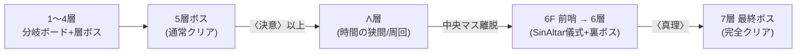

<!-- markdownlint-disable MD033 -->

# 概要 — ゲーム位置づけとラン構造

## Purpose

本プロジェクトは **Unity 3D のローグライク**（ボードゲーム調・ダイスベース戦闘）。
プレイヤーは分岐するボード状のフロアを進み、マスを踏んで戦闘・イベント・ショップ等を
解決し、各層のボスを倒して進行する。

ランタイム: Unity 2022.3.22f1 / Built-in Render Pipeline（URP/HDRP 不使用、ポスト処理は
カスタム `OnRenderImage`）。

## Definition

### ラン進行（正本: [GameLoop/RunState.cs](../../Assets/Scripts/GameLoop/RunState.cs)）

- 開始 HP = 30。`currentFloor` 1 → `maxFloor` 7。`normalClearFloor` = 5。
- **通常クリア** (`IsNormalClear`): 5層ボス撃破。**完全クリア** (`IsFullClear`): 7層ボス撃破。
- フロアは前哨基地(Outpost)で開始し、分岐ボードを進んで層ボスへ至る（[map-run](map-run.md)）。

### 〈確信〉ゲートと Λ層

- `convictionStage`（確信段階）：イベント「災厄の予兆」で〈根拠のない確信〉取得時 1、以降
  **エリート戦勝利毎に +1**。名称が段階で変化：3=〈決意〉、6+=〈真理〉。
- **6F 進入には〈決意〉(stage≥3)、7F 進入には〈真理〉(stage≥6) が必要**（メカ）。
  lore 的には「ギルド管轄も5層まで」「5層を抜けた時点で凱旋級の栄誉、普通の人間はそこで満足する」
  「6層以降に飛び降りるのは確信に憑かれた狂人だけ」（[lore-endings §1-E](lore-endings.md#L79)）。
  〈決意〉/〈真理〉は強敵連勝で確信が育った状態を表すゲーム機構名。
- **Λ層（時間の狭間）**：5層ボス撃破かつ〈決意〉以上で**強制突入**する周回エリア。
  滞在中 `currentFloor` は 5 のまま。中央マス踏破で 6F 前哨基地へ着地（[lambda-layer](lambda-layer.md)）。

### 6層の儀式デバフ（SinDebuff）

- 6層 `SinAltar`（祭壇マス）で支払えなかった儀式に応じ永続デバフを付与。
  3種：ゴルゴダの心 / 断絶した時間 / 灰燼の烙印。**6層ボス戦中のみ**効果を発揮。

### 特殊エンディング・フラグ

- `defeatedSaintGeorges`：5層裏ボス（シュヴァリエ・サン=ジョリオラ）撃破フラグ。
- `gedatsuVictory`：覚者の最終形態（妙覚）のサドンデス勝利による特殊エンディング（解脱）。

### システム地図（実装ディレクトリ）

| 領域 | spec | 主ディレクトリ |
|---|---|---|
| 戦闘 | [combat](combat.md) | `Assets/Scripts/CombatSystem/` |
| マップ／ラン | [map-run](map-run.md) | `Assets/Scripts/MapSystem/`, `GameLoop/` |
| ボス・調整 | [boss](boss.md) | `CombatSystem/`, `AutoTest/`（L3 チューナー） |
| Λ層 | [lambda-layer](lambda-layer.md) | `GameLoop/Lambda/` |
| ショップ・経済 | [shop-economy](shop-economy.md) | `InventorySystem/Shop/`, `CoinSystem/` |
| インベントリ | [inventory](inventory.md) | `InventorySystem/`（Grid/PassiveItems/Sigils） |
| イベント | [events](events.md) | `EventSystem/` |
| メタ進行 | [meta-progression](meta-progression.md) | `MetaProgression/` |
| アイテム | [items](items.md) | `Assets/Data/InventorySystem/items.json`, `InventorySystem/Items/` |

## Constraints

- MUST：正本は実コード。
- MUST：ダメージ計算は [DAMAGE_CALC_REFERENCE.md](../../Assets/Scripts/CombatSystem/DAMAGE_CALC_REFERENCE.md) を参照（本 docs で再記述しない）。
- MUST：`BALANCE_CHANGELOG_*` / `BALANCE_TIER_LIST_*` は BOT 自動生成、改変しない。

## Open Questions

- [meta-progression-scope](../open-questions/meta-progression-scope.md)

## See Also

- Specs: [map-run](map-run.md), [combat](combat.md), [lambda-layer](lambda-layer.md)
- 非スコープ: [non-goals](non-goals.md) ／ 用語: [glossary](glossary.md)
