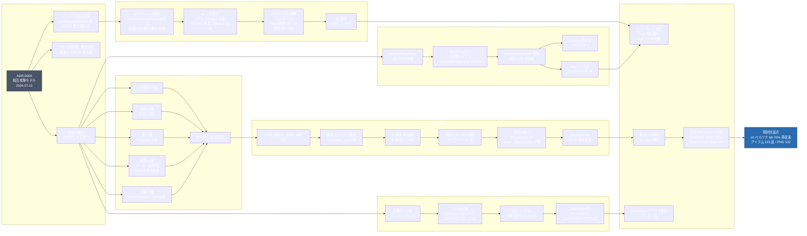
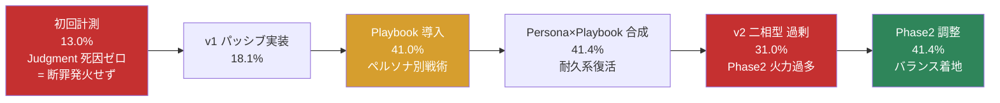
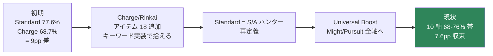
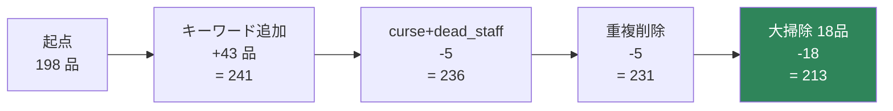
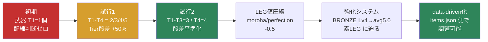
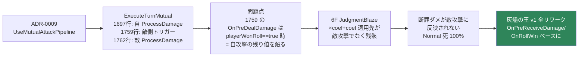

# 配線システム移行 バランス調整ジャーニー (2026-07-15〜18)

ADR-0009「相互攻撃モデル」導入から一連の派生調整までを可視化。矢印は原因→対応関係。

## 全体フロー

---

## 6F 勝率の推移

---

## ペルソナ勝率の収束 (最新 10000ラン)

---

## アイテム数推移

---

## ダイス設計の変遷

---

## 相互攻撃モデルで壊れたパッシブ処理の因果連鎖

---

## 未着手の課題

- **7F 覚者連戦の通しクリア率** (現状 p1-p7 各 80-95%、通し 55% 未満)
- **1〜3層 空気化** (100% 勝率、平均 1.2T、配線判断が形式化)
- **Λ層 リスク/リワード** (死亡 27-30% vs 純益 +0.5 アイテム)
- **5層 Chip 死因単色化** (敗北 96-98% が Chip 一色)
- **Charge ペルソナ底値** (依然 68% 帯・充電消費の Bot 学習未熟)
- **レア分布逆ピラミッド** (GOLD+LEG で 61%)
